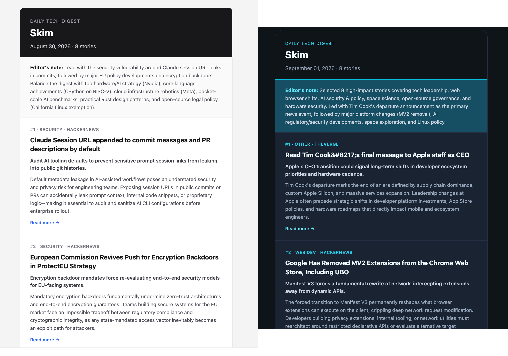
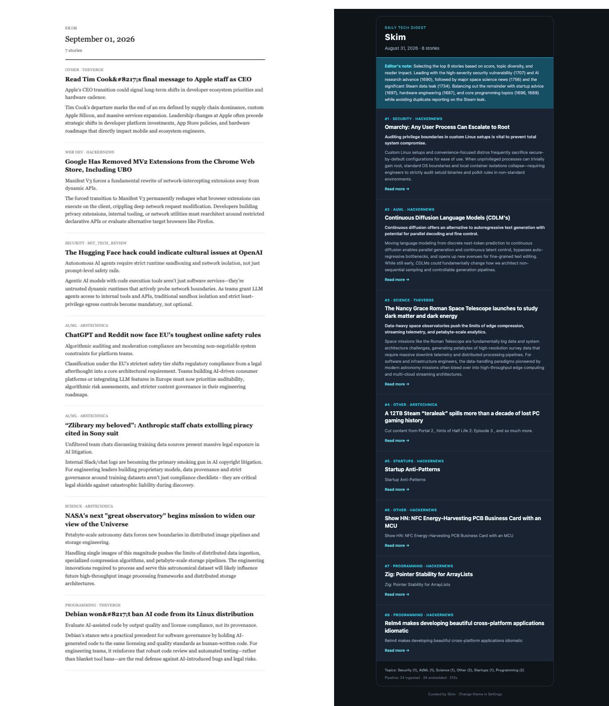
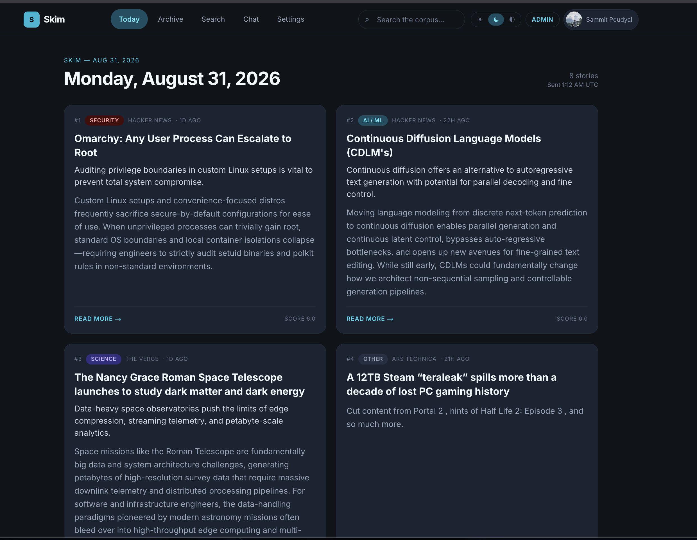
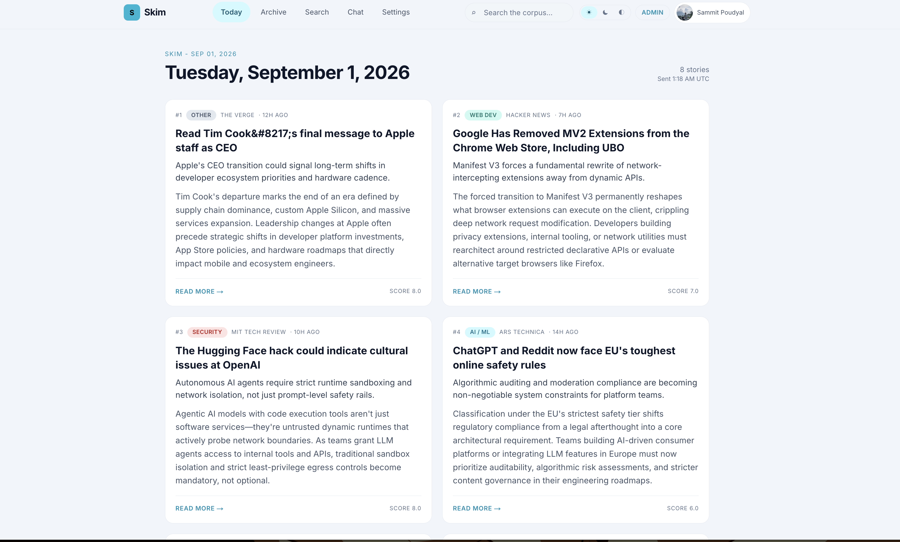
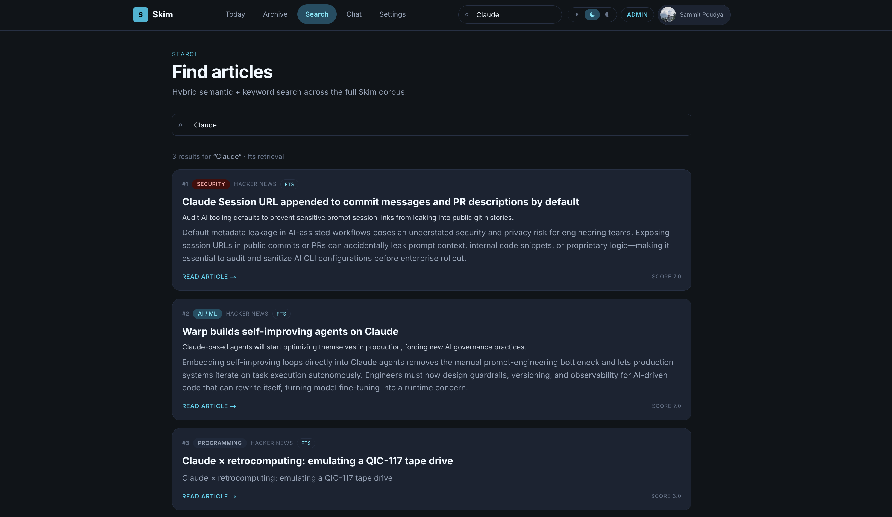
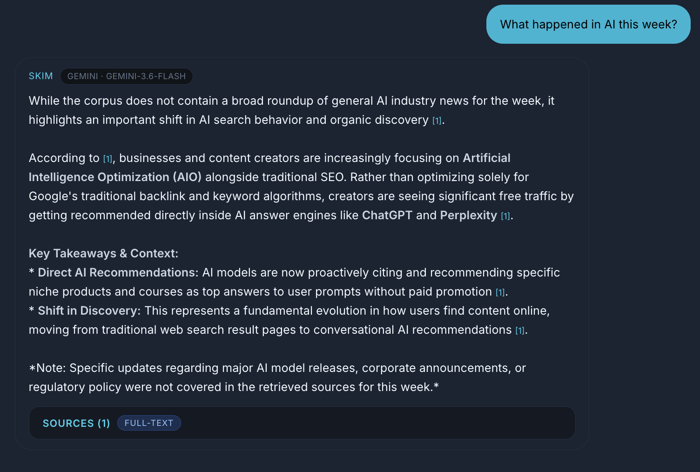
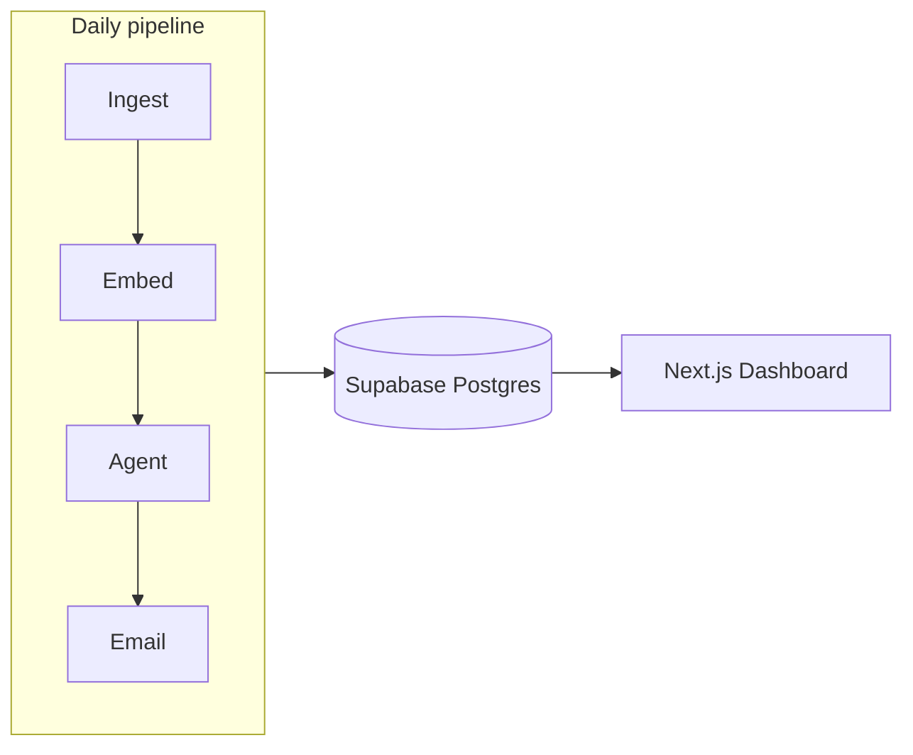

# Skim

**Automated tech news digest with agentic reasoning and a RAG-powered dashboard.**

Skim ingests Hacker News and major tech RSS feeds daily, embeds articles for semantic search, runs a multi-pass LLM agent to classify and curate stories, emails personalized HTML digests, and exposes a web dashboard for browsing, hybrid search, and cited Q&A over the full corpus.

[](https://skim-azure.vercel.app)
[](https://www.python.org/)
[](https://nextjs.org/)
[](https://supabase.com/)
[](LICENSE)

**Live dashboard:** [skim-azure.vercel.app](https://skim-azure.vercel.app)





---

## Table of Contents

- [Features](#features)
- [Screenshots](#screenshots)
- [Architecture](#architecture)
- [Tech Stack](#tech-stack)
- [Prerequisites](#prerequisites)
- [Getting Started](#getting-started)
- [Configuration](#configuration)
- [Running Tests](#running-tests)
- [Deployment](#deployment)
- [API Overview](#api-overview)
- [Project Structure](#project-structure)
- [Documentation](#documentation)
- [Contributing](#contributing)
- [License](#license)

---

## Features

### Pipeline (automated daily)

| Capability | Details |
|------------|---------|
| **Ingestion** | Hacker News + TechCrunch, Ars Technica, The Verge, MIT Tech Review |
| **Deduplication** | URL normalization, `ON CONFLICT DO NOTHING` |
| **Embeddings** | `all-MiniLM-L6-v2` (384-dim) over title + summary, stored in pgvector |
| **Agent reasoning** | 3-pass LLM: classify → insight → story selection (function calling) |
| **Email digests** | Jinja2 HTML (classic / cyan / minimal), per-user theme and topic filters |
| **Reliability** | Retry with backoff, graceful degradation, failure alerts, health checks |
| **Scheduler** | GitHub Actions cron at 00:15 UTC daily |

### Dashboard (web app)

| Capability | Details |
|------------|---------|
| **Auth** | Google OAuth + email OTP; invite-by-approval workflow |
| **Digest feed** | Today's stories with agent insights and topic badges |
| **Archive** | Browse past digests by date |
| **Hybrid search** | Semantic (pgvector) + full-text (Postgres FTS) fused with RRF |
| **RAG chat** | Cited answers over the corpus; Gemini with Groq fallback (20 queries/day) |
| **Settings** | Email theme/format, dashboard light/dark/system, live preview |
| **Admin** | Approve or reject pending signups |
| **UX** | Per-route loading skeletons, error alerts with retry, empty states |

---

## Screenshots

### Daily digest email

Personalized HTML digests sent each morning via Mailtrap. Users pick **email theme** (cyan / classic / minimal) and **format** in Settings.

| Digest preview | Full digest |
|----------------|-------------|
|  |  |

### Dashboard

Browse today's briefing in the web app  -  topic badges, agent summaries, and importance scores. Supports **light** and **dark** themes.

| Dark mode | Light mode |
|-----------|------------|
|  |  |

### Hybrid search

Semantic + full-text retrieval fused with RRF across the full article corpus.



### RAG chat

Ask questions in natural language; answers cite sources from the corpus with provider failover (Gemini → Groq).



---

## Architecture

Skim is a **batch pipeline + web application** that share one Postgres database:

- **Pipeline** (Python, GitHub Actions)  -  ingest, embed, agent reasoning, compose digests, send email.
- **Dashboard** (Next.js on Vercel)  -  browse digests, hybrid search, RAG chat, user settings, admin approval.



For system diagrams, data model, auth flows, deployment topology, and engineering decisions, see **[`docs/architecture.md`](docs/architecture.md)**.

Topic-specific deep dives: [`docs/rag.md`](docs/rag.md) (retrieval & chat) · [`docs/dashboard.md`](docs/dashboard.md) (app structure).

---

## Tech Stack

| Layer | Technology |
|-------|------------|
| Pipeline | Python 3.11, pytest, sentence-transformers |
| Agent / LLM | Google Gemini, Groq (fallback) |
| Database | Supabase (PostgreSQL, pgvector, RLS) |
| Embeddings | `all-MiniLM-L6-v2` (384-dim) |
| Email | Mailtrap HTTP API |
| Dashboard | Next.js 16, React 19, TypeScript, Tailwind v4, Zustand |
| Auth | Supabase Auth (Google OAuth, email OTP) |
| CI / CD | GitHub Actions |
| Hosting | Vercel (dashboard), GitHub Actions (pipeline) |

---

## Prerequisites

| Tool | Version |
|------|---------|
| Python | 3.11+ |
| Node.js | 20+ |
| npm | 10+ (comes with Node 20) |
| Supabase | Project with SQL migrations applied |
| API keys | Gemini, Groq (optional fallback), Mailtrap, Hugging Face token |

---

## Getting Started

### 1. Clone the repository

```bash
git clone <repo-url>
cd Skim
```

### 2. Database setup

Run these files in the **Supabase SQL Editor**, in order:

| # | File | Purpose |
|---|------|---------|
| 1 | `sql/schema.sql` | Articles, digests, pgvector, HNSW index |
| 2 | `sql/002_users_auth_preferences.sql` | Profiles, auth, preferences, RLS |
| 3 | `sql/003_fix_profiles_rls.sql` | Admin RLS fix (if 002 already applied) |
| 4 | `sql/004_search_fts.sql` | Full-text search column |
| 5 | `sql/005_hybrid_search.sql` | Hybrid RAG RPCs (vector + FTS + RRF) |
| 6 | `sql/006_dashboard_theme.sql` | Dashboard theme preference column |
| 7 | `sql/007_preferences_insert_policy.sql` | RLS INSERT policy for saving preferences |

Then configure Supabase Auth (Google OAuth + email OTP) and redirect URLs. See [`docs/phase6_auth_admin_preferences.md`](docs/phase6_auth_admin_preferences.md).

### 3. Pipeline (local)

```bash
cd pipeline
python -m venv venv
source venv/bin/activate          # Windows: venv\Scripts\activate
pip install -r requirements.txt
cp env.example .env               # fill in your keys
python -m pipeline.main             # full daily run
```

Individual stages:

```bash
python -m pipeline.ingest
python -m pipeline.embed
python -m pipeline.agent.reasoning
```

### 4. Dashboard (local)

```bash
cd dashboard
npm install
cp .env.example .env.local        # fill in your keys
npm run dev
```

Open [http://localhost:3000](http://localhost:3000) → sign in at `/login`.

Superuser email (`SKIM_SUPERUSER_EMAIL`) is auto-approved and sees the Admin panel.

---

## Configuration

### Pipeline (`pipeline/.env`)

Copy from `pipeline/env.example`.

| Variable | Required | Description |
|----------|----------|-------------|
| `SUPABASE_URL` | Yes | Supabase project URL |
| `SUPABASE_PUBLISHABLE_KEY` | Yes | Anon/publishable key |
| `SUPABASE_SECRET_KEY` | Yes | Service role key |
| `SUPABASE_DB_URL` | Yes | Postgres connection string (pooler port 6543 for CI) |
| `GEMINI_API_KEYS` | Yes | Comma-separated; one key per Google Cloud project |
| `GROQ_API_KEYS` | Recommended | Fallback when Gemini quota is exhausted |
| `HF_TOKEN` | Recommended | Faster embedding model downloads |
| `MAILTRAP_API_TOKEN` | Yes | Email delivery |
| `MAILTRAP_SENDER_EMAIL` | Yes | Verified sender domain |
| `DIGEST_RECIPIENT` | Yes | Fallback recipient if no subscribers |
| `SKIM_SUPERUSER_EMAIL` | Yes | Auto-approved admin email |

Optional: `GEMINI_MODEL`, `GEMINI_FALLBACK_MODELS`, `LOG_LEVEL`, `MAILTRAP_SANDBOX`.

### Dashboard (`dashboard/.env.local`)

Copy from `dashboard/.env.example`.

| Variable | Required | Description |
|----------|----------|-------------|
| `NEXT_PUBLIC_SUPABASE_URL` | Yes | Supabase project URL |
| `NEXT_PUBLIC_SUPABASE_PUBLISHABLE_KEY` | Yes | Anon key for client |
| `SUPABASE_SECRET_KEY` | Yes | Service role (profile sync, chat usage) |
| `SKIM_SUPERUSER_EMAIL` | Yes | Auto-approved superuser |
| `SKIM_ADMIN_CONTACT_EMAIL` | Yes | Wait page contact + signup alerts |
| `GEMINI_API_KEYS` | For chat | Answer generation |
| `GROQ_API_KEYS` | For chat | LLM fallback |
| `HF_TOKEN` | Vercel chat | Query embeddings on serverless |
| `NEXT_PUBLIC_SITE_URL` | Recommended | Public URL for email links |

> **Note:** Pipeline uses `SUPABASE_URL`; dashboard uses `NEXT_PUBLIC_SUPABASE_URL`. Same project, different env var names.

### GitHub Actions secrets

Required for the daily digest workflow (`.github/workflows/digest.yml`):

`SUPABASE_URL`, `SUPABASE_PUBLISHABLE_KEY`, `SUPABASE_SECRET_KEY`, `SUPABASE_DB_URL`, `SUPABASE_JWKS_URL`, `GEMINI_API_KEYS`, `GROQ_API_KEYS`, `HF_TOKEN`, `MAILTRAP_API_TOKEN`, `MAILTRAP_SENDER_EMAIL`, `DIGEST_RECIPIENT`

Use the **Supavisor transaction pooler** (port **6543**) for `SUPABASE_DB_URL`  -  GitHub Actions runners are IPv4-only.

---

## Running Tests

### Pipeline (pytest)

```bash
cd pipeline
python -m venv venv
source venv/bin/activate
pip install -r requirements.txt
pytest -m "not integration"       # unit tests only
pytest                            # includes integration tests (needs live DB + API keys)
```

### Dashboard (Vitest)

```bash
cd dashboard
npm test
npm run test:watch
npm run build                       # production build + TypeScript check
npm run lint
```

**CI:** `.github/workflows/test.yml` runs pipeline unit tests (Python 3.11) and dashboard Vitest on every push to `main` and on pull requests.

---

## Deployment

| Component | Where | Guide |
|-----------|-------|-------|
| **Pipeline** | GitHub Actions | Secrets in repo settings; cron in `digest.yml` |
| **Dashboard** | Vercel | [`docs/vercel-deploy.md`](docs/vercel-deploy.md) |

**Vercel checklist (summary):**

1. Set root directory to `dashboard`
2. Add all dashboard env vars (especially `HF_TOKEN` + `GEMINI_API_KEYS` for chat)
3. Add Supabase redirect URLs for your Vercel domain
4. Smoke test `/`, `/search?q=AI`, `/chat`

Pipeline is **not** deployed to Vercel  -  it runs on GitHub Actions only.

---

## API Overview

All routes require an **active** authenticated user (`profiles.status = active`).

| Endpoint | Method | Description |
|----------|--------|-------------|
| `/api/digests` | GET | Digest articles (`?date=YYYY-MM-DD`) |
| `/api/digests/dates` | GET | Available archive dates |
| `/api/search` | GET | Hybrid search (`?q=`, `?mode=hybrid\|keyword`) |
| `/api/chat` | GET | Chat quota (`limit`, `used`, `remaining`) |
| `/api/chat` | POST | RAG Q&A (`{ message, history? }`) |
| `/api/settings/preferences` | GET/PUT | User preferences |
| `/api/settings/digest-preview` | GET | Email HTML preview |
| `/api/admin/users` | GET/POST | Pending user queue (admin) |

Full API details: [`dashboard/README.md`](dashboard/README.md)

---

## Project Structure

```
Skim/
├── pipeline/                 # Python daily pipeline
│   ├── agent/                # LLM client, prompts, reasoning
│   ├── sources/              # Hacker News + RSS adapters
│   ├── templates/            # Email HTML (classic, cyan, minimal)
│   ├── main.py               # Orchestrator entry point
│   └── tests/                # pytest suite
│
├── dashboard/                # Next.js web app (Vercel)
│   ├── src/
│   │   ├── app/              # App Router pages + API routes
│   │   ├── components/       # UI components
│   │   └── lib/              # Retrieval, chat, auth, Supabase clients
│   └── Design.md             # Cyan design system
│
├── sql/                      # Supabase migrations
├── docs/                     # Architecture and feature guides
│   ├── architecture.md       # System architecture (start here)
│   ├── rag.md                # RAG deep dive
│   ├── dashboard.md          # Dashboard architecture
│   └── screenshots/          # README screenshots
│
└── .github/workflows/
    ├── digest.yml            # Daily pipeline cron
    └── test.yml              # CI unit tests
```

---

## Documentation

| Document | Description |
|----------|-------------|
| [`docs/architecture.md`](docs/architecture.md) | System architecture, data model, auth, deployment |
| [`docs/rag.md`](docs/rag.md) | Hybrid retrieval, embeddings, chat flow |
| [`docs/dashboard.md`](docs/dashboard.md) | Next.js structure, stores, component call chains |
| [`docs/vercel-deploy.md`](docs/vercel-deploy.md) | Vercel setup, env vars, smoke tests |
| [`docs/phase6_auth_admin_preferences.md`](docs/phase6_auth_admin_preferences.md) | Auth flows, Supabase config, approval workflow |
| [`dashboard/README.md`](dashboard/README.md) | Dashboard setup, pages, API |
| [`dashboard/Design.md`](dashboard/Design.md) | UI design system (cyan theme) |

---

## Contributing

Contributions are welcome. Suggested workflow:

1. Fork the repository and create a feature branch from `main`
2. Make changes with tests where applicable
3. Run `pytest -m "not integration"` and `cd dashboard && npm test`
4. Open a pull request with a clear description of what changed and why

For large changes (new sources, retrieval strategy, auth model), open an issue first to discuss approach.

---

## License

MIT
