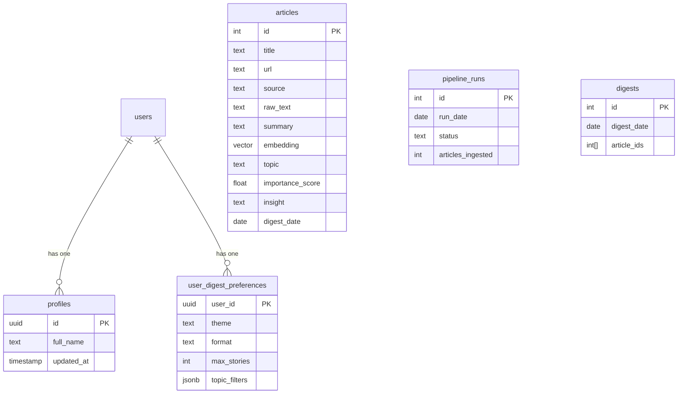
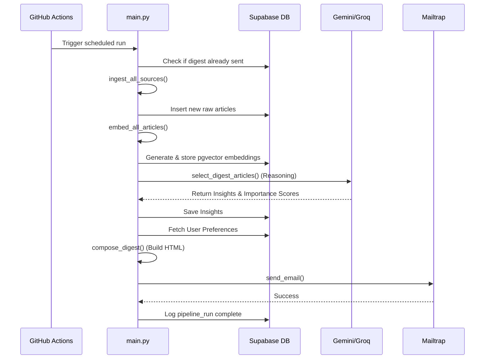

# Skim Project Guide & Architecture Explanation

This document serves as a comprehensive guide to understanding the **Skim** project. It outlines the architecture, how the frontend and backend are connected, and provides a deep dive into the inner workings of each component. It is written in simple terms suitable for a frontend or full-stack engineering interview.

At the end of this document, you will find the **Master Question Bank** answered using this project's context.

---

## 1. Project Architecture & Diagrams

Skim is a daily AI-curated news digest system. It consists of two decoupled systems that communicate through a shared **Supabase PostgreSQL** database.

1. **Frontend (Dashboard)**: A Next.js 14 App Router application where users can authenticate, configure their digest preferences, search past articles using semantic search, and chat with an AI assistant.
2. **Backend (Pipeline)**: A Python application orchestrated by GitHub Actions that fetches news, generates vector embeddings, uses LLMs (Gemini/Groq) to generate insights, and sends the final digest via email (Mailtrap).

### High-Level Architecture Diagram

```mermaid
graph TD
    subgraph Frontend [Next.js Dashboard (Vercel)]
        UI[React Server/Client Components]
        API[Next.js API Routes]
    end

    subgraph Backend [Python Pipeline (GitHub Actions)]
        Orchestrator[main.py]
        Ingest[ingest.py]
        Embed[embed.py]
        Reason[agent/reasoning.py]
        Compose[compose.py]
    end

    subgraph Database [Supabase]
        Auth[Supabase Auth]
        PG[(PostgreSQL + pgvector)]
    end

    subgraph External [External Services]
        LLM[Gemini / Groq API]
        Embedder[HuggingFace Embeddings]
        Email[Mailtrap]
    end

    %% Connections
    UI <-->|Auth / RPC| Auth
    UI <-->|Read/Write Prefs| PG
    API <-->|Semantic Search / Chat| PG
    API <-->|LLM Chat| LLM
    
    Orchestrator --> Ingest
    Orchestrator --> Embed
    Orchestrator --> Reason
    Orchestrator --> Compose
    
    Ingest -->|Write raw articles| PG
    Embed -->|HuggingFace| Embedder
    Embed -->|Write vectors| PG
    Reason -->|LLM Prompts| LLM
    Reason -->|Write insights| PG
    Compose -->|Fetch articles| PG
    Compose -->|Send HTML| Email
```

### Database Schema (ERD)



---

## 2. Frontend (Dashboard)

The frontend is built using **Next.js 14 (App Router)** and **Tailwind CSS**. 

### How it Works (Simple Terms)
- **App Router (`src/app`)**: Next.js uses file-system-based routing. The `app` directory contains folders like `login`, `admin`, and `settings`. Each folder with a `page.tsx` becomes a route (e.g., `/login`).
- **Server vs Client Components**: Next.js defaults to Server Components (rendering HTML on the server before sending to the client, great for SEO and performance). We use `"use client"` at the top of files that require interactivity (like forms, `useState`, or buttons).
- **Authentication**: We use `@supabase/ssr`. When a user logs in via the `/login` page (using email/password, OTP, or Google OAuth), Supabase sets an HTTP-only cookie containing a JWT. This cookie is securely passed to the server on every subsequent request.
- **Tailwind CSS (`src/lib/tailwind-ui.ts`)**: Instead of writing raw CSS, we use utility classes. We maintain a design system by abstracting common styles into exported constants (e.g., `btnPrimary`), which keeps the UI consistent across the app.

### Connecting to the Backend
The frontend **does not** communicate directly with the Python pipeline. They are totally decoupled.
Instead, they communicate through the **Database (Supabase)**:
1. The Python pipeline writes summarized news articles and their vector embeddings into the `articles` table.
2. The frontend (via Server Components or API Routes) queries the `articles` table using `@supabase/ssr` to display them to the user.
3. The frontend can also call a Postgres RPC function (`search_similar_articles`) to perform vector similarity searches (powered by `pgvector`) over the articles the backend ingested.

---

## 3. Backend (Pipeline)

The backend is a standalone **Python CLI application** orchestrated by GitHub Actions on a daily cron schedule, featuring fully timezone-aware execution and database queries.

### Pipeline Workflow (Service Flow Diagram)



### How it Works (Simple Terms)
1. **Ingestion (`ingest.py`)**: Connects to RSS feeds or APIs (like dev.to) and downloads the raw text of today's news. Deduplicates based on URLs.
2. **Embedding (`embed.py`)**: Converts the text of the articles into arrays of numbers (vectors) using a local HuggingFace model. These vectors capture the "meaning" of the text, allowing the frontend to do semantic "smart" searches.
3. **Reasoning (`agent/reasoning.py`)**: Sends the articles to an LLM (Gemini or Groq). The LLM acts as an "editor", reading the articles, scoring them by importance, and writing a concise "insight" or "key takeaway" for the ones that matter most.
4. **Composition & Sending (`compose.py`, `email_sender.py`)**: Takes the top articles, injects them into an HTML email template (customized by the user's color theme preferences stored in Supabase), and sends it out via Mailtrap.

---

## 4. Master Question Bank (Answered in Context)

> **Note on Context Bridging:** The provided question bank explicitly mentions "NepAI" (a PyTorch/FastAPI stack). As this project is **Skim** (a Next.js/Python/Supabase stack), the answers below bridge the core concepts. They answer the theoretical intent of the NepAI questions while remaining grounded in the reality of the Skim architecture.

### Part 1 — General Questions

**[High] Walk me through your GitHub — which project best represents your engineering ability, and why?**
I would point to Skim. It demonstrates full-stack proficiency by combining a modern Next.js 14 App Router frontend with a robust, decoupled Python ETL pipeline. It handles authentication, database triggers, vector embeddings (`pgvector`), and external LLM integrations, all tied together with automated CI/CD via GitHub Actions.

**[High] Pick one project and explain the architecture end-to-end: client → server → data layer → deployment.**
In Skim:
- **Client**: Next.js 14 React Server/Client components hosted on Vercel.
- **Server / API**: The frontend uses Next.js Route Handlers (`/api`) for dynamic endpoints (like LLM chat). The heavy lifting is done by a decoupled Python pipeline running on GitHub Actions.
- **Data Layer**: Supabase (PostgreSQL). The frontend uses `@supabase/ssr` to read data and authenticate via JWT cookies. The Python pipeline uses `psycopg2` to write data.
- **Deployment**: Vercel handles the Next.js edge deployment. GitHub Actions orchestrates the Python cron jobs. Supabase hosts the managed database.

**[High] Difference between React and Next.js — when would you reach for one over the other?**
React is a UI library for rendering components in the browser. Next.js is a full framework built *on top* of React that provides routing, Server-Side Rendering (SSR), API routes, and optimizations. I reach for Next.js when I need SEO, fast initial page loads (via SSR), or full-stack capabilities in a single repo. I'd use plain React (like Vite) only for highly interactive Single Page Applications (SPAs) where SEO doesn't matter (like an internal dashboard).

**[High] Client Components vs. Server Components in the Next.js App Router — how do you decide which to use?**
- **Server Components** (default): Used for fetching data, accessing backend resources directly (like Supabase), and keeping heavy dependencies off the client bundle.
- **Client Components** (`"use client"`): Used only when I need browser APIs, interactivity (`onClick`), or React hooks (`useState`, `useEffect`). I push Client Components as far down the component tree as possible.

**[High] How do you manage state — when do you reach for local state, Context, or a store like Zustand/Redux?**
- **Local State** (`useState`): For simple UI toggles (e.g., is a modal open? what is the input value?).
- **Context**: For global configuration that rarely changes (e.g., Theme, Auth Session).
- **Zustand**: For complex, frequently updating global state across disparate components. In Skim, since we use Next.js Server Components, a lot of "state" is actually just URL parameters or server-fetched data, drastically reducing the need for massive client-side stores.

**[High] Walk through a typical Express route end-to-end — middleware chain, controller, error handling.**
*(Translating to Next.js Route Handlers as used in Skim)*: A request hits `/api/chat`. First, Next.js middleware runs, checking for a valid Supabase auth cookie. If valid, the request reaches the Route Handler (Controller). The handler parses the JSON body, initiates a stream with the LLM via `litellm`, and returns a `StreamingTextResponse`. If an error occurs, a `try/catch` block catches it and returns a standard HTTP 500 JSON response.

**[High] How do you implement authentication — JWT vs. sessions? Where do you store the token (httpOnly cookie vs localStorage), and why does it matter?**
Skim uses JWTs managed by Supabase. Tokens are stored in **httpOnly cookies** rather than `localStorage`. This is critical for security because `httpOnly` cookies cannot be accessed by malicious JavaScript (preventing XSS attacks), whereas `localStorage` is completely exposed to the client.

**[High] How do you model a one-to-many relationship in MongoDB — embed or reference, and how do you decide?**
*(Relational equivalent in Skim)*: In Postgres, we use references (Foreign Keys). In MongoDB, you embed if the data is frequently accessed together and doesn't grow infinitely (e.g., an article and its tags). You reference if the "many" side can grow unboundedly (e.g., a user and their thousands of past digests) to avoid hitting the 16MB document limit.

### Part 2 & 3 — Architecture & Deep Dives

**[High] Why does the frontend never talk to the Python pipeline directly — walk me through the reasoning for the backend-as-sole-API (or DB-as-interface) pattern.**
In Skim, the Python pipeline is an asynchronous ETL script, not a persistent web server (like FastAPI/Express). By using the database as the integration layer, we achieve complete decoupling. The pipeline can run on a cron job, crash, or take 10 minutes to process LLM calls without blocking the frontend. The Next.js frontend simply queries the database for the *results* of the pipeline whenever a user logs in.

**[High] What's the practical difference between calling your own REST API vs. calling Supabase directly from the frontend?**
Calling a REST API requires you to build, deploy, and scale a backend server to serialize data. Calling Supabase directly from the frontend (using PostgREST and Row Level Security) eliminates the need for CRUD boilerplate. The frontend safely requests data directly from the DB, and Supabase enforces permissions at the database level.

**[High] Walk through the JWT access+refresh auth flow end-to-end.**
1. User enters credentials on `/login`.
2. Supabase verifies them and returns an Access Token (short-lived) and Refresh Token (long-lived).
3. The `@supabase/ssr` library stores these in an httpOnly cookie.
4. On every request, Next.js middleware reads the cookie. If the Access Token is expired but the Refresh Token is valid, Supabase silently issues a new Access Token, updates the cookie, and allows the request to proceed without forcing the user to log in again.

**[High] What's the single biggest weakness in this system right now, and how would you fix it with more time?**
In Skim, the Python pipeline currently processes articles in a somewhat linear batch. If one LLM call hangs or fails, it can delay the entire digest generation. I would fix this by introducing a message queue (like Celery/Redis or AWS SQS) so that embedding and reasoning for each article happen in parallel, isolated worker tasks.

### Part 4 — Bridging the MERN Gap

**[High] "Your projects use Python/Next.js/Supabase — do you have hands-on Node/Express/MongoDB experience? How would you translate what you built to that stack?"**
Absolutely. The architectural concepts translate 1-to-1. 
Instead of Next.js Route Handlers and Supabase, I would set up an **Express.js** server. 
- Supabase's `httpOnly` cookie auth translates perfectly to Express using `cookie-parser` and `jsonwebtoken` middleware to verify tokens on protected routes.
- Instead of Postgres relational tables and triggers, I would use **Mongoose** to define schemas in **MongoDB**. The `profiles` and `user_digest_preferences` tables in Skim would simply become embedded documents inside the `User` collection in MongoDB, actually simplifying the data model.
- The Python pipeline could be entirely rewritten in Node.js using `node-cron` for scheduling and the official Google GenAI SDK for the reasoning step. The principles of modularity and separation of concerns remain identical regardless of the language syntax.
