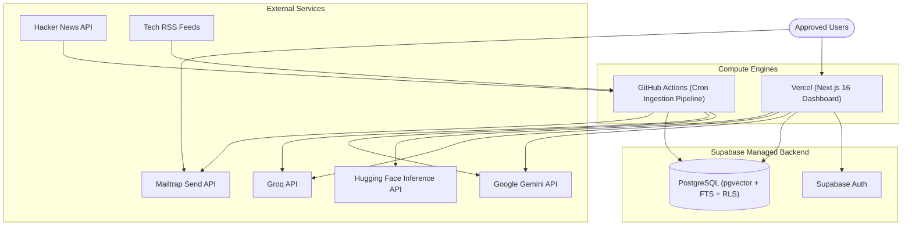

# Skim Documentation

Welcome to the **Skim** documentation directory. Skim is an automated, AI-powered tech-news intelligence platform that pairs an automated Python daily batch pipeline with a high-performance Next.js 16 web dashboard featuring hybrid RAG search and AI chat.

---

## Documentation Index

| Document | Scope & Purpose | Target Audience |
|---|---|---|
| [**Architecture Overview**](./architecture.md) | High-level system design, data flows, Supabase schema, RLS policies, pipeline lifecycle, and engineering decision log. | All Engineers & Architects |
| [**Dashboard Guide**](./dashboard.md) | Next.js 16 App Router architecture, Server/Client component boundaries, Zustand state management slices, API routes, and styling system. | Frontend & Full-Stack Engineers |
| [**RAG & AI Chat**](./rag.md) | Hybrid retrieval architecture (MiniLM 384-dim pgvector + Postgres FTS + RRF fusion), importance reranking, multi-provider LLM failover, and prompt engineering. | AI/ML & Backend Engineers |
| [**Auth, Admin & Preferences**](./phase6_auth_admin_preferences.md) | Google OAuth & Email OTP auth flows, invite-by-approval gating, superuser admin controls, Mailtrap alerts, and subscriber preference storage. | Full-Stack Engineers & Administrators |
| [**Vercel Deployment**](./vercel-deploy.md) | Production deployment checklist for the Next.js dashboard on Vercel, environment variables, Supabase redirect URLs, and smoke tests. | DevOps & Deployers |
| [**Branding & Visual Assets**](./branding/README.md) | Vector logo specifications, Google OAuth consent screen branding assets, and high-resolution icons. | Designers & Developers |
| [**Internal Project Report**](./report.md) | Internal engineering log detailing bug fixes, model failover configurations, performance optimizations, and test metrics. | Core Maintainers |

---

## High-Level System Architecture



---

## Directory Structure

```
docs/
├── README.md                           # This documentation index
├── architecture.md                     # System architecture & decision log
├── dashboard.md                        # Dashboard architecture & Zustand state guide
├── rag.md                              # Hybrid RAG retrieval & LLM chat guide
├── phase6_auth_admin_preferences.md    # Auth, admin approval & user preferences guide
├── vercel-deploy.md                    # Vercel production deployment guide
├── report.md                           # Internal engineering report & bug log
├── branding/                           # Logos and OAuth branding assets
│   ├── README.md                       # Branding asset guide
│   ├── skim-logo.svg                   # Vector logo source
│   ├── skim-logo-120.png               # Google OAuth consent screen asset (120x120)
│   └── skim-logo-512.png               # High-res app icon & social preview (512x512)
└── screenshots/                        # UI and email preview screenshots
    ├── dashboard.png                   # Dark theme dashboard
    ├── dashboard-light.png             # Light theme dashboard
    ├── search.png                      # Hybrid search results
    ├── rag-answer.png                  # RAG chat with cited sources
    ├── Analytics.png                   # Admin analytics preview
    ├── digest-email-themes.png         # Email digest themes
    └── digest-email-formats.png        # Email digest formats
```

---

## Quick Navigation by Task

- **Setting up local development?** Start with the root [`README.md`](../README.md) and [`dashboard/README.md`](../dashboard/README.md).
- **Configuring authentication & Google OAuth?** Read [`phase6_auth_admin_preferences.md`](./phase6_auth_admin_preferences.md) and [`branding/README.md`](./branding/README.md).
- **Deploying to production?** Follow [`vercel-deploy.md`](./vercel-deploy.md).
- **Understanding how search and chat retrieve articles?** See [`rag.md`](./rag.md).
- **Understanding React state and Next.js route flows?** Read [`dashboard.md`](./dashboard.md).
- **Applying database migrations?** Refer to the SQL checklist in [`architecture.md`](./architecture.md#migrations).
