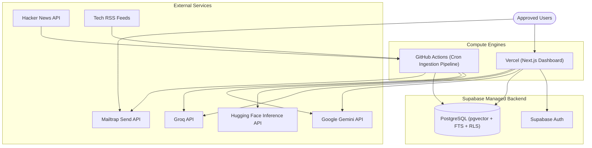

# Skim Documentation

Index for Skim docs: automated Python daily pipeline + Next.js dashboard with hybrid RAG search and chat.

---

## Documentation Index

| Document | Scope | Audience |
|---|---|---|
| [**Architecture Overview**](./architecture.md) | System design, data flows, schema, RLS, decision log | Engineers & architects |
| [**Dashboard Guide**](./dashboard.md) | Next.js App Router, Zustand, API routes, styling | Frontend / full-stack |
| [**RAG & AI Chat**](./rag.md) | Hybrid retrieval (pgvector + FTS + RRF), LLM failover | AI / backend |
| [**Auth, Admin & Preferences**](./phase6_auth_admin_preferences.md) | OAuth, OTP, approval gating, preferences | Full-stack / admins |
| [**Vercel Deployment**](./vercel-deploy.md) | Production deploy checklist | Deployers |
| [**Sources & Scrapers Benchmark**](./sources_and_scrapers_benchmark.md) | Feed/API/extractor latency notes | Pipeline maintainers |
| [**Branding**](./branding/README.md) | Logo and OAuth consent assets | Design / setup |

---

## High-Level System Architecture



---

## Directory Structure

```
docs/
├── README.md                           # This index
├── architecture.md                     # System architecture & decision log
├── dashboard.md                        # Dashboard architecture
├── rag.md                              # Hybrid RAG & chat
├── phase6_auth_admin_preferences.md    # Auth, admin, preferences
├── vercel-deploy.md                    # Vercel deploy checklist
├── sources_and_scrapers_benchmark.md   # Source/scraper benchmarks
├── branding/                           # Logos and OAuth assets
└── screenshots/                        # README screenshots
```

---

## Quick Navigation by Task

- **System architecture & data model?** [`architecture.md`](./architecture.md).
- **Local setup?** Root [`README.md`](../README.md) and [`dashboard/README.md`](../dashboard/README.md).
- **Auth & Google OAuth?** [`phase6_auth_admin_preferences.md`](./phase6_auth_admin_preferences.md) and [`branding/README.md`](./branding/README.md).
- **Deploy?** [`vercel-deploy.md`](./vercel-deploy.md).
- **Search & chat?** [`rag.md`](./rag.md).
- **React / App Router flows?** [`dashboard.md`](./dashboard.md).
- **SQL migrations?** [`architecture.md`](./architecture.md#migrations).
