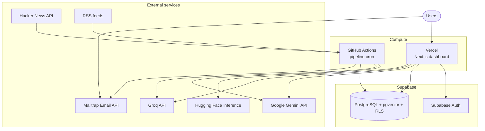
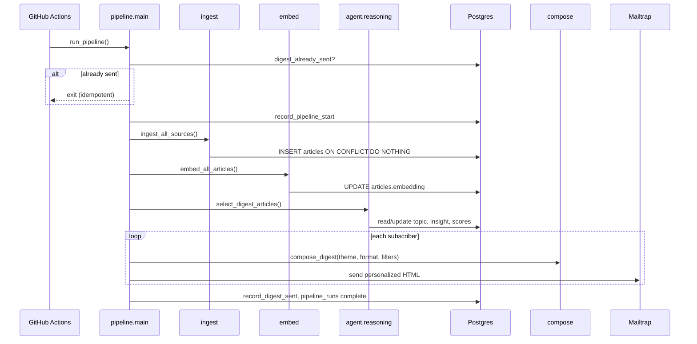
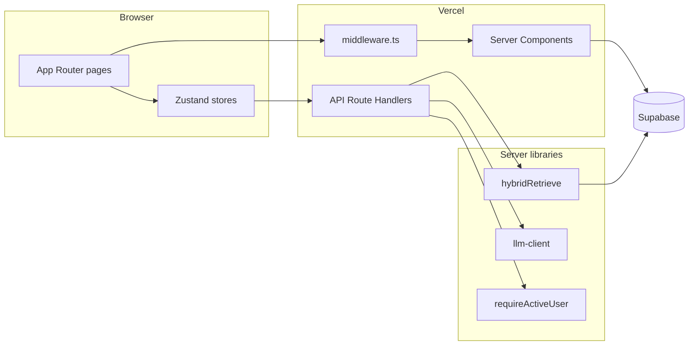
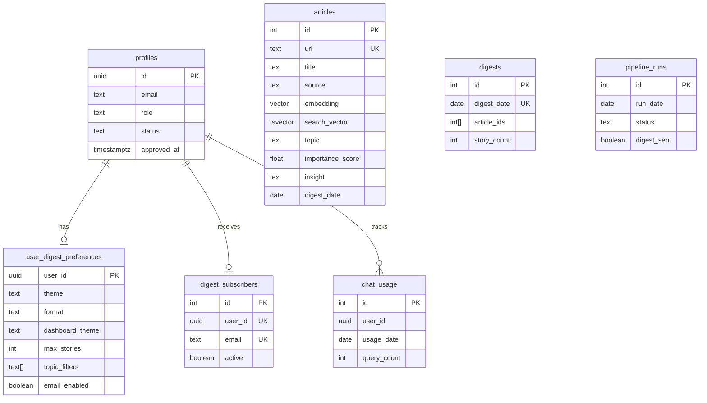
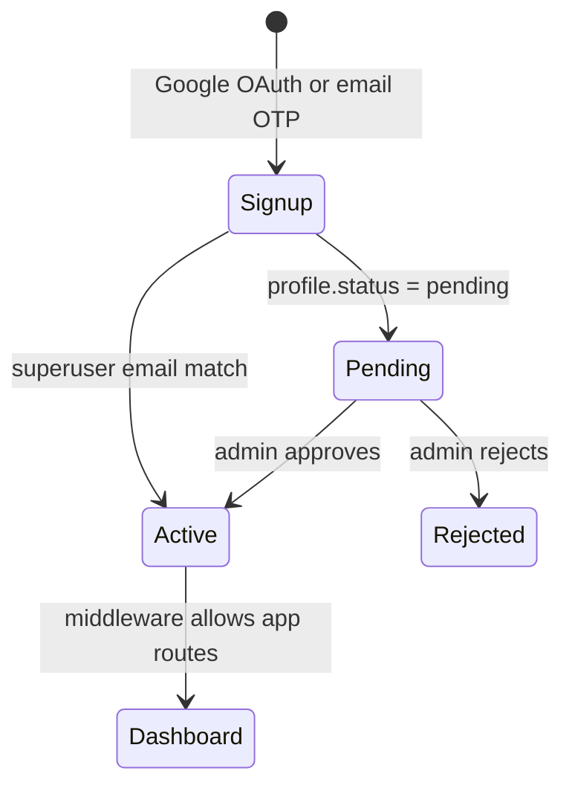

# Skim  -  System Architecture

Technical overview of the Skim platform: components, data flows, database design, and key engineering decisions.

**Related documentation**

| Document | Scope |
|----------|--------|
| [README.md](../README.md) | Overview, setup, deployment |
| [docs/rag.md](./rag.md) | Hybrid retrieval, embeddings, chat generation |
| [docs/dashboard.md](./dashboard.md) | Next.js app structure, stores, API routes |
| [docs/vercel-deploy.md](./vercel-deploy.md) | Production dashboard deployment |
| [docs/phase6_auth_admin_preferences.md](./phase6_auth_admin_preferences.md) | Auth and admin onboarding |

---

## Table of Contents

1. [Overview](#overview)
2. [System context](#system-context)
3. [Components](#components)
4. [Daily pipeline](#daily-pipeline)
5. [Dashboard application](#dashboard-application)
6. [Data model](#data-model)
7. [Authentication and authorization](#authentication-and-authorization)
8. [Retrieval and chat](#retrieval-and-chat)
9. [Email delivery](#email-delivery)
10. [Deployment topology](#deployment-topology)
11. [Observability and reliability](#observability-and-reliability)
12. [Decision log](#decision-log)

---

## Overview

Skim is a **batch pipeline + web application** that share a single Postgres database:

- **Pipeline** (Python, GitHub Actions cron) ingests news, embeds articles, runs multi-pass LLM reasoning, composes HTML digests, and sends email.
- **Dashboard** (Next.js on Vercel) lets approved users browse digests, search the corpus, and ask cited questions via RAG chat.

There is no always-on application server for ingestion. The dashboard is the only continuously available user-facing service.

---

## System context



---

## Components

| Component | Runtime | Responsibility |
|-----------|---------|----------------|
| **Ingestion** (`pipeline/ingest.py`, `pipeline/sources/`) | GHA | Fetch HN + RSS; normalize URLs; deduplicate inserts |
| **Embedding** (`pipeline/embed.py`) | GHA | `all-MiniLM-L6-v2` (384-dim) → `articles.embedding` |
| **Agent** (`pipeline/agent/`) | GHA | Classify, generate insights, select digest stories (function calling) |
| **Compose** (`pipeline/compose.py`) | GHA | Jinja2 HTML per subscriber theme/format |
| **Email** (`pipeline/email_sender.py`) | GHA | Mailtrap HTTP API; per-subscriber personalization |
| **Orchestrator** (`pipeline/main.py`) | GHA | Idempotent daily run; degradation paths; `pipeline_runs` logging |
| **Dashboard UI** (`dashboard/src/app/`, `components/`) | Vercel | SSR pages + client interactivity |
| **API routes** (`dashboard/src/app/api/`) | Vercel | Digests, search, chat, preferences, admin |
| **Database** | Supabase | Articles, vectors, FTS, users, preferences, usage quotas |
| **Auth** | Supabase | Google OAuth, email OTP, JWT sessions |

---

## Daily pipeline

Scheduled at **00:15 UTC** via `.github/workflows/digest.yml`.



### Ingestion sources

| Source | Adapter | Notes |
|--------|---------|-------|
| Hacker News | `sources/hackernews.py` | Firebase API top stories |
| TechCrunch, Ars Technica, The Verge, MIT Tech Review | `sources/rss.py` | feedparser + HTML stripping |

### Agent reasoning (three passes)

1. **Classify**  -  topic label + importance score (1–10) for ingested articles.
2. **Insight**  -  editorial “why it matters” for high-scoring candidates.
3. **Select**  -  holistically pick and order stories for the daily digest.

LLM calls use **Gemini** with multi-key rotation and **Groq** as last-resort fallback. On total LLM failure, a **degraded digest** (titles/summaries only) may still be sent.

### Idempotency

- `digests.digest_date` uniqueness prevents duplicate sends for the same day.
- `digest_already_sent()` short-circuits re-runs.
- Article inserts use URL-based deduplication.

---

## Dashboard application



| Route | Rendering | Data source |
|-------|-------------|-------------|
| `/` | Server | Today's digest articles |
| `/archive` | Server + client | Digest by date |
| `/search` | Client | `GET /api/search` (hybrid) |
| `/chat` | Client | `POST /api/chat` (RAG) |
| `/settings` | Server + client | `user_digest_preferences` |
| `/admin` | Server + client | Pending `profiles` (admin only) |
| `/login`, `/pending` | Client | Public / wait states |

See [dashboard.md](./dashboard.md) for directory layout, Zustand slices, and per-route call chains.

---

## Data model



### Migrations

Apply in order from `sql/`:

| File | Purpose |
|------|---------|
| `schema.sql` | Core tables, pgvector HNSW index, base RPCs |
| `002_users_auth_preferences.sql` | Profiles, preferences, RLS, auth trigger |
| `003_fix_profiles_rls.sql` | Admin RLS helper (`is_active_admin`) |
| `004_search_fts.sql` | `search_vector` column + GIN index |
| `005_hybrid_search.sql` | Hybrid vector + FTS + RRF RPCs |
| `006_dashboard_theme.sql` | `dashboard_theme` preference column |
| `007_preferences_insert_policy.sql` | RLS INSERT for preferences upsert |

### Row-level security

- **Articles, digests, pipeline_runs**  -  readable only by `profiles.status = 'active'`.
- **Profiles**  -  users read/update self; admins read/update pending queue.
- **Preferences**  -  users read/update/insert own row only.
- **Pipeline writes**  -  service role key (bypasses RLS) from GitHub Actions.

---

## Authentication and authorization



| Mechanism | Implementation |
|-----------|----------------|
| Identity | Supabase Auth (Google OAuth, email OTP) |
| Profile sync | `auth/complete` route + `profiles` upsert |
| Gate | `middleware.ts`  -  session + `profiles.status` |
| Admin | `role IN (superuser, admin)` + active status |
| API guard | `requireActiveUser()` on all `/api/*` routes |
| Approval cap | 10 active members (excluding superuser) |

Signup notifications go to the admin via Mailtrap; approved users receive a welcome email. Details: [phase6_auth_admin_preferences.md](./phase6_auth_admin_preferences.md).

---

## Retrieval and chat

Skim uses **hybrid retrieval** for search and chat:

1. Embed the query (`all-MiniLM-L6-v2`; Hugging Face API on Vercel serverless).
2. **Vector search** (pgvector cosine similarity via RPC).
3. **Full-text search** (`search_vector` + `websearch_to_tsquery`).
4. **Reciprocal Rank Fusion** (k=60) to merge ranked lists.
5. **Chat only**  -  build prompt with top articles → Gemini (key rotation, fallbacks) → Groq.

| Feature | Retrieval | Generation |
|---------|-----------|------------|
| `/search` | Hybrid | None (ranked articles) |
| `/chat` | Hybrid | Multi-provider LLM + citations |

Rate limit: **20 chat queries per user per day** (`chat_usage` table).

Full implementation: [rag.md](./rag.md).

---

## Email delivery

| Stage | Detail |
|-------|--------|
| Templates | Jinja2  -  `pipeline/templates/` (cyan, classic, minimal) |
| Formats | Full, brief, headlines |
| Personalization | Per-user theme, format, `max_stories`, `topic_filters` from `user_digest_preferences` |
| Transport | Mailtrap Send API (`MAILTRAP_API_TOKEN`) |
| Subscribers | `digest_subscribers` synced on admin approval |
| Preview | `GET /api/settings/digest-preview` (dashboard Settings) |

---

## Deployment topology

| Artifact | Host | Trigger |
|----------|------|---------|
| Python pipeline | GitHub Actions | Cron `digest.yml` + manual dispatch |
| Dashboard | Vercel (`dashboard/`) | Git push to `main` |
| Database + Auth | Supabase | Managed |
| CI tests | GitHub Actions `test.yml` | Push / PR |

**Secrets**

- **GHA pipeline:** Supabase service credentials, Gemini/Groq keys, Mailtrap, `SUPABASE_DB_URL` (pooler port **6543** for IPv4 runners).
- **Vercel:** `NEXT_PUBLIC_SUPABASE_*`, `SUPABASE_SECRET_KEY`, `GEMINI_API_KEYS`, `GROQ_API_KEYS`, `HF_TOKEN`, Mailtrap (admin alerts), site URL.

Pipeline does **not** run on Vercel. Dashboard does **not** run the ingestion cron.

---

## Observability and reliability

| Concern | Approach |
|---------|----------|
| Run history | `pipeline_runs` table (status, counts, duration, errors JSON) |
| Failure alerts | Email to admin on pipeline failure |
| Retries | Exponential backoff on LLM and network calls |
| Degradation | Skip embeddings or agent; send reduced digest |
| Health check | `pipeline/health_check.py`  -  pre-flight DB/API checks |
| Dashboard errors | Route error boundaries, API structured errors, retry UI |

---

## Decision log

| Decision | Choice | Rationale |
|----------|--------|-----------|
| Vector storage | pgvector in Postgres | Single DB for relational + vector data; hybrid SQL RPCs |
| Embedding model | MiniLM 384-dim | Free local inference at ingest scale; shared space with dashboard |
| Vector index | HNSW | Stable recall on small-to-medium corpora (vs ivfflat) |
| LLM provider | Gemini primary, Groq fallback | Free-tier quotas; key rotation across projects |
| Agent design | 3-pass function calling | Testable steps; better digest quality than one-shot |
| Scheduler | GitHub Actions cron | No idle server; fits daily batch workload |
| Dashboard host | Vercel serverless | SSR + API routes; separate from batch pipeline |
| Query embeddings on Vercel | Hugging Face Inference API | `@xenova/transformers` unreliable in serverless |
| Auth model | Supabase + admin approval | Quota control; RLS tied to `profiles.status` |
| Email | Mailtrap API | Sandbox for dev; verified domain for production |
| Search fusion | RRF (k=60) | Strong hybrid baseline without training |

---

## Repository layout

```
Skim/
├── pipeline/          # Python batch pipeline
├── dashboard/         # Next.js application
├── sql/               # Database migrations
├── docs/              # Architecture and feature guides
└── .github/workflows/ # digest.yml (cron), test.yml (CI)
```
