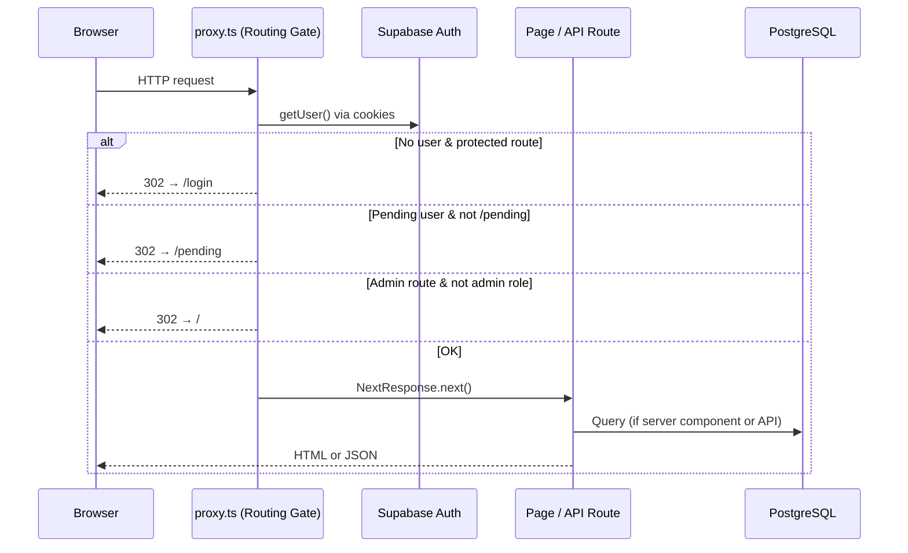
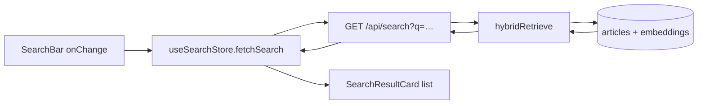
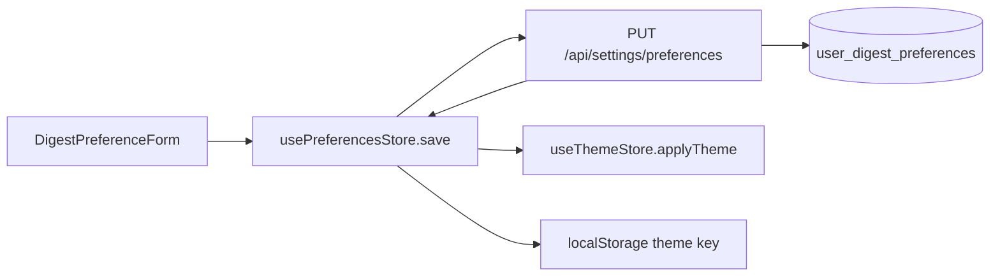
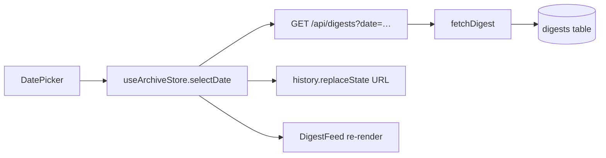

# Skim Dashboard  -  Architecture Guide

This document explains how the Next.js dashboard is structured: routing, server vs. client components, authentication, API routes, Zustand state management, and the call chains connecting the UI to Supabase and the hybrid RAG stack.

**Related documentation**

| Document | Scope |
|---|---|
| [docs/README.md](./README.md) | Central documentation directory index |
| [dashboard/README.md](../dashboard/README.md) | Setup, environment variables, quick start |
| [docs/rag.md](./rag.md) | Retrieval & LLM internals |
| [docs/phase6_auth_admin_preferences.md](./phase6_auth_admin_preferences.md) | Auth and admin setup |
| [docs/vercel-deploy.md](./vercel-deploy.md) | Production Vercel deployment |

**Production:** [https://skim-azure.vercel.app](https://skim-azure.vercel.app)

---

## Table of Contents

1. [High-level overview](#high-level-overview)
2. [Directory layout](#directory-layout)
3. [Request lifecycle](#request-lifecycle)
4. [Authentication & authorization](#authentication--authorization)
5. [App shell & layout](#app-shell--layout)
6. [Pages (App Router)](#pages-app-router)
7. [API routes](#api-routes)
8. [Zustand state management](#zustand-state-management)
9. [Data flow diagrams](#data-flow-diagrams)
10. [Styling & theming](#styling--theming)
11. [Testing](#testing)
12. [Key libraries](#key-libraries)
13. [Quick reference: what calls what](#quick-reference-what-calls-what)

---

## High-level overview

The dashboard is a **Next.js 16 App Router** application deployed on Vercel. It follows a hybrid rendering model:

| Layer | Role |
|---|---|
| **Routing Gate (`proxy.ts`)** | Session refresh, route gating (login, pending, admin) |
| **Server Components** | SSR data fetch from Supabase (digests, preferences, profile) |
| **Client Components** | Interactive UI (chat, search, archive navigation, settings form) |
| **API Routes** | Authenticated JSON endpoints for mutations and RAG |
| **Zustand stores** | Client-side state for chat, search, archive, theme, preferences, UI chrome |

```
Browser
   │
   ▼
proxy.ts (Routing Gate) ──► auth session + profile status check
   │
   ├── Server Component page ──► createClient() ──► Supabase (SSR)
   │         │
   │         └── passes props ──► Client Component ──► Zustand store ──► fetch /api/*
   │
   └── API Route ──► requireActiveUser() ──► Supabase + RAG libs
```

**Why Zustand (not Redux)?** The dashboard has a handful of independent feature slices (chat, search, archive, theme, preferences, UI). Zustand provides minimal boilerplate, works outside React (for testing via `getState()`), and does not require a provider wrapper. Redux would add unnecessary ceremony without benefit at this scale.

---

## Directory layout

```
dashboard/src/
├── app/                        # Next.js App Router
│   ├── layout.tsx              # Root layout: font, theme flash script, AppShell
│   ├── page.tsx                # /  -  today's digest (SSR)
│   ├── chat/page.tsx           # RAG chat UI
│   ├── search/page.tsx         # Hybrid search
│   ├── archive/page.tsx        # Past digests by date
│   ├── settings/page.tsx       # User preferences form
│   ├── admin/page.tsx          # Pending user approval
│   ├── login/page.tsx          # Auth entry (Google + Email OTP)
│   ├── pending/page.tsx        # Wait-for-approval screen
│   ├── privacy/page.tsx        # Privacy policy (for OAuth verification)
│   ├── auth/                   # OAuth callback, profile sync, sign-out routes
│   │   ├── callback/route.ts
│   │   ├── complete/route.ts
│   │   └── signout/route.ts
│   └── api/                    # Route handlers (JSON)
│       ├── chat/route.ts
│       ├── search/route.ts
│       ├── digests/route.ts
│       ├── digests/dates/route.ts
│       ├── settings/preferences/route.ts
│       ├── settings/digest-preview/route.ts
│       └── admin/users/route.ts
│
├── components/                 # React components
│   ├── layout/                 # AppShell, AppNav, AdminPendingBanner, ScrollProgress, ThemeToggle
│   ├── chat/                   # ChatInterface, ChatMessage, ChatLoadingBubble, ChatErrorPanel, SourceCitation
│   ├── search/                 # SearchResults, SearchResultCard
│   ├── digest/                 # DigestFeed, DigestCard, StoryTimestamp, TopicBadge
│   ├── archive/                # ArchiveView, DatePicker
│   ├── settings/               # DigestPreferenceForm, email previews
│   ├── admin/                  # AdminPanel
│   ├── theme/                  # ThemeProvider, DashboardThemeSelector
│   └── ui/                     # Badge, button, card, EmptyState, ErrorAlert, Input, ProgressBar, Toast
│
├── store/                      # Zustand slices
│   ├── theme-store.ts
│   ├── chat-store.ts
│   ├── search-store.ts
│   ├── archive-store.ts
│   ├── preferences-store.ts
│   ├── ui-store.ts
│   └── index.ts                # Re-exports + reset helpers
│
├── lib/                        # Shared logic (no React)
│   ├── supabase/               # server.ts, client.ts, admin.ts
│   ├── auth/                   # require-active-user, types
│   ├── retrieval/              # hybridRetrieve, RRF fusion, query builder
│   ├── chat/                   # llm-client, embeddings, rate-limit, prompt builder, errors
│   ├── digests.ts              # fetchDigest, fetchDigestDates
│   ├── search.ts               # keyword/FTS search fallback
│   ├── dashboard-theme.ts      # light/dark/system helpers
│   ├── digest-preferences.ts   # user preference helpers
│   ├── email-preview.ts        # Jinja2/HTML preview generators
│   ├── mailtrap.ts             # Mailtrap HTTP alert client
│   ├── nav.ts                  # Route navigation helpers
│   ├── preferences-validation.ts # Input sanitization
│   ├── topics.ts               # Topic taxonomy & color badges
│   └── tailwind-ui.ts          # Shared Tailwind class strings
│
└── proxy.ts                    # Routing gate (Next.js 16 Edge proxy / auth middleware)
```

---

## Request lifecycle

Every non-static request passes through this sequence:



1. **Routing Gate** (`src/proxy.ts`) creates a Supabase server client bound to request cookies and calls `getUser()`.
2. Public paths (`/login`, `/privacy`, `/auth/*`) pass through immediately.
3. Unauthenticated users hitting protected pages are redirected to `/login?next=…`; API calls receive JSON `401`.
4. Authenticated users with `profiles.status` of `pending` or `rejected` are redirected to `/pending` (API: JSON `403`).
5. `/admin` requires a `role` of `superuser` or `admin`.
6. Active users on `/pending` are redirected home.

API routes perform a **second** auth check via `requireActiveUser()` which also verifies `profiles.status === 'active'`.

---

## Authentication & authorization

### Supabase clients

| Module | Used by | Purpose |
|---|---|---|
| `lib/supabase/server.ts` | Server Components, API routes, proxy | Cookie-based session (SSR) |
| `lib/supabase/client.ts` | Browser-only auth actions | Client-side Supabase (login page) |
| `lib/supabase/admin.ts` | Admin API, profile sync, usage tracking | Service-role key (bypasses RLS) |

### Auth routes

| Route | Handler | Purpose |
|---|---|---|
| `/auth/callback` | `app/auth/callback/route.ts` | OAuth code exchange |
| `/auth/complete` | `app/auth/complete/route.ts` | Post-signup profile creation & admin alert |
| `/auth/signout` | `app/auth/signout/route.ts` | Clear session cookies |

### `requireActiveUser()`

Used by every API route. Returns `{ ok: true, ctx: { user, profile, supabase } }` or a ready-made `NextResponse` with `401`/`403`.

```typescript
// lib/auth/require-active-user.ts
const auth = await requireActiveUser();
if (!auth.ok) return auth.response;
// auth.ctx.supabase, auth.ctx.user, auth.ctx.profile available
```

---

## App shell & layout

### Root layout (`app/layout.tsx`)

- Loads the Inter font and global CSS variables.
- Injects an inline `<script>` before paint to read `localStorage['skim-dashboard-theme']` and set `html.light` / `html.dark`  -  prevents theme flash.
- Wraps all pages in `<AppShell>`.

### AppShell (server) → AppShellClient (client)

```
layout.tsx
  └── AppShell (async server component)
        ├── createClient() → getUser()
        ├── fetch profiles + user_digest_preferences.dashboard_theme
        └── AppShellClient
              ├── ThemeProvider (hydrates useThemeStore)
              ├── AppNav (if shouldShowNav(pathname))
              ├── AdminPendingBanner (for admins when users are pending)
              ├── ScrollProgress (reading indicator on long digests)
              ├── <main>{children}</main>
              └── AppFooter (hidden on /chat)
```

`shouldShowNav()` (`lib/nav.ts`) hides nav on `/login`, `/pending`, and `/auth/*`.

**Profile data** flows server → client as props (not Zustand). Only interactive chrome uses `useUiStore`.

---

## Pages (App Router)

| Route | Component type | Data source | Client state |
|---|---|---|---|
| `/` | Server | `fetchDigest(supabase, today)` | None |
| `/archive` | Server + Client | SSR: digest + dates → `ArchiveView` props | `useArchiveStore` |
| `/search` | Client (Suspense) |  -  | `useSearchStore` → `GET /api/search` |
| `/chat` | Client |  -  | `useChatStore` → `GET/POST /api/chat` |
| `/settings` | Server + Client | SSR: `user_digest_preferences` → form props | `usePreferencesStore` |
| `/admin` | Client |  -  | Local `useState` in `AdminPanel` |
| `/login` | Client | Supabase browser client | Local state |
| `/pending` | Static |  -  | None |

### Home (`/`)

```typescript
// app/page.tsx
const supabase = await createClient();
const digest = await fetchDigest(supabase, todayUtc());
return <DigestFeed digest={digest} isToday />;
```

`DigestFeed` is a server-rendered list of `DigestCard` components with zero client hydration overhead.

### Archive (`/archive`)

Server fetches initial date (from `?date=` query or latest) and available dates. `ArchiveView` hydrates `useArchiveStore` on mount; date changes call `selectDate()` which fetches `/api/digests?date=…` and updates the URL via `history.replaceState`.

### Search (`/search`)

`SearchResults` reads `?q=` from `useSearchParams()`, debounces, and calls `useSearchStore.fetchSearch(query)`.

### Chat (`/chat`)

`ChatInterface` mounts → `fetchQuota()` (`GET /api/chat`). User submits → `sendMessage()` → `POST /api/chat` with `{ message, history }`.

### Settings (`/settings`)

Server loads preferences row. `DigestPreferenceForm` hydrates `usePreferencesStore` and saves via `PUT /api/settings/preferences`. On success, syncs `useThemeStore.applyTheme()` locally without an extra roundtrip.

---

## API routes

All routes require an **active** user unless noted.

| Endpoint | Method | Handler flow |
|---|---|---|
| `/api/digests` | GET | `requireActiveUser` → `fetchDigest(supabase, date)` |
| `/api/digests/dates` | GET | `requireActiveUser` → `fetchDigestDates(supabase)` |
| `/api/search` | GET | `requireActiveUser` → `hybridRetrieve()` or `searchArticles()` |
| `/api/chat` | GET | `requireActiveUser` → `getChatUsage()` → quota JSON |
| `/api/chat` | POST | `requireActiveUser` → rate limit → `hybridRetrieve` → `generateChatAnswer` |
| `/api/settings/preferences` | GET/PUT | `requireActiveUser` → read/update `user_digest_preferences` |
| `/api/settings/digest-preview` | GET | `requireActiveUser` → render email HTML preview |
| `/api/admin/users` | GET/POST | Admin role check → list/approve/reject pending users |

### Chat POST call chain (detailed)

```
ChatInterface.sendMessage()
  → useChatStore.sendMessage()
    → POST /api/chat { message, history }
      → requireActiveUser()
      → checkChatRateLimit()
      → hybridRetrieve(supabase, message, { history, limit: 8 })
          → embedQuery()          # MiniLM local in dev or HF API on Vercel
          → Supabase RPC search_articles_hybrid
          → RRF fusion + importance rerank
      → generateChatAnswer(message, articles, history)
          → Gemini (primary) → fallback models → Groq
      → incrementChatUsage()
    ← { answer, sources, provider, model, remaining, retrieval_method }
  → append assistant ChatMessage to store
```

See [docs/rag.md](./rag.md) for retrieval and LLM internals.

---

## Zustand state management

Stores live in `dashboard/src/store/`. Each slice is independent (no combined root reducer). Tests reset stores via `reset*Store()` helpers exported from `store/index.ts`.

### Store reference

| Store | File | State | Actions | Used by |
|---|---|---|---|---|
| `useThemeStore` | `theme-store.ts` | `theme`, `resolved`, `saving`, `hydrated` | `hydrate`, `applyTheme`, `setTheme` | `ThemeProvider`, `ThemeToggle`, `DashboardThemeSelector` |
| `useChatStore` | `chat-store.ts` | `messages`, `input`, `loading`, `error`, `remaining` | `setInput`, `fetchQuota`, `sendMessage`, `retryLast` | `ChatInterface` |
| `useSearchStore` | `search-store.ts` | `results`, `loading`, `error` | `fetchSearch` | `SearchResults` |
| `useArchiveStore` | `archive-store.ts` | `date`, `digest`, `availableDates`, `loading`, `error` | `hydrate`, `selectDate`, `fetchAvailableDates` | `ArchiveView` |
| `usePreferencesStore` | `preferences-store.ts` | `draft`, `status`, `saving`, `dirty` | `hydrate`, `updateDraft`, `toggleTopic`, `save` | `DigestPreferenceForm` |
| `useUiStore` | `ui-store.ts` | `mobileNavOpen`, `navScrolled` | `setMobileNavOpen`, `setNavScrolled`, `closeMobileNav` | `AppNav` |

### Hydration pattern

Server Components fetch initial data and pass it as props. Client components call `hydrate()` once on mount:

```typescript
// ArchiveView.tsx (simplified)
useEffect(() => {
  hydrate({ date: initialDate, digest: initialDigest, availableDates });
}, [hydrate, initialDate, initialDigest, availableDates]);
```

This avoids prop-drilling during interaction while keeping first paint fast (SSR HTML).

### Theme persistence

| Action | localStorage | API | DOM |
|---|---|---|---|
| `ThemeToggle` / `DashboardThemeSelector` → `setTheme()` | ✓ | `PUT /api/settings/preferences` (theme only) | `applyDashboardTheme()` |
| Settings form → `save()` | ✓ | `PUT /api/settings/preferences` (full draft) | `applyTheme()` only |
| First visit | read by inline script in `layout.tsx` |  -  | set before React hydrates |

---

## Data flow diagrams

### Search



### Settings save



### Archive date change



---

## Styling & theming

| Concern | Location |
|---|---|
| Design tokens | `src/styles/globals.css` (`--skim-cyan-core`, surfaces, text) |
| Shared classes | `src/lib/tailwind-ui.ts` (`btnPrimary`, `card`, `navLink`, …) |
| Theme resolution | `src/lib/dashboard-theme.ts` |
| Default theme | **Dark** with cyan primary `#06b6d4` |

Tailwind v4 uses `@theme` in CSS; `tailwind.config.mjs` configures content paths.

**Chat layout:** `AppShellClient` → `PageContainer fill` → `ChatInterface` uses a `min-h-0` flex chain so messages scroll and the input bar stays pinned (no mobile overflow).

---

## Testing

```bash
cd dashboard
npm test        # 151 Vitest tests across 44 test files
npm run build   # Production build + TypeScript check
```

| Area | Test suites |
|---|---|
| Zustand stores | `store/chat-store.test.ts`, `store/theme-store.test.ts`, `store/preferences-store.test.ts` |
| Chat UI | `components/chat/ChatInterface.test.tsx`, `components/chat/SourceCitation.test.tsx` |
| Search | `lib/search.test.ts`, `app/api/search/route.test.ts` |
| Archive | `components/archive/ArchiveView.test.tsx`, `lib/digests.test.ts` |
| Settings & Preferences | `components/settings/DigestPreferenceForm.test.tsx`, `lib/preferences-validation.test.ts`, `lib/email-preview.test.ts` |
| Theme | `components/layout/ThemeToggle.test.tsx` |
| UI & Layout | `components/ui/*.test.tsx`, `components/layout/*.test.tsx` |
| Retrieval / LLM | `lib/retrieval/rrf.test.ts`, `lib/retrieval/query.test.ts`, `lib/chat/llm-client.test.ts`, `lib/chat/errors.test.ts`, `lib/chat/rate-limit.test.ts` |
| API routes | `app/api/chat/route.test.ts`, `app/api/digests/route.test.ts`, `app/api/settings/preferences/route.test.ts` |

---

## Key libraries

| Package | Role |
|---|---|
| `next` 16 | App Router, SSR, API routes |
| `react` 19 | UI components |
| `zustand` | Client state management |
| `@supabase/ssr` | Cookie-based auth in middleware + server |
| `@supabase/supabase-js` | Database queries |
| `tailwindcss` v4 | Utility CSS with `@theme` design tokens |
| `vitest` + `@testing-library/react` | Unit & component test runner |
| `@xenova/transformers` | Local query embeddings (dev) |
| `@google/genai` / `groq-sdk` | Chat answer generation |

---

## Quick reference: what calls what

| User action | Component | Store / fetch | API / server | Database / external |
|---|---|---|---|---|
| Open home | `page.tsx` |  -  | `fetchDigest` | `digests` |
| Send chat message | `ChatInterface` | `useChatStore` | `POST /api/chat` | `search_articles_hybrid` RPC + Gemini/Groq |
| Search corpus | `SearchResults` | `useSearchStore` | `GET /api/search` | `search_articles_hybrid` RPC |
| Change archive date | `ArchiveView` | `useArchiveStore` | `GET /api/digests` | `digests` |
| Save preferences | `DigestPreferenceForm` | `usePreferencesStore` | `PUT /api/settings/preferences` | `user_digest_preferences` |
| Toggle theme (nav) | `ThemeToggle` | `useThemeStore` | `PUT /api/settings/preferences` | `user_digest_preferences` |
| Approve user | `AdminPanel` | `useState` | `POST /api/admin/users` | `profiles` (service role) |
| Login | `login/page` |  -  | Supabase Auth | `auth.users` + `profiles` |