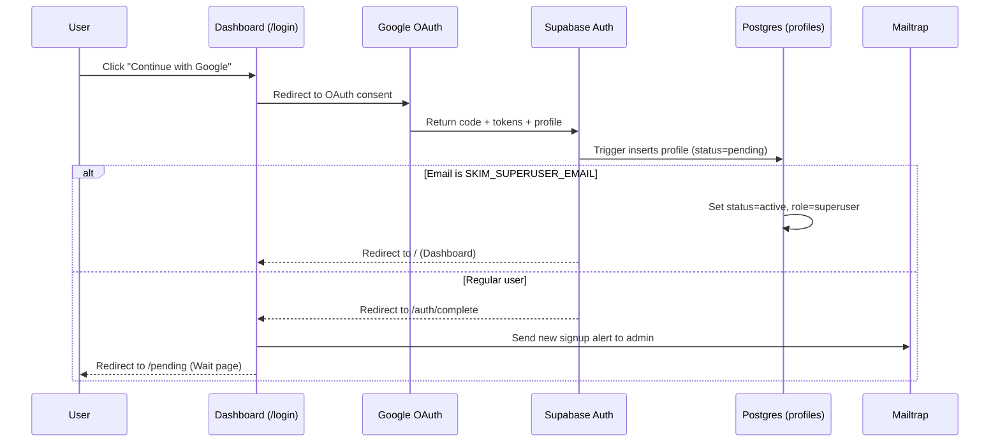

# Skim  -  Authentication, Admin Approvals & Digest Preferences

Authoritative reference for user authentication, invite-by-approval authorization, admin controls, and per-user digest personalization.

**Related documentation**

| Document | Scope |
|---|---|
| [docs/README.md](./README.md) | Central documentation directory index |
| [docs/architecture.md](./architecture.md) | System data model, RLS policies, and topology |
| [docs/vercel-deploy.md](./vercel-deploy.md) | Production Vercel deployment checklist |
| [docs/branding/README.md](./branding/README.md) | Google OAuth consent screen & branding assets |

---

## Table of Contents

1. [Access control model](#access-control-model)
2. [Authentication flows](#authentication-flows)
3. [User data collected](#user-data-collected)
4. [Database setup & migrations](#database-setup--migrations)
5. [Supabase Auth configuration](#supabase-auth-configuration)
6. [Environment variables](#environment-variables)
7. [Admin notifications](#admin-notifications)
8. [Digest preferences & personalization](#digest-preferences--personalization)
9. [Capacity & free tier math](#capacity--free-tier-math)
10. [Implementation map](#implementation-map)

---

## Access control model

Skim uses an **invite-by-approval** security model:
- Any user may initiate sign-up via Google OAuth or Email OTP.
- All new sign-ups enter a `pending` state (stored in `profiles.status`).
- Only the **superuser admin** (`SKIM_SUPERUSER_EMAIL`) has automatic approval and access to `/admin` to approve or reject members.
- Pending or rejected accounts are strictly gated by the routing gate (`proxy.ts`) and API middleware: they cannot view digests, execute searches, use RAG chat, or receive daily emails.

**Capacity:** Up to ~10 approved members + 1 superuser (~11 total) fits comfortably within free-tier quotas.

---

## Authentication flows

### A. Google OAuth (Sign up / Sign in)



1. User clicks **Continue with Google** on `/login`.
2. Google OAuth returns profile data to Supabase:
   - **Email** (verified by Google)
   - **Full name** → stored in `profiles.display_name`
   - **Avatar URL** → stored in `profiles.avatar_url`
   - **Provider** → `profiles.auth_provider = 'google'`
3. Supabase creates the `auth.users` row; the database trigger creates `profiles` with `status = 'pending'` (except superuser).
4. **Superuser** → automatically `status = 'active'`, redirected to `/`.
5. **Standard user** → redirected to `/pending`.
6. Admin receives an alert email with an approval link.

### B. Email OTP Sign-Up (New account registration)

Email OTP is reserved for **registering a new account**.

1. User opens `/login` → **Sign up** tab.
2. Enters email → Supabase sends a **6-digit verification code**.
3. User enters the OTP code → account is created in `auth.users` and `profiles` with `status = 'pending'`.
4. User is redirected to `/pending`.
5. Admin is notified via Mailtrap.

### C. Email OTP Sign-In (Returning approved users)

1. User opens `/login` → **Sign in** tab.
2. Enters email → Supabase sends a login OTP (`shouldCreateUser: false`).
3. If the account exists and `status = 'active'` → authenticated to dashboard (`/`).
4. If the account exists but is `pending` or `rejected` → redirected to `/pending`.
5. If no account exists → error: *"No account found. Use Sign up to request access."*

### D. Wait page (`/pending`)

Shown whenever `profiles.status` is `pending` or `rejected`.

| Element | Purpose |
|---|---|
| Status message | Explains that access requires administrator approval |
| **Contact Admin** button | Opens default mail client pre-addressed to `SKIM_ADMIN_CONTACT_EMAIL` |
| **Sign Out** button | Clears session cookies and returns to `/login` |

### E. Admin approval workflow (`/admin`)

1. Admin signs in → **Admin** link appears in navigation.
2. `/admin` loads pending users (name, email, auth provider, request timestamp).
3. **Approve action**:
   - Updates `profiles.status = 'active'` and `approved_at = NOW()`.
   - Inserts row into `digest_subscribers` (`active = true`).
   - Inserts default row into `user_digest_preferences`.
4. **Reject action**:
   - Updates `profiles.status = 'rejected'`.
   - User remains on `/pending` with a rejected notice.

---

## User data collected

| Field | Google OAuth | Email OTP | Stored in |
|---|---|---|---|
| Email | ✅ | ✅ | `profiles.email`, `auth.users` |
| Display name | ✅ (`full_name`) | Optional | `profiles.display_name` |
| Avatar | ✅ (`picture`) |  -  | `profiles.avatar_url` |
| Auth provider | `google` | `email` | `profiles.auth_provider` |
| Approval status | `pending` / `active` | same | `profiles.status` |
| Role | `member` (you: `superuser`) | same | `profiles.role` |

---

## Database setup & migrations

Apply migrations in order in the **Supabase SQL Editor**:

1. `sql/schema.sql` (articles, digests, pgvector, HNSW index)
2. `sql/002_users_auth_preferences.sql` (profiles, preferences, RLS, superuser seed)
3. `sql/003_fix_profiles_rls.sql` (admin RLS recursion helper `is_active_admin`)
4. `sql/004_search_fts.sql` (Postgres full-text search `search_vector` + GIN index)
5. `sql/005_hybrid_search.sql` (hybrid vector + FTS + RRF RPCs with `double precision`)
6. `sql/006_dashboard_theme.sql` (dashboard light/dark/system theme preference column)
7. `sql/007_preferences_insert_policy.sql` (RLS policy enabling preference record insertion)

---

## Supabase Auth configuration

### 1. Google OAuth Provider

1. Open [Google Cloud Console](https://console.cloud.google.com/) → **APIs & Services** → **Credentials**.
2. Create an **OAuth 2.0 Client ID** (Web application).
3. Add Authorized Redirect URI: `https://<project-ref>.supabase.co/auth/v1/callback`
4. In Supabase: **Authentication → Providers → Google** → Enable, enter Client ID and Secret.
5. Ensure scopes include `email`, `profile`, `openid`.
6. Configure consent screen branding per [docs/branding/README.md](./branding/README.md).

### 2. Email OTP Provider

1. In Supabase: **Authentication → Providers → Email** → Enable.
2. Enable **Confirm email**.
3. Select **Email OTP** with **6-digit code** (disable magic link for consistent UX).

### 3. Redirect URLs

In **Supabase → Authentication → URL Configuration**:

| Setting | Value |
|---|---|
| **Site URL** | `https://skim-azure.vercel.app` (or `http://localhost:3000` for dev) |
| **Redirect URLs** | `https://skim-azure.vercel.app/auth/callback`<br/>`https://skim-azure.vercel.app/auth/complete`<br/>`http://localhost:3000/auth/callback`<br/>`http://localhost:3000/auth/complete` |

---

## Environment variables

```bash
# dashboard/.env.local (and Vercel Project Settings)
NEXT_PUBLIC_SUPABASE_URL=https://xxxx.supabase.co
NEXT_PUBLIC_SUPABASE_PUBLISHABLE_KEY=eyJ...

SKIM_SUPERUSER_EMAIL=poudyal.sammit@gmail.com
SKIM_ADMIN_CONTACT_EMAIL=poudyal.sammit@gmail.com   # Shown on wait page & receives signup alerts

# Mailtrap HTTP API (Admin alerts & preview)
MAILTRAP_API_TOKEN=...
MAILTRAP_SENDER_EMAIL=digest@yourdomain.com
MAILTRAP_SENDER_NAME=Skim

# Server-side secrets
SUPABASE_SECRET_KEY=...
NEXT_PUBLIC_SITE_URL=https://skim-azure.vercel.app
```

---

## Admin notifications

When a user registers:
1. Supabase callback routes to `/auth/complete`.
2. `/auth/complete` triggers `sendAdminSignupNotification()` in `lib/mailtrap.ts`.
3. An email arrives at `SKIM_ADMIN_CONTACT_EMAIL` with user email, name, provider, and direct link to `/admin`.
4. Admin reviews pending requests on `/admin`.

---

## Digest preferences & personalization

Approved users manage preferences at `/settings`:

| Setting | Options | Default |
|---|---|---|
| **Email Theme** | Cyan (`cyan`), Classic (`classic`), Minimal (`minimal`) | `cyan` |
| **Email Format** | Full stories (`full`), Brief summaries (`brief`), Headlines only (`headlines`) | `full` |
| **Dashboard Theme** | `dark`, `light`, `system` | `dark` |
| **Max Stories** | 3 to 15 stories | 8 |
| **Topic Filters** | AI/ML, Engineering, Startups, Hardware, Security, Web | All enabled |
| **Email Delivery** | Enabled / Disabled toggle | Enabled |

The Python pipeline reads `user_digest_preferences` during daily compose (`pipeline/compose.py`) and renders personalized Jinja2 HTML for each recipient.

---

## Capacity & free tier math

| Service | Free Tier Allowance | Estimated Skim Usage (~11 Users) | Cost |
|---|---|---|---|
| **Mailtrap** | 1,000 emails/month | ~330 daily digests + alerts | $0/mo |
| **Supabase Auth** | 50,000 MAUs | 11 active users | $0/mo |
| **Gemini API** | Free tier per project | Pipeline + rate-limited chat | $0/mo |
| **Vercel** | Hobby Plan (Serverless) | Next.js 16 SSR + API routes | $0/mo |

---

## Implementation map

| Component / File | Purpose |
|---|---|
| `dashboard/src/app/login/page.tsx` | Login UI (Google OAuth & Email OTP tabs) |
| `dashboard/src/app/auth/callback/route.ts` | OAuth code exchange |
| `dashboard/src/app/auth/complete/route.ts` | Profile synchronization & admin alert dispatch |
| `dashboard/src/app/pending/page.tsx` | Wait-for-approval UI with mailto admin link |
| `dashboard/src/app/admin/page.tsx` | Admin user approval / rejection dashboard |
| `dashboard/src/proxy.ts` | Edge routing gate enforcing auth & profile status |
| `dashboard/src/lib/auth/require-active-user.ts` | API guard verifying active status on all `/api/*` |
| `sql/002_users_auth_preferences.sql` | Schema for profiles, preferences, and RLS |
| `sql/003_fix_profiles_rls.sql` | RLS recursion prevention |
| `sql/007_preferences_insert_policy.sql` | RLS policy for inserting preference records |
