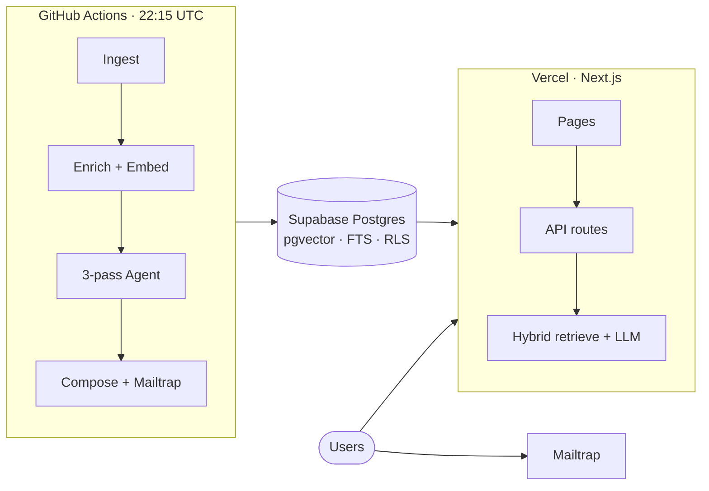

# Skim — Project Explained

A single, interview-ready walkthrough of **Skim**: what it is, how the pieces fit together, and deep answers to common technical questions grounded in the actual codebase.

**Related docs:** [architecture.md](./architecture.md) · [rag.md](./rag.md) · [dashboard.md](./dashboard.md) · [phase6_auth_admin_preferences.md](./phase6_auth_admin_preferences.md) · [root README](../README.md)

---

## Table of contents

1. [What Skim is](#1-what-skim-is)
2. [System at a glance](#2-system-at-a-glance)
3. [Daily pipeline (Python)](#3-daily-pipeline-python)
4. [Dashboard (Next.js)](#4-dashboard-nextjs)
5. [Data, search, and RAG](#5-data-search-and-rag)
6. [Auth, admin, and personalization](#6-auth-admin-and-personalization)
7. [Deployment and reliability](#7-deployment-and-reliability)
8. [Tech stack cheat sheet](#8-tech-stack-cheat-sheet)
9. [Skim deep-dive question bank (50)](#9-skim-deep-dive-question-bank-50)
10. [General interview questions (extra)](#10-general-interview-questions-extra)
11. [How to talk about Skim in interviews](#11-how-to-talk-about-skim-in-interviews)
12. [Quick numbers & further reading](#quick-numbers-to-memorize)

---

## 1. What Skim is

Skim is a **production tech-news intelligence product** with two halves that share one database:

| Half | Role |
|------|------|
| **Python batch pipeline** | Runs once a day on GitHub Actions: ingest HN + RSS + APIs → enrich full text → embed → multi-pass LLM editorial agent → compose personalized HTML digests → email via Mailtrap |
| **Next.js dashboard** | Runs on Vercel: Google OAuth / email OTP, admin approval, today’s digest + archive, hybrid search, RAG chat with citations, settings |

There is **no always-on ingestion server**. The dashboard never calls the Python process; both sides talk to **Supabase Postgres** (pgvector + FTS + RLS).

**Live:** [skim-azure.vercel.app](https://skim-azure.vercel.app)

### Problem it solves

Tech readers face a firehose: HN, company blogs, security feeds, product launches. Skim turns that into:

1. A **morning email** with a small, ranked set of stories and short “why it matters” insights  
2. A **searchable archive** (keyword + semantic)  
3. A **cited chat** over the corpus when you have a specific question  

### What makes it “systems” work (not just a demo)

- Real **batch idempotency** (don’t double-send digests)  
- Real **auth + RLS** (invite-by-approval, admin queue, member cap)  
- Real **provider failure modes** (Gemini quotas → key rotate → Groq → degraded digest)  
- Real **production constraints** (Vercel serverless embeddings, GHA IPv4 → Supabase pooler)  
- Automated tests on both sides (pytest + Vitest) gating PRs

---

## 2. System at a glance

**Integration pattern:** database-as-interface. The pipeline writes articles, embeddings, insights, and digests. The dashboard reads them under RLS and runs its own retrieval + chat LLM path for interactive features.

### Why not a FastAPI/Express always-on API for the pipeline?

The ingest/agent workload is **batch and bursty** (once/day, multi-minute LLM work). An always-on server would sit idle most of the day and still need a scheduler. Cron on GitHub Actions matches the workload shape; the dashboard’s Next.js Route Handlers cover interactive APIs (search, chat, settings, admin).

### Request paths (mental model)

| User action | Path |
|-------------|------|
| Open today’s digest | Vercel SSR → Supabase (RLS) → HTML |
| Search | Browser → `/api/search` → embed query → hybrid RPC → JSON |
| Chat | Browser → `/api/chat` → retrieve → Gemini/Groq → JSON + citations |
| Save settings | Browser → `/api/settings/preferences` → preferences row |
| Admin approve | Browser → `/api/admin/users` → profiles + subscribers |
| Morning email | GHA → pipeline → compose → Mailtrap (no browser involved) |

---

## 3. Daily pipeline (Python)

**Entry:** `python -m pipeline.main`  
**Schedule:** `.github/workflows/digest.yml` → cron `15 22 * * *` (**22:15 UTC**), plus `workflow_dispatch`.

### Stages (in order)

1. **Idempotency check** — `digest_already_sent(run_date)`; unique `digests.digest_date`.
2. **Ingest** — Hacker News, Dev.to, Lobsters APIs + ~13 RSS/Atom feeds (`feedparser`).
3. **English heuristic filter** — skip titles/summaries with high non-ASCII ratio.
4. **URL dedup** — normalize URL → in-batch set → DB lookup → `UNIQUE(url)` + `ON CONFLICT DO NOTHING`.
5. **Enrichment** — scrape article pages: Trafilatura → BeautifulSoup `
` → OpenGraph → feed summary; store as `raw_text` (async, max 10 connections).
6. **Embed** — `all-MiniLM-L6-v2`, 384-dim, L2-normalized; text = `title + summary` (not chunked).
7. **Agent (3 passes)** — classify (topic + importance) → insight generation → holistic story selection (default ~8 stories).
8. **Compose** — Jinja2 HTML only (no LLM): theme / format / topic filters / max_stories per subscriber.
9. **Email** — Mailtrap Send API; log `pipeline_runs`.

### Sources (current config)

- **APIs:** Hacker News, Dev.to, Lobsters  
- **RSS/Atom:** GitHub Blog, Simon Willison, InfoQ, BleepingComputer, The Register, Phoronix, Hugging Face, Cloudflare, TechCrunch, Ars Technica, The Verge, MIT Tech Review, Wired  

### Reliability

- Per-source try/except so one dead feed does not kill the run  
- Exponential backoff on network/LLM  
- Gemini multi-key rotation + model fallbacks → Groq last resort  
- Degraded digests (titles/summaries) if agent fully fails  
- Failure alert email + always-run health check step  

---

## 4. Dashboard (Next.js)

**Stack:** Next.js App Router, React, TypeScript, Tailwind, Zustand  
**Host:** Vercel (`dashboard/` as root)

| Route | Purpose |
|-------|---------|
| `/` | Today’s digest |
| `/archive` | Past digests by date |
| `/search` | Hybrid search UI |
| `/chat` | RAG Q&A (20 queries/user/day) |
| `/settings` | Email + dashboard preferences, digest preview |
| `/admin` | Approve / reject pending users |
| `/login`, `/pending` | Auth and wait states |

API routes under `/api/*` call `requireActiveUser()`, then Supabase RPCs / LLM clients. See [dashboard.md](./dashboard.md).

---

## 5. Data, search, and RAG

### Core tables

`articles` (url unique, embedding `vector(384)`, FTS `search_vector`, topic/insight/scores) · `digests` · `profiles` · `user_digest_preferences` · `digest_subscribers` · `chat_usage` · `pipeline_runs`

### Hybrid retrieval (why this shape)

News queries are messy: sometimes the user types exact tokens (“OpenAI o3”), sometimes intent (“why are inference costs dropping?”). Neither pure keyword nor pure vector wins alone.

1. Embed query (MiniLM; HF Inference on Vercel)  
2. Vector search (`<=>` cosine ops on HNSW)  
3. FTS (`english` config, `websearch_to_tsquery`, GIN)  
4. **RRF:** \(0.55/(60+r_v) + 0.45/(60+r_f)\)  
5. Importance boost: `rrf * (1 + importance_score / 25)` — editorial signal from the agent influences interactive search too  
6. Chat: top articles → prompt with `[1][2]` citation rules → Gemini → Groq  

**Fallback ladder** if hybrid RPC fails: in-process RRF → vector-only → FTS → `ILIKE`. That keeps search usable even when one path breaks.

Details: [rag.md](./rag.md).

### What is stored vs computed

| Stored on article | Computed at request/email time |
|-------------------|--------------------------------|
| title, url, summary, raw_text | personalized theme/format filters |
| embedding, search_vector | hybrid rank for a query |
| topic, importance, insight | chat answer + citations |
| digest membership | HTML email body per subscriber |

---

## 6. Auth, admin, and personalization

- **Identity:** Supabase Auth — Google OAuth + email OTP  
- **Gate:** new users `profiles.status = pending` until admin approves (superuser email auto-active)  
- **Cap:** 10 active members excluding superuser  
- **Personalization:** applied at **compose / query time** (theme, format, max_stories, topic_filters, dashboard_theme) — the shared article corpus and agent insights are **not** recomputed per user  

---

## 7. Deployment and reliability

| Piece | Where |
|-------|--------|
| Pipeline | GitHub Actions runners (`ubuntu-latest`), job timeout 360m |
| Dashboard | Vercel serverless |
| DB / Auth | Supabase (use pooler port **6543** from GHA — IPv4) |
| CI | `test.yml` — pytest + Vitest |

Sentence-transformers artifacts are **cached** in Actions (`~/.cache/huggingface`, torch ST cache).

---

## 8. Tech stack cheat sheet

| Layer | Choice |
|-------|--------|
| Pipeline | Python 3.11, feedparser, Trafilatura, BeautifulSoup, sentence-transformers, Jinja2 |
| LLM | Gemini (primary, key rotate) → Groq `openai/gpt-oss-120b` |
| DB | Supabase Postgres, pgvector **HNSW** `vector_cosine_ops`, FTS english |
| Embeddings | `all-MiniLM-L6-v2` (384), L2 normalized |
| Email | Mailtrap |
| Dashboard | Next.js, TypeScript, Tailwind, Zustand |
| Auth | Supabase Auth + RLS |

---

## 9. Skim deep-dive question bank (50)

Answers below are written as you would say them in an interview: grounded in how Skim actually works, honest about gaps, and specific where numbers exist in code.

### Part A — Systems & retrieval (1–30)

---

#### 1. What exactly is feedparser parsing — RSS, Atom, or both? What happens when a feed is malformed?

**Both.** `feedparser` auto-detects RSS and Atom. Skim’s live feed list includes classic RSS (e.g. TechCrunch) and Atom (e.g. Simon Willison, The Register).

On malformed XML, feedparser does not throw hard; it typically yields **empty `entries`**, and our adapter returns `[]`. Network failures are retried with backoff; each source is wrapped so one bad feed does not abort the whole ingest. Sparse entries (missing date/summary) are allowed; empty URLs after normalization are dropped.

---

#### 2. Where does your GitHub Actions cron job actually run, and what happens if two scheduled runs overlap?

It runs on **GitHub-hosted `ubuntu-latest` runners** — ephemeral VMs, not our Vercel app. Schedule in `digest.yml` is **`15 22 * * *` (22:15 UTC)**.

There is **no** workflow-level `concurrency:` cancel. Overlap is handled in the **app**:

- `digest_already_sent(run_date)` short-circuits a second run for the same day  
- `digests.digest_date` is **UNIQUE**  
- article inserts use `ON CONFLICT DO NOTHING` on URL  

So a delayed/overlapping job should exit early or no-op on digest write rather than double-emailing.

---

#### 3. Sentence-Transformers loads a model into memory on every run — how long does cold-start take, and did you consider caching the model artifact?

Cold start on a fresh runner is typically **tens of seconds to a couple of minutes** depending on cache hit and HF rate limits (downloading `all-MiniLM-L6-v2`). Within a process we use a **module-level lazy singleton** (`get_model()`), so we load once per job, not once per article.

Yes, we cache: GitHub Actions caches Hugging Face / sentence-transformers directories with key `st-all-MiniLM-L6-v2-v1`. `HF_TOKEN` helps avoid anonymous download throttling. On Vercel we do **not** load ST locally for queries — we call the **Hugging Face Inference API** because `@xenova/transformers` was unreliable in serverless.

---

#### 4. What is "enrichment" concretely doing to a raw article before storage? Name every transformation step.

At ingest time, roughly:

1. Fetch adapter payload (API JSON or feedparser entry)  
2. Normalize URL (lowercase host, strip `www.`, strip `utm_*` / `ref` / `source`, drop fragment)  
3. Strip HTML from feed summary (BeautifulSoup) → collapse whitespace → cap at **1000 chars**  
4. English heuristic filter on title/summary  
5. Dedup (in-batch + DB + unique constraint)  
6. **Page scrape cascade** into `raw_text`: Trafilatura (keep if >100 chars) → BS4 all `
` → OpenGraph `og:description` → else feed summary  
7. Insert row: title, url, source, published_at, summary, raw_text  

**Later (not at insert):** embeddings from `title + summary`; agent writes `topic`, `importance_score`, `insight`, `key_takeaway`.

---

#### 5. How do you define a "duplicate" article — exact URL, title similarity, or embedding distance? What threshold, and why that number?

**Exact normalized URL only.** No title fuzzy match, no embedding-distance dedup, **no similarity threshold**.

Why: for news URLs, the canonical link is the durable identity; fuzzy title matching has high false-positive risk across different outlets covering the same story. The DB enforces `url TEXT UNIQUE`. Normalization removes tracking params so `?utm_source=...` does not create clones.

---

#### 6. If two articles about the same event are worded completely differently, does your dedup catch them? Prove it.

**No.** Same-event, different outlets = **two rows**. That is intentional for a multi-source digest: TechCrunch vs Ars on the same launch should both be ingestible; the **agent selection pass** is where editorial redundancy is reduced, not the deduper.

Proof from design: dedup code path only compares normalized URL strings / unique constraint — there is no cosine gate at insert. If you want near-duplicate clustering, that would be a separate post-ingest step (embedding distance or MinHash), which we have not shipped.

---

#### 7. Why 384 dimensions specifically for MiniLM — what's the actual trade-off against a 768-dim or 1024-dim embedding model?

`all-MiniLM-L6-v2` outputs **384**. Trade-offs vs larger models:

| | 384 MiniLM | 768 / 1024 |
|--|------------|------------|
| Quality | Strong for short news titles+summaries | Better nuance on long docs |
| Cost / speed | Fast local encode; small index | Heavier RAM, slower HNSW |
| Ops | One space for pipeline + dashboard | Must re-embed everything on swap |

We also **rejected mixing** Gemini 768-dim embeddings with MiniLM — different spaces break similarity. Free-tier / local ingest volume favors MiniLM.

---

#### 8. Explain cosine similarity vs. dot product for your embeddings — did you normalize vectors, and does it matter here?

We store with **`vector_cosine_ops`** and score as `1 - (embedding <=> query)`. Encode uses **`normalize_embeddings=True` (L2)**.

After L2 normalization, **cosine similarity equals dot product** (and is monotone with Euclidean distance on the unit sphere). Normalization matters so magnitude (document length quirks) does not dominate “meaning” similarity. If we had skipped normalize but used cosine ops, Postgres still computes cosine; normalizing keeps behavior consistent with the library defaults and any client-side math.

---

#### 9. Postgres full-text search uses tsvector/tsquery under the hood — what language config are you using, and does it handle non-English source content?

Config is **`english`** (`to_tsvector('english', ...)` and `websearch_to_tsquery('english', ...)`). Stemming/stopwords are English-centric.

Non-English content: we already **filter aggressively at ingest** with a non-ASCII heuristic, so most corpus text is English. Remaining foreign tokens get weaker stemming; FTS quality degrades. We do not use `simple` or multi-config columns today.

---

#### 10. How do you combine a dense vector score and a full-text rank score into one ranking? What's your fusion formula?

**Reciprocal Rank Fusion** with weights (defaults in `005_hybrid_search.sql` / dashboard RRF):

\[
\text{rrf} = 0.55 \cdot \frac{1}{60 + \mathrm{rank}_{vector}} + 0.45 \cdot \frac{1}{60 + \mathrm{rank}_{fts}}
\]

Then importance rerank:

\[
\text{adjusted} = \mathrm{rrf} \times \left(1 + \frac{\mathrm{importance\_score\,(or\,5)}}{25}\right)
\]

We fuse **ranks**, not raw scores, so vector cosine and `ts_rank_cd` stay on comparable footing.

---

#### 11. What index type backs your pgvector column — IVFFlat or HNSW — and why? What's the recall/speed trade-off you chose?

**HNSW** on `embedding vector_cosine_ops`.

We tried **IVFFlat** early (`lists=100`) on a **small** corpus (~100 rows) and recall collapsed — lists were oversized relative to data. HNSW gives high recall without list tuning and is the right default for a growing-but-still-modest article table. Trade-off: HNSW build/memory cost is higher than IVFFlat, but query quality mattered more than micro-optimizing insert speed.

---

#### 12. At what row count does an IVFFlat index need to be rebuilt/retuned, and would you know if yours was stale right now?

Rule of thumb: IVFFlat `lists` is often ~`sqrt(n)` or `n/1000` depending on guidance; when `n` grows by an order of magnitude you retune/rebuild. **We are not on IVFFlat anymore**, so this does not apply operationally.

Would we know if an IVFFlat index were stale? Not automatically — Postgres will not alert “lists too high.” You discover it via **eval queries / recall tests**. That pain is exactly why we switched to HNSW for Skim’s scale.

---

#### 13. Walk me through what happens, step by step, when your Gemini call fails — timeout, rate limit, and malformed-response cases separately.

Shared pattern (pipeline `llm_client` + dashboard chat client): multi-key Gemini pool → model fallbacks → Groq.

| Failure | Behavior |
|---------|----------|
| **Timeout** | Gemini ~**60s**, Groq ~**30s**. Retry with backoff (up to ~3). Then next key / next model / Groq. |
| **Rate limit (429)** / auth-ish **400–404** | Rotate API key; continue. Sustained Gemini pain → fallback models; consecutive **503/504** can force model switch (high-demand path). |
| **Malformed / non-structured response** | Agent expects function-calling / parseable JSON. Parse failure → retry or skip that batch item; selection can fall back to score-sorted articles; extreme case → **degraded digest** without insights. Chat path returns an error to the UI with retry. |

Insight concurrency drops to **1** on Groq to reduce free-tier pressure.

---

#### 14. How do you prevent the Groq fallback from producing a different citation format than Gemini would have?

Citation format is enforced in the **prompt contract**, not by the provider: numbered sources `[1]`, `[2]`, combinations `[1][3]`, only from the retrieved list. Same prompt builder feeds Gemini and Groq.

We do **not** have a hard post-validator that rejects answers with illegal citation shapes (soft constraint). Provider swap can still change prose style; format drift is mitigated by shared instructions + temperature **0.3**, not by a separate Groq-specific template.

---

#### 15. Your daily digest — is it generated by one giant prompt or composed from smaller retrieved chunks? Justify the choice.

**Neither one-shot “write the email” nor RAG-chunk composition.** It is a **3-pass agent** over ingested articles:

1. Classify batches (topic + importance)  
2. Generate insights for top candidates  
3. Holistically select ~7–10 stories  

Then **Jinja2** composes HTML from structured fields.

Why: one giant prompt is harder to test, more failure-prone under token limits, and conflates scoring with prose. Multi-pass gives inspectable intermediate state (`importance_score`, `insight`) reused by the dashboard and email.

---

#### 16. How do you stop the LLM from citing a source it never actually retrieved?

**Prompt grounding:** only the retrieved article list is passed, labeled `[1]…[n]`, with instructions to cite only those IDs. Retrieval happens **before** generation; the model never gets the full DB.

Gaps: we do not currently run a strict citation-ID allowlist filter that strips hallucinated numbers. Trust is “retrieve-then-constrain,” plus human-visible source cards in the UI. A production hardening step would parse `[n]` and drop/flag out-of-range citations.

---

#### 17. What's your chunking strategy for long articles before embedding — fixed token windows, sentence-based, or something else? Why?

**No chunking.** One article → one vector from **`title + summary`** (summary capped ~1000 chars). Full `raw_text` is stored for enrichment/future use but **not** embedded today.

Why: digest/search UX is title+blurb oriented; MiniLM’s context is limited; chunking multiplies rows and complicates “one card = one article” ranking. Trade-off: long-body nuance is underrepresented in vectors — acceptable for news headlines, weaker for deep-paper Q&A.

---

#### 18. If a source website changes its HTML structure, how much of your scraping breaks, and how would you detect that silently happening?

RSS/API ingest still works (titles/links/summaries). **Enrichment** (`raw_text`) is what breaks: Trafilatura/BS4/OG cascade may return short/empty text; we fall back to feed summary.

Detection today is weak/silent: no dedicated “extractor quality” alert. Practical signals: shorter average `raw_text`, more nulls, benchmark script (`pipeline/scripts/benchmark_sources.py` → `docs/sources_and_scrapers_benchmark.md`), and digest quality review. Proper fix: track enrichment success rate in `pipeline_runs` and alert on drops.

---

#### 19. Concurrent scraping with Trafilatura/BeautifulSoup — how many concurrent requests, and how do you avoid getting IP-blocked?

Enrichment uses `httpx.AsyncClient` with **`max_connections=10`**, **10s timeout**, polite `User-Agent: Skim/1.0`. RSS fetch is sequential per feed with retry.

We do **not** rotate proxies or implement per-domain rate limiters beyond connection caps. Avoiding bans is mostly: low daily volume, small concurrency, official APIs where possible (HN/Dev.to/Lobsters), and accepting that some sites **403** (seen in benchmarks, e.g. openai.com/news).

---

#### 20. What does your "LLM classification score" actually optimize for, and how did you validate it correlates with real quality?

`importance_score` is a **1–10 editorial judgment** from the classify prompt (impact / relevance for a tech-news reader), not a calibrated probability.

Validation is mostly **offline judgment + digest spot checks**, not a labeled IR metric yet. An agent eval dataset (held-out labeled articles) was planned but is still a gap. Downstream we use the score for insight candidacy thresholds and RRF importance boost — so errors bias both email and search ranking.

---

#### 21. How would an attacker poison your digest by publishing a malicious RSS feed with prompt-injection content in the article body?

If we added their feed (or they compromised a trusted feed), injection text in title/summary/`raw_text` could influence **classify/insight/select** prompts and, later, **RAG chat** if retrieved.

Mitigations we have: curated source list (not open submission), admin-gated product, content treated as untrusted data in principle — but we do **not** have a dedicated prompt-injection sanitizer or “untrusted content” delimiters hardened against all attacks. Defense in depth would: isolate retrieved text in clear boundaries, strip instruction-like patterns, restrict tools, and never let article text change system policy.

---

#### 22. Supabase auth supports Google OAuth, email OTP, and password — what happens if the same email signs up via two different methods?

Skim uses **Google OAuth + email OTP** (not a first-class password flow in the product UX). Profiles key off `auth.users.id`; `profiles.email` is **UNIQUE**.

If Supabase treats the second method as a **separate** auth user, the second profile upsert can **conflict on email**. Ideal path is identity linking in Supabase Auth; we do not ship a custom `linkIdentity` UX. Operationally: prefer one method per email, or resolve in Supabase dashboard. `auth_provider` is stored for visibility.

---

#### 23. Your admin moderation panel — what's the actual moderation action doing to the database state?

**Approve:** `profiles.status = 'active'`, set `approved_at` / `approved_by`; upsert `digest_subscribers`; ensure `user_digest_preferences`; send welcome email; enforce **≤10** active non-superuser members (409 if full).

**Reject:** `profiles.status = 'rejected'`.

Pending users cannot pass middleware / `requireActiveUser()` into app APIs.

---

#### 24. How do personalized UI preferences interact with the shared/global daily digest — is personalization applied at query time or storage time?

**Storage-time (global):** shared articles, embeddings, topics, insights, digest article_ids.

**Compose / query-time (per user):** email theme, format, `max_stories`, `topic_filters`, `email_enabled`, dashboard light/dark/system. `compose_digest` filters the same selected stories per subscriber; Settings preview hits the same path. We do **not** re-run the agent per user.

---

#### 25. What's your P99 latency for a user query end-to-end (retrieval + LLM), and where's the bottleneck?

We do **not** have a production APM P99 dashboard published. Empirically:

- **Search (retrieval only):** typically sub-second to a few seconds — bottleneck is **query embedding** (HF Inference on Vercel) more than Postgres.  
- **Chat:** often **several seconds**; bottleneck is **LLM generation** (Gemini/Groq), then embedding, then RPC.

Honest interview answer: measure with Vercel analytics / timed logs before quoting a hard P99; architecture-wise LLM >> DB.

---

#### 26. If Supabase goes down for 10 minutes, what does a user see, and what silently breaks in the ingestion pipeline?

**Users:** login/session refresh fails; SSR pages and `/api/*` error; empty/error UI with retry — no offline corpus cache.

**Pipeline:** ingest/embed/agent/email all need DB writes/reads — the run fails, `pipeline_runs` may not record cleanly, failure alert should fire. Cron does not queue independently of Postgres. Digests are not sent without DB idempotency + subscriber reads.

---

#### 27. How do you version your embedding model — if you swap MiniLM for a newer model, do you re-embed the entire historical corpus?

Today: **single live space**, no embedding-version column. Swapping models **requires re-embedding all rows** (and ideally a dual-write/backfill window). Mixing dims/spaces without rebuild silently corrupts search — we already learned that mixing Gemini-768 with MiniLM-384 was a mistake.

---

#### 28. What's stopping someone from scraping your own digest and calling it their own product? Does that matter to your design?

Technically little beyond **auth gate**, rate limits (chat 20/day), and MIT license on the **code**. Email HTML and public marketing pages can be scraped like any site.

Does it matter? For a portfolio/small invite-only product, **distribution and pipeline reliability** matter more than DRM. If it were a commercial moat play: signed emails, no public archive, ToS, watermarking, anomaly detection — not current priorities.

---

#### 29. Estimate your monthly LLM API cost at 10x current traffic — walk through the math.

Order-of-magnitude (free-tier oriented; replace with your real invoices):

**Current shape (illustrative):**

- Pipeline/day: classify ~50 articles in batches of 5 ≈ 10 calls; insights ~12; select 1 → ~25 Gemini calls/day  
- Chat: ≤20/user/day × ~10 users = ≤200 chat completions/day (usually far less)  

**10× users (100) + same pipeline:**

- Pipeline LLM ≈ same order (still one daily batch) unless you personalize per user with extra LLM  
- Chat ≤2000/day  

If average chat completion ≈ $0.001–0.01 on mid-tier flash (wildly provider-dependent), chat alone ≈ **$60–$600/month** at the high end of that toy range; pipeline remains comparatively small. Embedding via HF and Mailtrap scale separately.

**Interview move:** show the drivers (chat dominates at 10× users; pipeline is O(articles) not O(users) today) rather than a fake precise dollar figure.

---

#### 30. If you had to remove the vector search entirely and rely only on full-text search, how much would answer quality degrade, and how would you measure that degradation?

Degradation is **query-dependent**: keyword-heavy queries (“CVE-2024-…”, exact product names) stay decent; paraphrase / conceptual queries (“why are vector databases taking off?”) lose a lot without dense retrieval.

**Measure:** build a 20–50 query gold set with relevant article IDs; compare Recall@k / nDCG for `hybrid` vs `fts-only` vs `vector-only`; for chat, side-by-side faithfulness + citation accuracy. Skim already has mode fallbacks (`hybrid` → vector → FTS → ILIKE) — an ablation harness is the missing piece, not the ability to disable vectors.

---

### Part B — Experience, judgment, and product (31–50)

---

#### 31. What was the single hardest technical problem you hit building Skim, and how did you actually solve it (not just "I fixed it")?

**pgvector recall on a tiny corpus with IVFFlat.** Early index params assumed a larger table; similarity search returned nonsense. Debugging meant comparing sequential scan vs indexed results, reading pgvector ops classes, and recognizing **lists ≫ row count** destroys IVFFlat. Fix: migrate to **HNSW + cosine ops**, standardize on **384-dim MiniLM**, and add hybrid FTS so keyword queries still work when vectors miss.

Runner-up: **Gemini free-tier quotas** killing digests — solved with multi-project key rotation, model fallbacks, Groq last resort, and degraded digest path.

---

#### 32. Did you ever consider using a managed vector DB (Pinecone, Weaviate) instead of pgvector, and why did you stick with Postgres?

Yes. Pinecone/Weaviate would simplify ANN ops, but for Skim’s scale they add **another bill, another auth surface, and split brain** vs relational data (digests, RLS, FTS). Hybrid SQL RPCs (vector + FTS + RRF) in one Postgres is operationally simpler for an invite-only product. Revisit managed vector DB if corpus hits millions and HNSW maintenance becomes painful.

---

#### 33. What was your biggest wrong assumption going in, and when did you discover it was wrong?

**Assumption:** “Embeddings on Vercel are just like local sentence-transformers.”  
**Reality:** `@xenova/transformers` in serverless was flaky; chat/search broke in production while working locally. Discovered on **Vercel deploy smoke tests**. Fix: HF Inference API + `HF_TOKEN` for query embeddings in production.

Second wrong assumption: IVFFlat “just works” out of the box for any table size.

---

#### 34. Describe a moment the ingestion pipeline broke in a way you didn't anticipate — what was the root cause?

Examples from the build log:

- **GHA → Supabase direct DB URL over IPv6** failed on IPv4-only runners → switched to **Supavisor pooler :6543**.  
- **Insight pass runtime** ballooned (~minutes) and risked job timeout → parallelize insights (concurrency 3) and tighten candidate limits.  
- **Feed/HTML edge cases** (403 sites, huge feeds like HF blog with hundreds of entries) — mitigated with `limit=30` and extractor fallbacks, not by assuming every URL returns clean article text.

---

#### 35. What's the most difficult trade-off you made — e.g., freshness vs. cost, or dedup accuracy vs. speed — and how did you decide?

**URL-exact dedup vs semantic near-duplicate collapse.** Exact URL is fast, deterministic, and safe; it **keeps** multi-outlet coverage of the same event. Semantic dedup would save reader attention but risks dropping legitimate distinct analysis. We pushed redundancy handling into the **selection agent** and `max_stories` / topic filters instead of aggressive ingest dedup.

Close second: **free-tier LLM cost/latency vs digest richness** — 3-pass agent is slower/more calls than one-shot, but quality and testability won.

---

#### 36. If you had unlimited budget, what's the first thing you'd change about the LLM fallback chain?

Replace “rotate free keys until something answers” with a **primary paid tier + explicit SLO**:

- Dedicated production Gemini/Anthropic/OpenAI with reserved capacity  
- Structured output / tool calling with schema validation  
- Separate small model for classify vs larger for insights  
- Observability: per-provider latency, error budget, automatic canary  

Groq stays as hard failover, not a quality peer you land on after thrashing keys.

---

#### 37. What metric do you actually use to say Skim "works" — and what does the current number look like?

Operationally: **`pipeline_runs` success**, digest sent flag, CI green (pytest + Vitest), and manual smoke (`/`, search, chat). Product quality is still mostly **editorial eyeballing** of email + chat citations — not a published weekly nDCG.

Honest number to cite in interview: consecutive successful daily runs / alert rate, plus “chat answers include grounded sources in spot checks” — and acknowledge offline eval is the next maturity step.

---

#### 38. What's something you built that turned out to be unnecessary or over-engineered in hindsight?

- Early **Gemini embedding path / mixed dimensions** — complexity without benefit once MiniLM was standardized.  
- Over-reliance on **IVFFlat tuning** instead of picking HNSW sooner.  
- Some experimental scraper breadth beyond what the digest editor actually needs when feed summaries are already good enough for embedding.

---

#### 39. What would you do differently if you started Skim from scratch today?

1. Start with **HNSW + MiniLM + FTS** on day one (skip IVFFlat detour).  
2. Add an **eval set** before polishing UI.  
3. Log enrichment success rates from the start.  
4. Use **HF Inference (or a tiny embed service)** for dashboard queries from day one on Vercel.  
5. Keep the DB-as-interface split — that part aged well.

---

#### 40. How did you validate that source-cited answers were actually trustworthy before shipping that feature?

Methods used: hand-crafted questions against known articles, verifying citation numbers map to retrieved cards in the UI, testing failover Gemini→Groq for format sanity, and quota gating so abuse cannot burn keys.

What we did **not** fully do: automated citation entailment tests or red-team prompt injection suite. Trustworthy = “retrieved-then-prompted + human spot check,” not formal guarantees.

---

#### 41. What was the most surprising failure mode you discovered only after deploying, not while developing locally?

**Production-only embedding / auth cookie issues on Vercel** — local Node could run transformers or slightly different cookie redirect handling; production serverless and OAuth redirect cookie setting failed in ways localhost never showed. Also **Supabase connection** differences (pooler vs direct) showed up on Actions, not on a laptop VPN path.

---

#### 42. Why RSS/HN as your data sources specifically — what other sources did you consider and reject?

HN + major tech RSS give **high-signal, linkable, frequently updating** tech news with stable APIs/feeds. We expanded to Dev.to, Lobsters, and more blogs (Cloudflare, HF, Register, etc.).

Considered/rejected or deferred: **arXiv** (different reading modality, PDF-heavy), indiscriminate web crawl (legal/quality), Twitter/X firehose (auth/ToS/noise), paywalled full text (fragile). Benchmarks also showed some sites hard-block scrapers (403).

---

#### 43. What's the biggest unsolved problem in Skim right now that you're aware of but haven't fixed?

**Lack of a quantitative retrieval/agent eval loop** — we can ship features without knowing if last week’s prompt change improved or hurt ranking. Adjacent gaps: prompt-injection hardening, embedding model versioning/backfill tooling, and silent enrichment quality monitoring.

---

#### 44. How do you know your daily digest is actually good, versus just "it runs without crashing"?

Today: successful `pipeline_runs`, non-empty story set, reading the email/HTML preview, checking insights aren’t empty, and user/admin feedback. That separates “up” from “good” only partially.

Better bar: labeled preference pairs (story A vs B), weekly precision of selected topics, unsubscribe/open rates if email analytics exist, and agent eval accuracy on importance/topic.

---

#### 45. What was the learning curve like adopting pgvector — what tripped you up initially?

Tripping hazards: **ops class choice** (cosine vs L2), **similarity vs distance** (`<=>` returns distance), **index type vs data size**, **dimension mismatches**, and RPC type mismatches (`real` vs `double precision` breaking hybrid functions). Mental model shift: vectors are just another indexed column — until recall silently dies and you need eval queries.

---

#### 46. If a recruiter asked "why should I care about this project," what's your 30-second pitch?

“Skim is a live product, not a toy notebook: a daily Python agent pipeline curates tech news into personalized emails, and a Next.js app lets users search and chat over the corpus with hybrid RAG on Postgres. I owned ingestion, embeddings, LLM failover, auth/RLS, and production deploy on Actions + Vercel — the kind of end-to-end AI systems work that breaks in real quotas, indexes, and serverless constraints.”

---

#### 47. What part of Skim took far longer than you expected, and why?

**Making production chat/search reliable** — not the happy-path RAG demo. Embeddings on Vercel, RLS edge cases (admin recursion, preferences INSERT policy), OAuth cookie redirects, and Gemini quota gymnastics consumed disproportionate time versus building the first dashboard page.

Pipeline insight latency / CI timeouts were a close second.

---

#### 48. How do you handle scope creep — did Skim's feature list grow beyond your original plan, and how did you decide what to cut?

Yes: from “email digest cron” → dashboard → hybrid RAG → admin approval → themes → analytics screenshots, etc.

Cuts / deferrals: heavy agent eval harness, arXiv, demo video polish, semantic near-dup clustering, managed vector DB. Decision filter: **does it teach a new systems skill or unblock real users on free-tier constraints?** If it’s pure chrome, park it.

---

#### 49. What's one piece of feedback (from a user, mentor, or yourself in hindsight) that changed the project's direction?

**“Local works isn’t shipped.”** Production Vercel + Actions failures forced architecture changes (HF embeddings, pooler URL, HNSW, RLS fixes). Also the realization that **one shared Postgres** beats a separate vector product for this stage — pushed hybrid SQL retrieval instead of bolting on Pinecone.

Invite-only approval came from quota reality: open signup would burn Gemini/Mailtrap instantly.

---

#### 50. If this had to run unattended for 6 months with zero maintenance, what would break first?

Most likely, in order:

1. **LLM provider free-tier / model deprecations** (model IDs change; quotas tighten)  
2. **RSS/HTML extractor drift** or feed URL moves  
3. **GitHub Actions / third-party secret expiry**  
4. **Supabase disk/plan limits** as articles accumulate  
5. Silent quality decay without eval alerts  

Least likely first: the Jinja templates or Next.js static shell — the fragile plane is **external APIs + unmonitored content extraction**.

---

## 10. General interview questions (extra)

These are the broader questions interviewers ask after (or instead of) Skim-specific deep dives. Answers stay tied to Skim so you can bridge theory → shipping experience.

### A. Architecture & system design

---

#### G1. Walk me through your GitHub — which project best represents your engineering ability, and why?

Skim. It is end-to-end: ingestion, embeddings, multi-pass LLM agent, email product, authenticated dashboard, hybrid RAG, CI, and production deploy. It shows I can own **batch systems and interactive web**, not just UI or just notebooks. Failures I hit (IVFFlat recall, Vercel embeddings, RLS recursion, Gemini quotas) are the kind of problems real teams care about.

---

#### G2. Explain Skim’s architecture client → server → data → deploy in under two minutes.

- **Client:** Next.js App Router on Vercel — Server Components for digest pages, Client Components for search/chat/settings.  
- **Server/API:** Next.js Route Handlers for `/api/search`, `/api/chat`, preferences, admin. Auth gated by Supabase session + `requireActiveUser()`.  
- **Batch backend:** Python pipeline on GitHub Actions (not called by the browser).  
- **Data:** Supabase Postgres — articles, vectors (pgvector), FTS, profiles, preferences, RLS.  
- **Deploy:** push to `main` → Vercel dashboard; cron → Actions pipeline; secrets in both hosts.

---

#### G3. Why does the frontend never talk to the Python pipeline directly?

The pipeline is a **cron ETL job**, not a request/response server. Coupling the UI to it would mean waiting on multi-minute LLM work, handling crashes mid-run, and exposing service credentials. The **database is the contract**: pipeline writes results; dashboard reads results. That decoupling is the same idea as event-driven / CQRS-lite: writers and readers evolve independently.

---

#### G4. What’s the difference between synchronous APIs and batch jobs — when do you use each?

| | Sync API | Batch job |
|--|----------|-----------|
| Latency | ms–seconds | minutes–hours OK |
| Trigger | User request | Schedule / queue |
| Failure | Return 5xx / retry UX | Alert, rerun, degrade |
| Skim | search, chat, settings | ingest, embed, agent, email |

Rule: if the user is waiting with a spinner, use an API (with timeouts/quotas). If the work is “produce tomorrow’s digest,” use batch.

---

#### G5. How would you scale Skim to 10,000 users?

Bottlenecks shift:

1. **Email & Mailtrap** — need proper ESP, queues, unsubscribe compliance  
2. **Chat LLM cost** — stricter quotas, caching, smaller models for classify, paid tiers  
3. **Postgres** — connection pooling already; maybe read replicas; HNSW still fine until millions of rows  
4. **Auth** — open signup or self-serve tiers instead of 10-seat admin queue  
5. **Pipeline** — parallelize by source; queue workers (Celery/SQS) if runs exceed Actions limits  
6. **Personalization** — still compose-time filters first; only later per-user LLM ranking  

I would **not** start by rewriting Next.js or swapping pgvector on day one of growth.

---

#### G6. Monolith vs microservices — where does Skim sit, and would you split it?

Skim is a **modular monolith across two deployables**: one Python package + one Next.js app + one DB. That’s the right size. Split only when teams or scaling axes diverge (e.g., dedicated embed service, dedicated mail worker). Premature microservices would multiply auth, observability, and deploy complexity without buying much.

---

### B. Frontend (React / Next.js)

---

#### G7. React vs Next.js — when do you pick each?

React is a UI library. Next.js adds routing, SSR/RSC, API routes, image/font optimization, and deploy conventions. For Skim I need **auth-aware SSR**, SEO-ish public pages (privacy), and colocated APIs — Next.js wins. Pure Vite/React fits highly interactive SPAs with a separate backend and no SSR needs.

---

#### G8. Server Components vs Client Components — how do you decide?

Default **Server Components**: fetch digests, keep secrets off the client, smaller bundles. Use **`"use client"`** only for hooks, events, browser APIs — search box, chat thread, theme toggle, forms. Push client boundaries **down** the tree so parents stay server-rendered.

In Skim: `/` and `/archive` lean server; `/search`, `/chat`, `/settings` interactive surfaces are client-driven talking to APIs.

---

#### G9. How do you manage state — local, Context, Zustand, URL?

| Tool | Use in Skim |
|------|-------------|
| `useState` | Input fields, modal open, transient UI |
| URL/search params | Shareable search queries, archive dates |
| Server-fetched props | Today’s digest — not mirrored in a global store |
| Zustand | Chat messages, search results, theme store across components |
| Context | Rare; prefer Zustand or server session |

Avoid dumping server data into client stores “just in case” — it causes stale sync bugs.

---

#### G10. What is SSR / SSG / CSR, and what does Skim use?

- **SSR:** HTML rendered per request (digest pages with auth).  
- **SSG:** build-time static (limited for personalized/auth apps).  
- **CSR:** browser renders after JS load (chat UX).  

Skim mixes **SSR + client islands + Route Handlers**. Marketing/privacy can be static-ish; the app shell is dynamic because of session + RLS.

---

#### G11. How do you prevent layout shift / improve perceived performance?

Route-level `loading.tsx` skeletons, `ErrorAlert` + retry, empty states, optimistic theme preview from Settings, and keeping heavy ML **off** the client bundle (HF API on server). Chat shows loading bubbles while waiting on LLM.

---

### C. Auth, security, and APIs

---

#### G12. JWT vs sessions — what does Skim use, and where is the token stored?

Supabase issues JWTs (access + refresh). `@supabase/ssr` stores them in **httpOnly cookies**, not `localStorage`. That blocks trivial XSS token theft. Middleware/proxy refreshes expired access tokens using the refresh token when possible.

---

#### G13. Walk through login end-to-end.

1. User hits `/login` → Google OAuth or email OTP.  
2. Supabase verifies → sets auth cookies on callback.  
3. `auth/complete` upserts `profiles` (pending unless superuser).  
4. Middleware checks session + `profiles.status`.  
5. Pending → `/pending`; active → app; APIs call `requireActiveUser()`.

---

#### G14. What is Row Level Security, and why use it instead of only checking auth in Next.js?

RLS enforces **authorization in the database**. Even if a bug exposes the anon key or a route forgets a check, Postgres still rejects reads of articles/profiles the user shouldn’t see. Skim: active users read corpus; users read/update own preferences; admins manage pending profiles via `is_active_admin()` SECURITY DEFINER helpers (to avoid recursive policy bugs).

App-layer checks are still required for UX and for service-role operations (admin emails, chat usage). Defense in depth.

---

#### G15. REST vs RPC vs GraphQL — what did you choose?

Skim uses **REST-ish Route Handlers** + **Postgres RPCs** for search (`search_hybrid`, etc.). No GraphQL — the query shapes are few and stable. RPCs keep hybrid SQL (vector + FTS + RRF) next to the data instead of pulling huge rows into Node to fuse.

---

#### G16. How do you design API errors for the frontend?

Structured JSON with status codes: 401 unauthenticated, 403 pending/rejected, 409 member cap, 429 chat quota, 500 with safe message. UI maps these to `ErrorAlert` + retry. Avoid leaking stack traces or SQL to the client.

---

#### G17. XSS, CSRF, SSRF — how do they show up in Skim?

| Threat | Mitigation |
|--------|------------|
| XSS | React escaping; httpOnly cookies; careful HTML email is email-client side |
| CSRF | SameSite cookies + Supabase session model; mutating via same-origin APIs |
| SSRF | Enrichment fetches **article URLs from feeds**, not raw user-supplied URLs in chat; still a residual risk if a feed points at internal IPs — harden with allowlists/block private ranges if needed |
| Prompt injection | Untrusted article text in LLM context — see Q21 |

---

### D. Backend, data, and Python

---

#### G18. SQL vs NoSQL for Skim — why Postgres?

We need **joins** (digest ↔ articles), **transactions**, **unique URL constraints**, **FTS**, **vectors**, and **RLS**. Document DBs shine for flexible nested docs; Skim’s core model is relational. pgvector kept vectors in-process with SQL.

---

#### G19. What indexes matter in Skim besides HNSW?

- `UNIQUE(url)` on articles  
- GIN on `search_vector`  
- Unique `digest_date`  
- PK/FK indexes on profiles, preferences, chat_usage `(user_id, usage_date)`  

Without FTS GIN, keyword search degrades; without URL unique, dedup races.

---

#### G20. Explain idempotency with a concrete Skim example.

Running the cron twice the same UTC day must not send two digests. Skim checks `digest_already_sent`, and `INSERT` into `digests` uses uniqueness on `digest_date`. Article inserts are idempotent on URL. Idempotency keys turn “at least once” scheduling into “exactly once” business effects.

---

#### G21. Retry, backoff, jitter — where do you use them?

Network fetches and LLM calls use exponential backoff. Retry **transient** errors (timeouts, 429, 503), not permanent ones (malformed schema you can’t parse). Too aggressive retries worsen rate limits — hence key rotation and provider fallback instead of hammering one key.

---

#### G22. Sync vs async Python in the pipeline?

Most orchestration is sync for clarity in Actions logs. Enrichment uses **async httpx** with a connection cap for concurrent page fetches. LLM insight generation uses a small worker pool (concurrency 3). Rule: async for many I/O-bound HTTP calls; keep the top-level pipeline easy to reason about.

---

#### G23. How do you test a system that calls Gemini and Supabase?

- **Unit tests** mock HTTP/LLM; assert URL normalize, RRF math, compose filters, idempotency helpers.  
- **Integration tests** (opt-in) hit live DB/APIs, excluded from default CI with markers.  
- Dashboard: Vitest for components, stores, retrieval helpers.  

CI runs `pytest -m "not integration"` + `npm test` so PRs don’t depend on flaky external quotas.

---

### E. AI / RAG / ML concepts

---

#### G24. What is RAG in one paragraph, using Skim?

**Retrieval-Augmented Generation:** before the LLM answers, we retrieve relevant articles from our DB (hybrid vector + FTS), put them in the prompt as numbered sources, and ask the model to answer **only from that context** with citations. That reduces hallucinations versus “chat with the whole internet” and ties answers to Skim’s corpus.

---

#### G25. Embeddings — what are they, intuitively?

A model maps text to a point in high-dimensional space where **similar meaning ⇒ nearby vectors**. Cosine similarity finds neighbors. Skim embeds `title + summary` into 384 floats. Search embeds the query the same way and asks pgvector for nearest articles.

---

#### G26. Dense vs sparse retrieval — why hybrid?

- **Dense (vectors):** paraphrases, synonyms, conceptual match.  
- **Sparse (FTS/BM25-like):** exact tokens, tickers, CVE IDs, proper nouns.  

Hybrid + RRF covers both failure modes. Pure vector misses exact IDs; pure FTS misses “why are vector DBs popular?”

---

#### G27. What is hallucination, and how does Skim reduce it?

Hallucination = fluent but ungrounded claims. Mitigations: retrieve-then-generate, citation instructions, show source cards in UI, limit chat quota, don’t claim web browsing. Residual risk remains — especially with prompt injection in retrieved text.

---

#### G28. Temperature, tokens, tool calling — how do you use them?

Chat uses low **temperature (~0.3)** for more deterministic answers. **maxOutputTokens** capped to control cost/latency. Pipeline agent uses **function calling / structured outputs** so classify/select return fields you can store, not free-form essays you have to regex.

---

#### G29. Fine-tuning vs prompting vs RAG — what did you pick?

Skim uses **prompting + RAG + multi-pass workflows**, not fine-tuning. Fine-tuning needs data/ops we don’t have; RAG adapts as the corpus grows daily; prompting encodes editorial policy. Fine-tune later only for stable classify labels if eval proves prompts plateau.

---

#### G30. How do you evaluate an LLM feature before trusting it?

Gold questions with expected article IDs; side-by-side Gemini vs Groq; citation validity checks; pipeline dry-runs reading digests; track `pipeline_runs` failures. Ideal next step: offline nDCG + faithfulness scores in CI — currently mostly manual + operational metrics.

---

### F. DevOps, CI/CD, observability

---

#### G31. What does your CI pipeline run?

`.github/workflows/test.yml`: Python 3.11 unit tests + dashboard Vitest on PRs/`main`. Separate `digest.yml` for production cron (not the same as test). Lint/build on dashboard before deploy via Vercel.

---

#### G32. Secrets management — where do keys live?

GitHub Actions secrets for pipeline; Vercel env for dashboard; never commit `.env`. Distinguish `NEXT_PUBLIC_*` (browser-visible) vs server-only (`SUPABASE_SECRET_KEY`, `GEMINI_API_KEYS`). Service role bypasses RLS — treat like root.

---

#### G33. Blue/green, rollbacks — how do you recover a bad dashboard deploy?

Vercel keeps deployment history — promote previous deployment. DB migrations are trickier: prefer **expand/contract** (add column nullable → backfill → enforce) so old app versions keep working. Skim SQL files are ordered migrations applied manually in Supabase SQL editor.

---

#### G34. What would you log/monitor in a more mature Skim?

- Pipeline: stage durations, articles ingested, embed failures, LLM tokens, digest sent  
- API: p50/p95 latency, chat 429 rate, error rate by route  
- Retrieval: empty-result rate, HF embed latency  
- Product: DAU, digest opens (if ESP supports), approval queue depth  

Today: `pipeline_runs`, failure emails, Vercel/Actions logs.

---

### G. Behavioral & product judgment

---

#### G35. Tell me about a time you debugged a production-only bug.

Vercel chat/search worked locally with `@xenova/transformers` but failed in serverless. I reproduced via production logs, isolated embeddings as the failing stage, switched query embeds to **Hugging Face Inference API**, added `HF_TOKEN`, and smoke-tested `/search` and `/chat` on the deployed URL. Lesson: local Node ≠ Vercel runtime.

---

#### G36. Tell me about a technical disagreement (even with yourself) and how you resolved it.

IVFFlat vs HNSW; Pinecone vs pgvector; one-shot digest prompt vs 3-pass agent. Resolution method: **measure or ship the smaller reversible experiment**. IVFFlat failed recall on real data → HNSW. pgvector kept ops simple. 3-pass won because intermediate fields powered both email and UI.

---

#### G37. How do you prioritize when everything feels important?

User-blocking production bugs → auth/data integrity → digest reliability → RAG quality → cosmetic UI. Skim’s invite cap exists so quota fires don’t outrank feature polish.

---

#### G38. Describe Skim to a non-engineer PM in 3 sentences.

Every night we collect important tech stories, score them with AI, and email you a short briefing. The website lets you search past stories and ask questions with links back to sources. Sign-up is approval-based so we can keep quality and costs under control.

---

#### G39. What’s your biggest weakness on this project?

Quantitative eval and security hardening for prompt injection lag feature work. I can articulate the gap and the first experiments I’d run (gold set, citation parser, enrichment success metrics).

---

#### G40. Where do you want to grow next technically?

Stronger **eval-driven AI** (datasets, regression CI), deeper **data platform** skills (queues, backfills, model versioning), and more rigorous **abuse/security** for LLM apps — while keeping full-stack product ownership.

---

### H. Conceptual “explain like I’m interviewing you”

---

#### G41. What is cosine similarity without math panic?

If you turn two texts into arrows, cosine looks at the **angle** between them, not how long they are. Small angle ⇒ similar meaning. After we L2-normalize, that angle story matches dot product — which is why normalization matters in Skim.

---

#### G42. What is an HNSW index, intuitively?

A multi-layer graph over vectors for **approximate nearest neighbor** search: jump long distances on upper layers, refine on lower layers. Faster than scanning every row; approximate means you trade a tiny recall risk for speed — usually excellent for product search at Skim’s scale.

---

#### G43. What is Reciprocal Rank Fusion?

When two ranked lists disagree (vector vs FTS), RRF scores an item by **how high it appears in each list**, not by raw scores. Formula uses `1/(k + rank)`. Skim weights vector a bit higher (0.55) than FTS (0.45) with `k=60`.

---

#### G44. Connection pooling — why does GHA use port 6543?

Serverless/CI opens many short-lived connections. Supabase’s **Supavisor pooler** (transaction mode, port 6543) multiplexes clients onto fewer Postgres backends and is IPv4-friendly for GitHub runners. Direct DB host/port can fail or exhaust connections.

---

#### G45. What is the N+1 problem, and did you hit it?

N+1 = one query for parents, then one query per child in a loop. In digest rendering, avoid fetching each article separately after loading `article_ids` — fetch articles **IN (...)** once. ORM-heavy apps hit this often; Skim’s explicit Supabase queries make it easier to spot.

---

#### G46. CAP theorem in one breath — does it matter here?

You can’t simultaneously maximize Consistency, Availability, and Partition tolerance. Skim is a single regional Postgres: we choose **strong consistency** for digest idempotency and auth. We are not a multi-region AP system; if Supabase is down, we accept downtime (see Q26).

---

#### G47. Event-driven architecture — would you add a queue?

Yes, if stages need independent scaling/retries: `ingest → queue → embed workers → queue → agent workers → compose`. Today Actions steps are sequential and simpler. Queue helps when one LLM hang shouldn’t block unrelated embeds, or when fan-out grows.

---

#### G48. How do you design for graceful degradation?

Skim examples: skip failed feeds; fall back extractors; continue without embeddings if needed; agent fail → title-only digest; hybrid search → vector → FTS → ILIKE; Gemini → Groq; UI error + retry instead of blank crash. Degradation keeps **core promise** (something useful ships) when best path dies.

---

#### G49. Accessibility and internationalization — what’s the state?

Dashboard aims for usable contrast/themes (light/dark). Full a11y audit and i18n are not primary goals yet; corpus is English-filtered. Honest answer: baseline semantic HTML + themes; deeper a11y would be axe audits and keyboard chat UX next.

---

#### G50. If you joined our team tomorrow, how would Skim experience transfer?

I already practiced: shipping under quota constraints, designing retrieval + generation carefully, securing multi-tenant data with RLS, splitting batch vs request paths, and debugging prod-only ML infra. I’d ramp fastest on your domain schema and eval harness — the patterns transfer.

---

## 11. How to talk about Skim in interviews

### STAR stories you can reuse

| Situation | Story hook |
|-----------|------------|
| Production outage / bug | Vercel embeddings / OAuth cookies / pooler IPv4 |
| Performance | Insight pass timeout → concurrency 3 |
| Design trade-off | pgvector vs Pinecone; URL dedup vs semantic dedup |
| Security / abuse | Invite-only + chat quota + RLS |
| Ambiguity | “What does good digest mean?” → operational + editorial checks |

### Phrases that land well

- “The database is the integration layer between batch and UI.”  
- “We fuse ranks with RRF because raw vector scores and ts_rank aren’t comparable.”  
- “Free-tier reality forced multi-key rotation and a hard Groq fallback.”  
- “I optimized for recall first (HNSW), not premature IVFFlat tuning.”  

### Phrases to avoid

- Claiming perfect citation guarantees or zero hallucination  
- Pretending you have published P99 SLOs without metrics  
- Saying “we used AI” without naming retrieve → generate → cite  

### 60-second demo script (if sharing screen)

1. Show morning digest email / preview (themes)  
2. Dashboard today’s stories + insight  
3. Search a paraphrase query → hybrid results  
4. Chat a question → point at citations  
5. Mention cron + tests + live URL  

---

## Quick numbers to memorize

| Item | Value |
|------|--------|
| Cron | 22:15 UTC (`15 22 * * *`) |
| Embedding | MiniLM 384-dim, L2 normalized |
| Index | HNSW cosine |
| RRF | k=60, weights 0.55 / 0.45 |
| FTS language | `english` |
| Chat quota | 20 / user / day |
| Member cap | 10 (+ superuser) |
| Scrape concurrency | 10 |
| Digest stories | ~7–10 (default 8) |
| Summary cap | 1000 chars |
| Gemini timeout | ~60s (pipeline) |
| Insight concurrency | 3 (1 on Groq) |

---

## Further reading

| Doc | When to open it |
|-----|-----------------|
| [architecture.md](./architecture.md) | System diagrams, ERD, decision log |
| [rag.md](./rag.md) | Retrieval & chat implementation detail |
| [dashboard.md](./dashboard.md) | App Router, stores, API map |
| [phase6_auth_admin_preferences.md](./phase6_auth_admin_preferences.md) | Auth & admin flows |
| [sources_and_scrapers_benchmark.md](./sources_and_scrapers_benchmark.md) | Feed/scraper latency notes |
| [vercel-deploy.md](./vercel-deploy.md) | Production deploy checklist |
| [report.md](./report.md) | Internal engineering notes (if present) |

---

## Question index (quick jump)

| Set | Count | Focus |
|-----|-------|--------|
| §9 Part A | Q1–Q30 | Skim systems, retrieval, auth, cost |
| §9 Part B | Q31–Q50 | Judgment, learning, product honesty |
| §10 A–H | G1–G50 | General full-stack, AI, DevOps, behavioral |

**Total in this file: 100 answered prompts** you can rehearse aloud.
