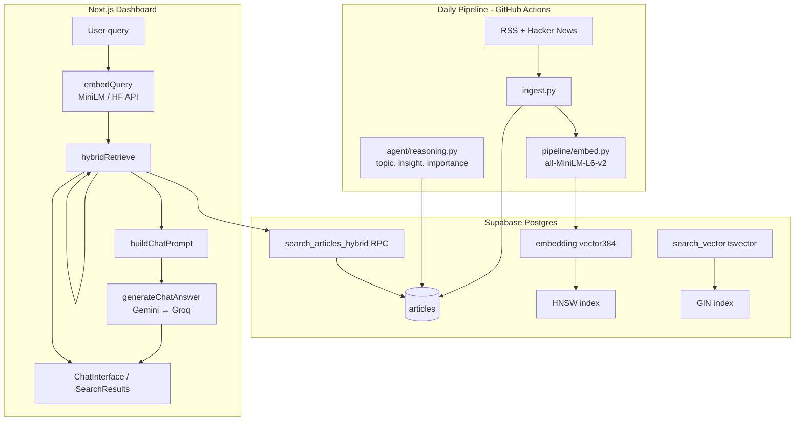

# Skim RAG  -  Architecture & Implementation Guide

Complete reference for how retrieval-augmented generation works in Skim: what gets stored, how the database searches, how queries flow from the UI to Postgres and back through the LLM.

**Related docs:** `[progress.md](../progress.md)` · `[vercel-deploy.md](./vercel-deploy.md)` · `[dashboard/README.md](../dashboard/README.md)`

---

## Table of Contents

1. [What RAG means in Skim](#what-rag-means-in-skim)
2. [End-to-end architecture](#end-to-end-architecture)
3. [The corpus: what gets indexed](#the-corpus-what-gets-indexed)
4. [Embeddings: one shared vector space](#embeddings-one-shared-vector-space)
5. [Hybrid retrieval pipeline](#hybrid-retrieval-pipeline)
6. [Database search layer](#database-search-layer)
7. [Reciprocal Rank Fusion (RRF)](#reciprocal-rank-fusion-rrf)
8. [Conversational query building](#conversational-query-building)
9. [Generation: from articles to answers](#generation-from-articles-to-answers)
10. [Search page vs Chat](#search-page-vs-chat)
11. [API reference](#api-reference)
12. [UI components](#ui-components)
13. [Rate limiting & auth](#rate-limiting--auth)
14. [Environment variables](#environment-variables)
15. [Source file map](#source-file-map)
16. [Troubleshooting](#troubleshooting)
17. [Design decisions](#design-decisions)

---

## What RAG means in Skim

**Retrieval-Augmented Generation (RAG)** here means:

1. **Retrieve**  -  find the most relevant articles from the Skim corpus for a user question.
2. **Augment**  -  pass those articles (title, summary, insight, takeaway, URL) into the LLM prompt as grounded context.
3. **Generate**  -  the LLM writes an answer that cites specific sources and does not invent facts.

Skim does **not** fine-tune a model on your articles. It uses **off-the-shelf** embeddings + a general LLM (Gemini, with Groq fallback) over retrieved context.

Two user-facing features share the same retrieval stack:


| Feature    | Route                        | Retrieval | Generation                            |
| ---------- | ---------------------------- | --------- | ------------------------------------- |
| **Search** | `/search`, `GET /api/search` | ✅ Hybrid  | ❌ Returns ranked articles only        |
| **Chat**   | `/chat`, `POST /api/chat`    | ✅ Hybrid  | ✅ Gemini → Groq answer with citations |


---

## End-to-end architecture




### Chat request lifecycle (step by step)

```
User types question in ChatInterface
        │
        ▼
POST /api/chat  { message, history }
        │
        ├─ requireActiveUser()     → 401/403 if not signed in / not approved
        ├─ checkChatRateLimit()    → 429 if 20 queries used today
        │
        ▼
buildRetrievalQueries(message, history)
        │  vectorQuery: last 2 user turns + current message (up to 512 chars)
        │  ftsQuery: focused keyword query (up to 256 chars)
        ▼
embedQuery(vectorQuery)            → 384-dim float vector
        │
        ▼
hybridRetrieve(supabase, message)  → up to 8 RetrievedArticle objects
        │
        ▼
generateChatAnswer(message, articles, history)
        │  buildChatPrompt() → system instruction + article context + history
        │  Gemini key rotation → fallback models → Groq
        ▼
incrementChatUsage(userId)
        │
        ▼
JSON { answer, sources[], provider, model, retrieval_method, remaining }
```

---

## The corpus: what gets indexed

All RAG search runs over the `articles` table in Supabase.

### Indexed text


| Field      | Used for     | Notes                                          |
| ---------- | ------------ | ---------------------------------------------- |
| `title`    | Vector + FTS | Primary signal                                 |
| `summary`  | Vector + FTS | RSS excerpt, HTML-stripped, max 1000 chars     |
| `raw_text` | ❌ Not used   | Column exists; always NULL in current pipeline |


**Pipeline embedding input:** `f"{title} {summary}"` (see `pipeline/embed.py`).

### Agent-enriched metadata (retrieval boost + LLM context)


| Field              | Set by                  | Used in RAG                  |
| ------------------ | ----------------------- | ---------------------------- |
| `topic`            | Agent Pass 1 (classify) | Topic badges, prompt context |
| `importance_score` | Agent Pass 1 (0–10)     | RRF reranking boost          |
| `insight`          | Agent Pass 2            | LLM prompt context           |
| `key_takeaway`     | Agent Pass 2            | LLM prompt context           |
| `published_at`     | Ingestion               | Sorting, citation dates      |
| `source`           | Ingestion               | hackernews, techcrunch, etc. |


### What is NOT in the corpus

- Full article body text (no scraping in Phase 1)
- External web pages (no live browsing)
- User-uploaded documents
- Email digest HTML (digests reference article IDs, not separate RAG index)

---

## Embeddings: one shared vector space

### Model


| Property        | Value                                                 |
| --------------- | ----------------------------------------------------- |
| Model           | `all-MiniLM-L6-v2`                                    |
| Dimensions      | **384**                                               |
| Distance metric | Cosine (`<=>` operator in pgvector)                   |
| Normalization   | L2-normalized (pipeline: `normalize_embeddings=True`) |


### Where embeddings are created


| Layer                 | When                    | How                               | Stored in              |
| --------------------- | ----------------------- | --------------------------------- | ---------------------- |
| **Pipeline**          | Daily after ingest      | `sentence-transformers` in Python | `articles.embedding`   |
| **Dashboard (query)** | Per search/chat request | Local or HF API                   | Not stored (ephemeral) |


### Critical rule: same model, same space

Query vectors **must** live in the same 384-dim space as `articles.embedding`.

An earlier experiment used Gemini `gemini-embedding-001` (768-dim) in a separate column. That was **removed**  -  mixing embedding models makes vector search return garbage. Skim RAG uses **MiniLM only**.

### Query embedding implementation

**File:** `dashboard/src/lib/chat/embeddings.ts`


| Environment | Mode                               | Mechanism                                                             |
| ----------- | ---------------------------------- | --------------------------------------------------------------------- |
| Local dev   | `local` (default)                  | `@xenova/transformers` - dynamic import, quantized MiniLM             |
| Vercel      | `hf` (auto when `VERCEL` set)      | Hugging Face Inference API (`sentence-transformers/all-MiniLM-L6-v2`) |
| Override    | `SKIM_EMBEDDING_MODE=hf|local|off` | Force strategy                                                        |


On Vercel, local MiniLM + onnxruntime is unreliable in serverless lambdas. `**HF_TOKEN` is required** for production chat/search vector leg.

If embedding fails entirely, retrieval **degrades** to FTS and keyword fallbacks (no vector leg).

---

## Hybrid retrieval pipeline

**Orchestrator:** `dashboard/src/lib/retrieval.ts` → `hybridRetrieve()`

### Default parameters


| Parameter         | Chat | Search | Notes                              |
| ----------------- | ---- | ------ | ---------------------------------- |
| `limit`           | 8    | 20     | Max articles returned              |
| `vectorWeight`    | 0.55 | 0.55   | RRF weight for semantic leg        |
| `ftsWeight`       | 0.45 | 0.45   | RRF weight for keyword leg         |
| `rrf_k`           | 60   | 60     | RRF smoothing constant             |
| `match_threshold` | 0.2  | 0.2    | Min cosine similarity (vector RPC) |


### Fallback chain

Retrieval never hard-fails if one leg is unavailable. It tries in order:

```
1. search_articles_hybrid RPC     (fastest  -  SQL-side RRF)
        │ fails or empty
        ▼
2. In-process RRF                 (parallel vector + FTS RPCs, fuse in TypeScript)
        │ fails or empty
        ▼
3. Vector-only                      search_articles_vector → search_similar_articles
        │ fails or empty
        ▼
4. FTS-only                         search_articles_fts → Supabase textSearch
        │ fails or empty
        ▼
5. Keyword ILIKE                    title ILIKE %query% OR summary ILIKE %query%
```

Each result is tagged with `retrieval_method`: `"hybrid"` | `"vector"` | `"fts"` | `"keyword"`.

### Importance boost (post-RRF)

After fusion, articles are reranked by agent importance score:

```
adjusted_rrf = rrf_score × (1 + importance_score / 25)
```

Default importance when NULL is treated as **5** in the boost formula. High-importance stories from the agent pipeline surface more often in RAG results.

**File:** `dashboard/src/lib/retrieval/rrf.ts` → `boostByImportance()`

---

## Database search layer

### Schema essentials

```sql
-- articles.embedding: 384-dim pgvector column
embedding vector(384)

-- articles.search_vector: auto-generated tsvector (migration 004)
search_vector tsvector GENERATED ALWAYS AS (
  to_tsvector('english', coalesce(title, '') || ' ' || coalesce(summary, ''))
) STORED
```

### Indexes


| Index                         | Type   | Column          | Purpose                            |
| ----------------------------- | ------ | --------------- | ---------------------------------- |
| `articles_embedding_hnsw_idx` | HNSW   | `embedding`     | Fast approximate nearest neighbor  |
| `articles_search_vector_idx`  | GIN    | `search_vector` | Full-text search                   |
| `articles_topic_idx`          | B-tree | `topic`         | Filtering (not used in hybrid RPC) |


**Why HNSW, not ivfflat:** ivfflat needs a large corpus to train its cluster lists. On ~100 articles it returned irrelevant matches (e.g. 0.16 similarity for "OpenAI GPT"). HNSW works at any scale.

### Vector similarity math

pgvector uses the **cosine distance** operator `<=>`:

```sql
similarity = 1 - (embedding <=> query_embedding)
```

- `1.0` = identical direction (perfect match)
- `0.0` = orthogonal
- Results filtered by `match_threshold` (default 0.2 in hybrid RPC, 0.25 in standalone vector RPC)

Query embedding is passed as a string literal: `"[0.12, -0.34, ...]"` (see `vectorLiteral()` in `retrieval.ts`).

### Full-text search (FTS)

**Migration:** `sql/004_search_fts.sql`

- English `to_tsvector` on `title + summary`
- Queries use `websearch_to_tsquery('english', query_text)`  -  supports quoted phrases, `OR`, `-` negation (Google-style)
- Ranking: `ts_rank_cd(search_vector, query)`

### SQL RPC functions

**Migration:** `sql/005_hybrid_search.sql` (run after `004`)


| Function                  | Input                           | Output                                         | Role                          |
| ------------------------- | ------------------------------- | ---------------------------------------------- | ----------------------------- |
| `search_articles_vector`  | `vector(384)`, count, threshold | Articles + `similarity`                        | Semantic leg                  |
| `search_articles_fts`     | `text`, count                   | Articles + `fts_rank`                          | Keyword leg                   |
| `search_articles_hybrid`  | vector + text + weights         | Articles + similarity, fts_rank, **rrf_score** | Fused ranking                 |
| `search_similar_articles` | `vector(384)`                   | Legacy RPC from `schema.sql`                   | Fallback if `005` not applied |


All RPCs are `SECURITY DEFINER` with `GRANT EXECUTE` to `authenticated` and `anon` (dashboard calls them via user's Supabase session; RLS on `articles` still applies for direct table access).

**Type note:** `005` uses `double precision` return types. An earlier version used `real`/`float` and caused Postgres error: *"structure of query does not match function result type"*. Re-run `005` if you see `Hybrid RPC unavailable` in logs.

### How hybrid RPC works internally

```sql
-- Simplified view of search_articles_hybrid
WITH vector_results AS (
  SELECT *, ROW_NUMBER() OVER (ORDER BY similarity DESC) AS rank_v
  FROM search_articles_vector(embedding, match_count * 2, 0.2)
),
fts_results AS (
  SELECT *, ROW_NUMBER() OVER (ORDER BY fts_rank DESC) AS rank_f
  FROM search_articles_fts(query_text, match_count * 2)
)
SELECT *,
  vector_weight / (rrf_k + rank_v) + fts_weight / (rrf_k + rank_f) AS rrf_score
FROM vector_results FULL OUTER JOIN fts_results ON id
ORDER BY rrf_score DESC
LIMIT match_count;
```

The TypeScript `reciprocalRankFusion()` in `rrf.ts` implements the same formula when the SQL RPC is unavailable.

---

## Reciprocal Rank Fusion (RRF)

RRF combines ranked lists from different retrieval methods without normalizing their raw scores (which are on incompatible scales).

### Formula

For document `d`:

```
RRF(d) = Σ  weight_i / (k + rank_i(d))
```

Where:

- `rank_i(d)` = 1-based rank in list `i` (vector list, FTS list)
- `k` = 60 (smoothing  -  prevents top-ranked items from dominating)
- `vector_weight` = 0.55, `fts_weight` = 0.45

### Why hybrid?


| Leg                   | Strength                                              | Weakness                        |
| --------------------- | ----------------------------------------------------- | ------------------------------- |
| **Vector (semantic)** | Paraphrases, concepts ("AI regulation" ↔ "EU AI Act") | Misses exact names, rare tokens |
| **FTS (keyword)**     | Exact terms, company names, acronyms                  | Misses semantic similarity      |


RRF surfaces articles that rank well in **either** or **both** lists.

### Example


| Article | Vector rank | FTS rank | RRF contribution           |
| ------- | ----------- | -------- | -------------------------- |
| A       | 1           | 5        | 0.55/61 + 0.45/65 ≈ 0.0160 |
| B       | 8           | 1        | 0.55/68 + 0.45/61 ≈ 0.0154 |
| C       | 2           | -        | 0.55/62 ≈ 0.0089           |


Article A wins  -  strong in both legs.

---

## Conversational query building

**File:** `dashboard/src/lib/retrieval/query.ts`

Chat passes `history` into retrieval so follow-ups stay grounded.

### Vector query

Combines the **last 2 user turns** + current message (deduplicated), capped at 512 characters:

```
"What happened in AI?"  →  vectorQuery: "What happened in AI?"
"What about funding?"   →  vectorQuery: "What happened in AI? What about funding?"
```

Semantic search benefits from richer context.

### FTS query

Uses the **current message** only, unless it's a short follow-up (≤4 words):

```
"What about funding?"  →  ftsQuery: "What happened in AI? What about funding?"
```

Keyword search stays focused but inherits context for vague follow-ups.

---

## Generation: from articles to answers

Retrieval and generation are **separate steps**. Search stops after retrieval; Chat continues.

### Prompt construction

**File:** `dashboard/src/lib/chat/prompt.ts`

1. **System instruction** (`CHAT_SYSTEM_INSTRUCTION`)  -  citation rules, partial-answer behavior, refusal only when 0 articles
2. **Conversation history**  -  last turns wrapped in `<conversation_history>`
3. **Retrieved articles**  -  numbered `[1]`, `[2]`, … with title, URL, summary, insight, takeaway, topic, scores
4. **User question**  -  wrapped in `<user_question>`

Example structure sent to the LLM:

```xml
<conversation_history>
User: What happened in AI this week?
Assistant: According to [1], OpenAI released...
</conversation_history>

<retrieved_articles count="8" retrieval="hybrid">
[1] OpenAI announces new model - techcrunch, Aug 28 [sim=0.82, rrf=0.015]
    URL: https://...
    Summary: ...
    Insight: ...
</retrieved_articles>

<user_question>
What about European startups?
</user_question>
```

### LLM provider chain

**File:** `dashboard/src/lib/chat/llm-client.ts`

```
gemini-3.6-flash (primary, GEMINI_MODEL)
  → rotate GEMINI_API_KEYS on 403/404/429
  → try GEMINI_FALLBACK_MODELS (gemini-2.0-flash, gemini-3.5-flash-lite)
  → Groq openai/gpt-oss-120b (GROQ_API_KEYS)
```

Errors are structured as `ChatLlmError` with `error_code`, `tried_providers`, `retry_after_seconds`.

### Citation behavior

- LLM instructed to cite `[1]`, `[2]` inline
- UI maps numbers to `SourceCitation` component with URLs, topic badges, similarity bars
- Sources in API response are the **retrieved articles**, not LLM-hallucinated links

---

## Search page vs Chat


| Aspect        | `/search`                                            | `/chat`                                                   |
| ------------- | ---------------------------------------------------- | --------------------------------------------------------- |
| API           | `GET /api/search?q=...`                              | `POST /api/chat`                                          |
| Default mode  | `hybrid`                                             | always hybrid                                             |
| Alt mode      | `?mode=keyword` (FTS/ILIKE only via `lib/search.ts`) | -                                                         |
| Default limit | 20                                                   | 8                                                         |
| History       | No                                                   | Yes - last 6 turns to LLM, last 2 user turns to retrieval |
| LLM           | No                                                   | Yes                                                       |
| Rate limit    | None                                                 | 20 queries/user/day                                       |
| UI            | `SearchResultCard` with rank, similarity %           | `ChatMessage` + `SourceCitation`                          |


Both call `hybridRetrieve()` when `mode=hybrid`.

---

## API reference

### `GET /api/search`

**Auth:** Active user required.


| Param   | Default  | Description                         |
| ------- | -------- | ----------------------------------- |
| `q`     | -        | Search query (required for results) |
| `mode`  | `hybrid` | `hybrid` or `keyword`               |
| `limit` | 20       | 1–50                                |


**Response (hybrid):**

```json
{
  "results": [
    {
      "id": 42,
      "title": "...",
      "url": "...",
      "source": "techcrunch",
      "summary": "...",
      "insight": "...",
      "topic": "ai_ml",
      "importance_score": 7.5,
      "similarity": 0.78,
      "fts_rank": 0.12,
      "rrf_score": 0.014,
      "retrieval_method": "hybrid"
    }
  ],
  "query": "OpenAI",
  "mode": "hybrid"
}
```

### `GET /api/chat`

Returns daily quota:

```json
{ "limit": 20, "used": 3, "remaining": 17 }
```

### `POST /api/chat`

**Body:**

```json
{
  "message": "What happened in AI this week?",
  "history": [
    { "role": "user", "content": "..." },
    { "role": "assistant", "content": "..." }
  ]
}
```

**Success response:**

```json
{
  "answer": "According to [1], ...",
  "sources": [
    {
      "id": 42,
      "title": "...",
      "url": "...",
      "similarity": 0.78,
      "rrf_score": 0.014,
      "retrieval_method": "hybrid"
    }
  ],
  "remaining": 16,
  "used": 4,
  "retrieval_method": "hybrid",
  "provider": "gemini",
  "model": "gemini-3.6-flash",
  "articles_retrieved": 8
}
```

**Error codes:**


| HTTP | `error_code`           | Meaning                    |
| ---- | ---------------------- | -------------------------- |
| 401  | -                      | Not authenticated          |
| 403  | -                      | Account pending / rejected |
| 429  | -                      | Daily chat limit (20/day)  |
| 503  | `config`               | Missing API keys           |
| 503  | `all_providers_failed` | Gemini + Groq exhausted    |
| 500  | `unknown`              | Unexpected server error    |


---

## UI components


| Component           | File                                     | Role                                                |
| ------------------- | ---------------------------------------- | --------------------------------------------------- |
| `ChatInterface`     | `components/chat/ChatInterface.tsx`      | Message state, calls `/api/chat`, suggested prompts |
| `ChatMessage`       | `components/chat/ChatMessage.tsx`        | Renders user/assistant bubbles, provider badge      |
| `ChatLoadingBubble` | `components/chat/ChatLoadingBubble.tsx`  | embed → search → generate steps                     |
| `ChatErrorPanel`    | `components/chat/ChatErrorPanel.tsx`     | Structured errors, retry button                     |
| `SourceCitation`    | `components/chat/SourceCitation.tsx`     | Collapsible sources with similarity bar             |
| `SearchBar`         | `components/ui/SearchBar.tsx`            | Debounced input, navigates to `/search?q=`          |
| `SearchResults`     | `components/search/SearchResults.tsx`    | Fetches `/api/search`, renders cards                |
| `SearchResultCard`  | `components/search/SearchResultCard.tsx` | Rank, topic, similarity %, retrieval method badge   |


---

## Rate limiting & auth

### Auth

All RAG endpoints use `requireActiveUser()`:

- User must be signed in (`supabase.auth.getUser()`)
- `profiles.status` must be `"active"` (not pending/rejected)

Middleware also blocks `/api/*` for pending users with JSON 403.

### Chat rate limit

**Table:** `chat_usage` (`user_id`, `usage_date`, `query_count`)  
**Limit:** 20 POST requests per user per UTC day  
**File:** `dashboard/src/lib/chat/rate-limit.ts`

Search has **no** rate limit (only chat generation is capped  -  LLM cost control).

---

## Environment variables

### Required for RAG chat (production)


| Variable                               | Purpose                            |
| -------------------------------------- | ---------------------------------- |
| `NEXT_PUBLIC_SUPABASE_URL`             | Database + auth                    |
| `NEXT_PUBLIC_SUPABASE_PUBLISHABLE_KEY` | Client session                     |
| `SUPABASE_SECRET_KEY`                  | Chat usage tracking (admin client) |
| `GEMINI_API_KEYS`                      | Answer generation                  |
| `HF_TOKEN`                             | Query embeddings on Vercel         |


### Optional


| Variable                 | Default                                  | Purpose                        |
| ------------------------ | ---------------------------------------- | ------------------------------ |
| `GROQ_API_KEYS`          | -                                        | LLM fallback                   |
| `GEMINI_MODEL`           | `gemini-3.6-flash`                       | Primary model                  |
| `GEMINI_FALLBACK_MODELS` | `gemini-2.0-flash,gemini-3.5-flash-lite` | Model fallbacks                |
| `GROQ_MODEL`             | `openai/gpt-oss-120b`                    | Groq model                     |
| `SKIM_EMBEDDING_MODE`    | auto                                     | `hf` on Vercel, `local` in dev |


### Vercel-specific

- `vercel.json` sets `maxDuration: 60` for API routes
- First chat message may take 10–30s (cold start + HF model load)
- Hobby plan may timeout at 10s in some regions  -  upgrade if needed

---

## Source file map

```
Skim RAG codebase
│
├── sql/
│   ├── schema.sql              articles.embedding, HNSW, search_similar_articles
│   ├── 004_search_fts.sql      search_vector tsvector + GIN index
│   └── 005_hybrid_search.sql   vector, fts, hybrid RPCs
│
├── pipeline/
│   └── embed.py                Writes articles.embedding (MiniLM, daily)
│
└── dashboard/src/
    ├── app/api/
    │   ├── chat/route.ts       GET quota, POST RAG Q&A
    │   └── search/route.ts     GET hybrid/keyword search
    │
    ├── lib/
    │   ├── retrieval.ts        hybridRetrieve() orchestrator + fallbacks
    │   ├── retrieval/
    │   │   ├── query.ts        buildRetrievalQueries()
    │   │   └── rrf.ts          reciprocalRankFusion(), boostByImportance()
    │   ├── search.ts           keyword-only search (mode=keyword)
    │   └── chat/
    │       ├── embeddings.ts   embedQuery()  -  local / HF
    │       ├── prompt.ts       buildChatPrompt(), system instruction
    │       ├── llm-client.ts   generateChatAnswer()  -  Gemini/Groq
    │       ├── errors.ts       ChatLlmError, provider error parsing
    │       └── rate-limit.ts   20/day quota
    │
    └── components/
        ├── chat/               ChatInterface, SourceCitation, ...
        └── search/             SearchResults, SearchResultCard
```

---

## Troubleshooting


| Symptom                          | Likely cause                             | Fix                                            |
| -------------------------------- | ---------------------------------------- | ---------------------------------------------- |
| `Hybrid RPC unavailable` in logs | `005` not applied or type mismatch       | Re-run `sql/005_hybrid_search.sql`             |
| Chat returns 500 on Vercel       | Missing `HF_TOKEN` or transformers crash | Set `HF_TOKEN`; redeploy embedding fix         |
| Chat returns 503 `config`        | No `GEMINI_API_KEYS`                     | Add keys in Vercel env                         |
| Irrelevant vector results        | Wrong embedding model / dimension        | Ensure MiniLM 384-dim only                     |
| Search works, chat doesn't       | LLM keys missing                         | Add `GEMINI_API_KEYS` / `GROQ_API_KEYS`        |
| Slow first query                 | HF cold start + model load               | Normal; subsequent queries faster              |
| 0 results for valid topic        | Corpus gap or threshold too high         | Check `articles` count; try keyword mode       |
| `429` on chat                    | Daily limit hit                          | Wait until UTC midnight or raise limit in code |


### Verify hybrid RPC in Supabase SQL editor

```sql
-- Replace with a real 384-dim vector from a known article, or test FTS only:
SELECT id, title, fts_rank
FROM search_articles_fts('OpenAI', 5);

SELECT count(*) FROM articles WHERE embedding IS NOT NULL;
```

### Local debug

```bash
cd dashboard
npm run dev
# Search: http://localhost:3000/search?q=AI
# Chat:   http://localhost:3000/chat
```

Check server logs for `Query embedding failed` (falls back to FTS) or `Hybrid RPC unavailable` (in-process RRF).

---

## Design decisions


| Decision          | Choice                     | Rationale                                               |
| ----------------- | -------------------------- | ------------------------------------------------------- |
| Embedding model   | all-MiniLM-L6-v2 (384-dim) | Free, local in pipeline, good quality for short text    |
| Vector index      | HNSW                       | Works on small corpora; ivfflat failed at ~100 articles |
| Fusion method     | RRF (k=60)                 | No score normalization needed; proven hybrid retrieval  |
| Weights           | 0.55 vector / 0.45 FTS     | Slight semantic bias; FTS catches exact names           |
| Indexed text      | title + summary only       | Matches pipeline embed input; no full-page scrape       |
| SQL vs TS RRF     | SQL primary, TS fallback   | Fast path in Postgres; graceful degradation             |
| LLM               | Gemini + Groq fallback     | Same resilience pattern as pipeline                     |
| Chat limit        | 20/day/user                | Controls free-tier LLM cost                             |
| Vercel embeddings | HF Inference API           | Serverless cannot reliably run onnx MiniLM              |
| Citations         | Numbered sources in prompt | Grounds answers; UI maps numbers to URLs                |


---

## SQL migration checklist

Apply in Supabase SQL Editor **in order**:

- [ ] `sql/schema.sql`  -  `embedding vector(384)`, HNSW index
- [ ] `sql/004_search_fts.sql`  -  `search_vector` column
- [ ] `sql/005_hybrid_search.sql`  -  hybrid RPCs (**required for best performance**)

Without `005`, RAG still works via TypeScript fallbacks but is slower and logs warnings.

---

*Last updated: 2026-08-31*