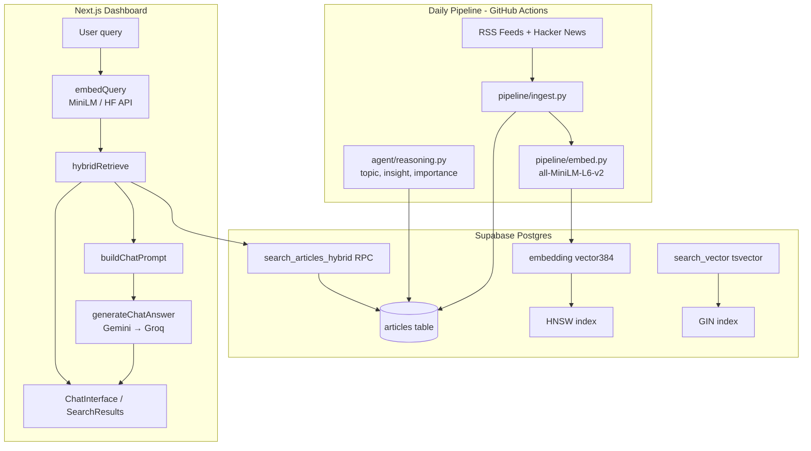

# Skim RAG  -  Architecture & Implementation Guide

Complete reference for how Retrieval-Augmented Generation (RAG) works in Skim: storage design, vector and full-text database search, query embedding flows, Reciprocal Rank Fusion (RRF), importance score boosting, and multi-provider LLM failover.

**Related documentation**

| Document | Scope |
|---|---|
| [docs/README.md](./README.md) | Central documentation directory index |
| [docs/architecture.md](./architecture.md) | High-level system architecture and data model |
| [docs/dashboard.md](./dashboard.md) | Dashboard routes, stores, and API handlers |
| [docs/vercel-deploy.md](./vercel-deploy.md) | Vercel environment variables & deployment |

---

## Table of Contents

1. [What RAG means in Skim](#what-rag-means-in-skim)
2. [End-to-end architecture](#end-to-end-architecture)
3. [The corpus: what gets indexed](#the-corpus-what-gets-indexed)
4. [Embeddings: one shared vector space](#embeddings-one-shared-vector-space)
5. [Hybrid retrieval pipeline](#hybrid-retrieval-pipeline)
6. [Database search layer](#database-search-layer)
7. [Reciprocal Rank Fusion (RRF)](#reciprocal-rank-fusion-rrf)
8. [Conversational query building](#conversational-query-building)
9. [Generation: from articles to answers](#generation-from-articles-to-answers)
10. [Search page vs Chat](#search-page-vs-chat)
11. [API reference](#api-reference)
12. [UI components](#ui-components)
13. [Rate limiting & auth](#rate-limiting--auth)
14. [Environment variables](#environment-variables)
15. [Source file map](#source-file-map)
16. [Troubleshooting](#troubleshooting)
17. [Design decisions](#design-decisions)
18. [SQL migration checklist](#sql-migration-checklist)

---

## What RAG means in Skim

**Retrieval-Augmented Generation (RAG)** in Skim operates as follows:

1. **Retrieve**  -  Find the most relevant articles from the Skim corpus for a user question using hybrid semantic + full-text search.
2. **Augment**  -  Inject those articles (title, summary, insight, key takeaway, URL, published date) into the LLM prompt as strictly grounded context.
3. **Generate**  -  The LLM generates a cohesive answer citing specific numbered sources (`[1]`, `[2]`), avoiding hallucinations.

Skim uses an **off-the-shelf** sentence transformer (`all-MiniLM-L6-v2`) and multi-provider LLMs (Google Gemini with Groq fallback) over the retrieved context.

| Feature | Route | Retrieval | Generation |
|---|---|---|---|
| **Search** | `/search`, `GET /api/search` | ✅ Hybrid | ❌ Returns ranked articles only |
| **Chat** | `/chat`, `POST /api/chat` | ✅ Hybrid | ✅ Gemini → Groq answer with citations |

---

## End-to-end architecture



### Chat request lifecycle (step by step)

```
User types question in ChatInterface
        │
        ▼
POST /api/chat  { message, history }
        │
        ├─ requireActiveUser()     → 401/403 if not signed in / not approved
        ├─ checkChatRateLimit()    → 429 if 20 queries used today
        │
        ▼
buildRetrievalQueries(message, history)
        │  vectorQuery: last 2 user turns + current message (up to 512 chars)
        │  ftsQuery: focused keyword query (up to 256 chars)
        ▼
embedQuery(vectorQuery)            → 384-dim float vector
        │
        ▼
hybridRetrieve(supabase, message)  → up to 8 RetrievedArticle objects
        │
        ▼
generateChatAnswer(message, articles, history)
        │  buildChatPrompt() → system instruction + article context + history
        │  Gemini key rotation → fallback models → Groq
        ▼
incrementChatUsage(userId)
        │
        ▼
JSON { answer, sources[], provider, model, retrieval_method, remaining }
```

---

## The corpus: what gets indexed

All RAG search queries run against the `articles` table in Supabase.

### Indexed text

| Field | Used for | Notes |
|---|---|---|
| `title` | Vector + FTS | Primary lexical and semantic signal |
| `summary` | Vector + FTS | RSS excerpt, HTML-stripped, capped at 1000 chars |
| `raw_text` | ❌ Not used | Column exists; kept NULL (no full-text scraping needed) |

**Pipeline embedding input string:** `f"{title} {summary}"` (in `pipeline/embed.py`).

### Agent-enriched metadata

| Field | Set by | Used in RAG |
|---|---|---|
| `topic` | Agent Pass 1 (classify) | Topic badges, structured prompt context |
| `importance_score` | Agent Pass 1 (0–10) | RRF reranking importance boost |
| `insight` | Agent Pass 2 | Editorial "Why it matters" prompt context |
| `key_takeaway` | Agent Pass 2 | Concise takeaway prompt context |
| `published_at` | Ingestion | Citation timestamps and recency sorting |
| `source` | Ingestion | Source attribution (`hackernews`, `techcrunch`, etc.) |

---

## Embeddings: one shared vector space

### Model specifications

| Property | Value |
|---|---|
| Model | `sentence-transformers/all-MiniLM-L6-v2` |
| Dimensions | **384** |
| Distance metric | Cosine (`<=>` operator in pgvector) |
| Normalization | L2-normalized (`normalize_embeddings=True` in Python) |

### Shared vector space rule

Query vectors **must** reside in the identical 384-dimensional space as `articles.embedding`.

### Query embedding implementation (`dashboard/src/lib/chat/embeddings.ts`)

| Environment | Mode | Strategy |
|---|---|---|
| Local dev | `local` | `@xenova/transformers` - dynamic import of quantized MiniLM |
| Vercel | `hf` (auto when `VERCEL` is set) | Hugging Face Inference API (`sentence-transformers/all-MiniLM-L6-v2`) via `HF_TOKEN` |
| Override | `SKIM_EMBEDDING_MODE=hf\|local\|off` | Explicit override |

---

## Hybrid retrieval pipeline

**Orchestrator:** `dashboard/src/lib/retrieval.ts` → `hybridRetrieve()`

### Default parameters

| Parameter | Chat | Search | Notes |
|---|---|---|---|
| `limit` | 8 | 20 | Max articles returned |
| `vectorWeight` | 0.55 | 0.55 | RRF weight for semantic leg |
| `ftsWeight` | 0.45 | 0.45 | RRF weight for keyword leg |
| `rrf_k` | 60 | 60 | RRF smoothing constant |
| `match_threshold` | 0.20 | 0.20 | Minimum cosine similarity |

### Fallback chain

Retrieval never hard-fails if one subsystem is degraded:

```
1. search_articles_hybrid RPC     (fastest  -  SQL-side RRF)
        │ fails or empty
        ▼
2. In-process RRF                 (parallel vector + FTS RPCs, fuse in TypeScript)
        │ fails or empty
        ▼
3. Vector-only                    search_articles_vector → search_similar_articles
        │ fails or empty
        ▼
4. FTS-only                       search_articles_fts → Supabase textSearch
        │ fails or empty
        ▼
5. Keyword ILIKE                  title ILIKE %query% OR summary ILIKE %query%
```

Each result is tagged with `retrieval_method`: `"hybrid" | "vector" | "fts" | "keyword"`.

### Importance boost (post-RRF)

After RRF fusion, articles are adjusted by agent importance score:

$$\text{adjusted\_rrf} = \text{rrf\_score} \times \left(1 + \frac{\text{importance\_score}}{25}\right)$$

Default importance is treated as 5.0 when NULL. High-importance stories surface higher in RAG context.

---

## Database search layer

### Schema essentials

```sql
-- articles.embedding: 384-dim pgvector column
embedding vector(384)

-- articles.search_vector: auto-generated tsvector (migration 004)
search_vector tsvector GENERATED ALWAYS AS (
  to_tsvector('english', coalesce(title, '') || ' ' || coalesce(summary, ''))
) STORED
```

### Indexes

| Index | Type | Column | Purpose |
|---|---|---|---|
| `articles_embedding_hnsw_idx` | HNSW | `embedding` | Approximate nearest neighbor vector search |
| `articles_search_vector_idx` | GIN | `search_vector` | Full-text keyword search |
| `articles_topic_idx` | B-tree | `topic` | Topic taxonomy filtering |

### SQL RPC functions (`sql/005_hybrid_search.sql`)

| Function | Input | Output | Role |
|---|---|---|---|
| `search_articles_vector` | `vector(384)`, count, threshold | Articles + `similarity` | Semantic vector leg |
| `search_articles_fts` | `text`, count | Articles + `fts_rank` | Keyword FTS leg |
| `search_articles_hybrid` | vector + text + weights | Articles + `similarity`, `fts_rank`, `rrf_score` | Fused ranking |

All RPCs are defined with `double precision` return types for cross-platform precision and stability.

---

## Reciprocal Rank Fusion (RRF)

RRF combines ranked lists from different retrieval methods without requiring score normalization:

$$RRF(d) = \sum_{i} \frac{w_i}{k + \text{rank}_i(d)}$$

Where:
- $\text{rank}_i(d)$ is the 1-based rank in list $i$
- $k = 60$ (smoothing constant)
- $w_{\text{vector}} = 0.55$, $w_{\text{fts}} = 0.45$

---

## Conversational query building

**File:** `dashboard/src/lib/retrieval/query.ts`

- **Vector query:** Combines the last 2 user turns + current message (deduplicated), capped at 512 characters.
- **FTS query:** Uses the current message only, unless it is a short follow-up (≤4 words), inheriting previous context.

---

## Generation: from articles to answers

### Prompt construction (`dashboard/src/lib/chat/prompt.ts`)

1. **System Instruction:** Citation rules, partial-answer behavior, refusal only when 0 articles found.
2. **Conversation History:** Last conversation turns wrapped in `<conversation_history>`.
3. **Retrieved Articles:** Numbered `[1]`, `[2]`, … with title, URL, summary, insight, key takeaway, topic, and scores.
4. **User Question:** Wrapped in `<user_question>`.

### LLM provider chain (`dashboard/src/lib/chat/llm-client.ts`)

```
gemini-3.6-flash (primary, GEMINI_MODEL)
  → rotate GEMINI_API_KEYS on 403/404/429
  → try GEMINI_FALLBACK_MODELS (gemini-2.0-flash, gemini-3.5-flash-lite)
  → Groq openai/gpt-oss-120b (GROQ_API_KEYS)
```

---

## Search page vs Chat

| Aspect | `/search` | `/chat` |
|---|---|---|
| API | `GET /api/search?q=...` | `POST /api/chat` |
| Default mode | `hybrid` | `hybrid` |
| Alternate mode | `?mode=keyword` (FTS/ILIKE) |  -  |
| Default limit | 20 | 8 |
| History | None | Up to 6 turns in LLM, 2 in vector retrieval |
| LLM | No | Yes |
| Rate limit | None | 20 queries/user/day |
| UI | `SearchResultCard` with similarity % | `ChatMessage` + `SourceCitation` |

---

## API reference

### `GET /api/search`

Parameters: `q` (query string, required), `mode` (`hybrid` | `keyword`), `limit` (1–50, default 20).

### `GET /api/chat`

Returns user quota: `{ "limit": 20, "used": 3, "remaining": 17 }`.

### `POST /api/chat`

Payload: `{ "message": "...", "history": [...] }`.  
Response: `{ "answer": "...", "sources": [...], "provider": "gemini", "model": "gemini-3.6-flash", "remaining": 16 }`.

---

## UI components

| Component | File | Role |
|---|---|---|
| `ChatInterface` | `components/chat/ChatInterface.tsx` | Message state, suggested prompts, call dispatch |
| `ChatMessage` | `components/chat/ChatMessage.tsx` | Message bubbles & provider badges |
| `ChatLoadingBubble` | `components/chat/ChatLoadingBubble.tsx` | Animated step progression |
| `ChatErrorPanel` | `components/chat/ChatErrorPanel.tsx` | Structured error display with retry button |
| `SourceCitation` | `components/chat/SourceCitation.tsx` | Collapsible source cards with similarity bars |
| `SearchBar` | `components/ui/SearchBar.tsx` | Debounced query input |
| `SearchResults` | `components/search/SearchResults.tsx` | Search result list container |
| `SearchResultCard` | `components/search/SearchResultCard.tsx` | Individual result card with match metrics |

---

## Rate limiting & auth

- **Authentication:** `requireActiveUser()` validates session and requires `profiles.status = 'active'`.
- **Chat Limit:** 20 POST requests per user per UTC day tracked in the `chat_usage` table.

---

## Environment variables

| Variable | Purpose |
|---|---|
| `NEXT_PUBLIC_SUPABASE_URL` | Supabase endpoint |
| `NEXT_PUBLIC_SUPABASE_PUBLISHABLE_KEY` | Client Supabase key |
| `SUPABASE_SECRET_KEY` | Service role key for quota tracking |
| `GEMINI_API_KEYS` | Comma-separated Gemini API keys |
| `HF_TOKEN` | Hugging Face token for serverless query embeddings |
| `GROQ_API_KEYS` | Optional Groq API keys for fallback |
| `GEMINI_MODEL` | Primary model (`gemini-3.6-flash`) |
| `GEMINI_FALLBACK_MODELS` | Fallback models (`gemini-2.0-flash,gemini-3.5-flash-lite`) |

---

## Source file map

```
Skim RAG Codebase
├── sql/
│   ├── schema.sql              articles.embedding, HNSW index
│   ├── 004_search_fts.sql      search_vector tsvector + GIN index
│   ├── 005_hybrid_search.sql   vector, fts, hybrid RPCs (double precision)
│   └── 007_preferences_insert_policy.sql  Preferences RLS insert policy
├── pipeline/
│   └── embed.py                Batch MiniLM embedding on ingest
└── dashboard/src/
    ├── app/api/
    │   ├── chat/route.ts       GET quota, POST RAG Q&A
    │   └── search/route.ts     GET hybrid/keyword search
    ├── lib/
    │   ├── retrieval.ts        hybridRetrieve() orchestrator
    │   ├── retrieval/query.ts  Conversational query builder
    │   ├── retrieval/rrf.ts    RRF fusion & importance booster
    │   ├── search.ts           Keyword-only search fallback
    │   └── chat/
    │       ├── embeddings.ts   embedQuery() (MiniLM local / HF API)
    │       ├── prompt.ts       buildChatPrompt() & system instructions
    │       ├── llm-client.ts   generateChatAnswer() failover cascade
    │       ├── errors.ts       ChatLlmError parsing
    │       └── rate-limit.ts   Daily chat quota enforcement
    └── components/
        ├── chat/               ChatInterface, SourceCitation, ...
        └── search/             SearchResults, SearchResultCard
```

---

## Troubleshooting

| Symptom | Cause | Fix |
|---|---|---|
| `Hybrid RPC unavailable` in logs | `005` migration missing | Apply `sql/005_hybrid_search.sql` in Supabase |
| Chat 500 on Vercel | Missing `HF_TOKEN` | Add `HF_TOKEN` in Vercel Project Settings |
| Chat 503 `config` | Missing `GEMINI_API_KEYS` | Add Gemini keys in Vercel Project Settings |
| 429 Quota Exceeded | Daily 20 queries limit hit | Resets at 00:00 UTC |

---

## Design decisions

| Decision | Choice | Rationale |
|---|---|---|
| Vector Storage | pgvector in PostgreSQL | Single database for relational data, full-text, and vectors |
| Embedding Model | `all-MiniLM-L6-v2` (384-dim) | Fast, free, robust on short technical text |
| Vector Index | HNSW | High recall on small-to-medium corpora without clustering degradation |
| Fusion Strategy | RRF ($k=60$) + Importance Boost | Combines semantic nuances and exact keywords effectively |
| Vercel Embeddings | Hugging Face Inference API | Serverless runtime cannot reliably execute ONNX C++ bindings |

---

## SQL migration checklist

Apply in Supabase SQL Editor in order:

- [ ] `sql/schema.sql`
- [ ] `sql/002_users_auth_preferences.sql`
- [ ] `sql/003_fix_profiles_rls.sql`
- [ ] `sql/004_search_fts.sql`
- [ ] `sql/005_hybrid_search.sql`
- [ ] `sql/006_dashboard_theme.sql`
- [ ] `sql/007_preferences_insert_policy.sql`