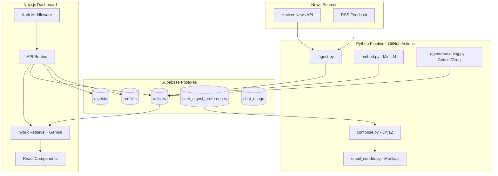

# Skim  -  Complete Project Progress Report

> **Last updated:** 2026-08-31 (Session 4  -  UI refactor, Vercel deploy, chat fix)  
> **Purpose:** Serial record of everything built, integrated, fixed, and planned  -  across all phases and this development session.  
> **Audience:** Developers onboarding to the project or resuming work after a break.

---

## Table of Contents

1. [Executive Summary](#executive-summary)
2. [What Skim Is](#what-skim-is)
3. [Current Status at a Glance](#current-status-at-a-glance)
4. [Chronological Build History](#chronological-build-history)
5. [Phase 6  -  Dashboard (Detailed)](#phase-6--dashboard-detailed)
6. [Hybrid RAG System (6.2 + 6.3)](#hybrid-rag-system-62--63)
7. [Bug Fixes & Incidents](#bug-fixes--incidents)
8. [System Architecture](#system-architecture)
9. [Data Flow & Interconnections](#data-flow--interconnections)
10. [Database Schema & Migrations](#database-schema--migrations)
11. [Pipeline  -  File Inventory](#pipeline--file-inventory)
12. [Dashboard  -  File Inventory](#dashboard--file-inventory)
13. [API Reference](#api-reference)
14. [UI Components](#ui-components)
15. [Authentication & Authorization](#authentication--authorization)
16. [Testing](#testing)
17. [CI/CD](#cicd)
18. [Environment Variables](#environment-variables)
19. [Setup Checklist](#setup-checklist)
20. [What's Next (Remaining Work)](#whats-next-remaining-work)
21. [Design Decisions Log](#design-decisions-log)
22. [Session Notes (This Chat)](#session-notes-this-chat)

---

## Executive Summary

**Skim** is an agentic tech news digest system:

- A **Python pipeline** ingests Hacker News + RSS feeds daily, embeds articles locally, runs a 3-pass LLM agent (classify → insight → select), and emails personalized HTML digests.
- A **Next.js 16 dashboard** provides Google OAuth + email OTP auth with admin approval, digest browsing, archive, settings, and **hybrid RAG chat** over the full article corpus.

**Phases 0–6 are complete.** Pipeline runs daily on GitHub Actions; dashboard is deployed to **Vercel** at [https://skim-azure.vercel.app](https://skim-azure.vercel.app). Phase 7 (onboarding, demo, uptime) is next.

| Metric | Count |
|--------|-------|
| Pipeline unit tests | 148+ (pytest) |
| Dashboard unit tests | 81 (Vitest) |
| **Total automated tests** | **229+** |
| Production URL | `https://skim-azure.vercel.app` |
| SQL migrations | 6 |
| News sources | 5 (HN + 4 RSS) |
| Email themes | 3 |
| Dashboard themes | 3 (light / dark / system) |
| Supabase project ref | `eqedawnpptnbvraslqwv` |
| Superuser | `poudyal.sammit@gmail.com` |

---

## What Skim Is

```
┌─────────────────────────────────────────────────────────────────────────┐
│                           SKIM PLATFORM                                  │
├──────────────────────────────┬──────────────────────────────────────────┤
│         PIPELINE             │              DASHBOARD                    │
│  (GitHub Actions cron)       │         (Next.js on Vercel)               │
│                              │                                           │
│  Ingest → Embed → Agent      │  Auth → Digests → Archive → Chat         │
│  → Compose → Email           │  Search → Settings → Admin               │
└──────────────────────────────┴──────────────────────────────────────────┘
                              │
                    ┌─────────▼─────────┐
                    │  Supabase Postgres │
                    │  + pgvector        │
                    │  + Auth + RLS      │
                    └───────────────────┘
```

**Daily loop:** GitHub Actions runs `pipeline.main` at 00:15 UTC → articles land in DB → embeddings written → agent classifies/insights/selects → personalized emails sent → dashboard reads same data for browse + RAG.

---

## Current Status at a Glance

| Phase | Status | Description |
|-------|--------|-------------|
| **0  -  Setup** | ✅ Done | Repo, Supabase, env vars, GitHub Actions skeleton |
| **1  -  Ingestion** | ✅ Done | HN + RSS adapters, dedup, Postgres storage |
| **2  -  Embeddings** | ✅ Done | MiniLM 384-dim, pgvector HNSW, similarity RPC |
| **3  -  Agent Reasoning** | ✅ Done | 3-pass LLM, key rotation, Groq fallback, parallel insights |
| **4  -  Digest + Email** | ✅ Done | Jinja2 templates, Mailtrap, per-user themes, orchestrator |
| **5  -  Reliability** | ✅ Done | Retry, health check, failure alerts, degradation, CI tests |
| **6A  -  Auth + Admin** | ✅ Done | Google OAuth, email OTP, approval workflow, Admin panel |
| **6B  -  Dashboard APIs** | ✅ Done | Digests, hybrid search, multi-provider chat, preferences, admin |
| **6B  -  Dashboard UI** | ✅ Done | Home, archive, chat, `/search`, navbar SearchBar, component restructure |
| **6B  -  Hybrid RAG** | ✅ Done | MiniLM + FTS + RRF; re-run `sql/005` (double precision fix) in Supabase |
| **6C  -  Preferences** | ✅ Done | Email theme/format, live preview, pipeline personalization |
| **6E  -  Themes** | ✅ Done | Dashboard light/dark/system, `sql/006`, email preview API |
| **6B  -  Deploy + polish** | ✅ Done | Error boundaries, skeletons, theme toggle, cyan Tailwind refactor |
| **6.11  -  Vercel deploy** | ✅ Live | [skim-azure.vercel.app](https://skim-azure.vercel.app); chat embedding fix for serverless |
| **7  -  Go Live** | 📋 Planned | Onboard ~10 users, demo video, 14-day uptime check |

---

## Chronological Build History

### Phase 0  -  Project Setup ✅

**Goal:** Repository structure, database, secrets, CI skeleton.

**What was built:**
- Monorepo layout: `pipeline/`, `dashboard/`, `sql/`, `.github/workflows/`
- Supabase project with publishable/secret key naming
- `sql/schema.sql`  -  core tables (`articles`, `digests`, `pipeline_runs`), pgvector extension
- Dashboard Next.js 16 scaffold
- GitHub Actions workflow skeleton

**Key decision:** Switched from Resend to **Mailtrap** after API key 401 errors.

---

### Phase 1  -  Ingestion ✅

**Goal:** Fetch tech news daily, deduplicate, store in Postgres.

**What was built:**

| File | Role |
|------|------|
| `pipeline/sources/base.py` | `SourceAdapter` ABC, URL normalization (strip UTM params) |
| `pipeline/sources/hackernews.py` | HN top stories via Firebase API |
| `pipeline/sources/rss.py` | feedparser + BeautifulSoup HTML stripping |
| `pipeline/ingest.py` | `ingest_all_sources()`  -  per-source failure isolation |
| `pipeline/db.py` | psycopg2 connection, insert with `ON CONFLICT DO NOTHING` |
| `pipeline/models.py` | Pydantic `Article` model |
| `pipeline/config.py` | RSS source list, `SUMMARY_MAX_CHARS=1000` |

**Sources configured:** `hackernews`, `techcrunch`, `arstechnica`, `theverge`, `mit_tech_review`

**Design choice:** Embed `title + summary` only  -  `raw_text` column exists but is always NULL (no full-page scraping in Phase 1).

**Typical run:** ~91 articles fetched, ~87 deduped on repeat days.

---

### Phase 2  -  Embeddings ✅

**Goal:** Semantic search over article corpus with zero API cost.

**What was built:**

| File | Role |
|------|------|
| `pipeline/embed.py` | `all-MiniLM-L6-v2` via sentence-transformers; `embed_new_articles()` |
| `sql/schema.sql` | `embedding vector(384)`, HNSW index, `search_similar_articles()` RPC |

**Key fix:** Replaced `ivfflat` index with **HNSW**  -  ivfflat with `lists=100` on ~109 rows returned irrelevant results (0.16 similarity for "OpenAI GPT"). HNSW works at any corpus size.

**Properties:**
- Idempotent: only processes rows where `embedding IS NULL`
- Model cached in GitHub Actions for faster CI
- Cosine similarity in Python + Supabase RPC

---

### Phase 3  -  Agent Reasoning ✅

**Goal:** LLM-powered classification, editorial insights, and story selection.

**What was built:**

| File | Role |
|------|------|
| `pipeline/agent/llm_client.py` | Gemini primary, Groq fallback, thread-safe key pool, round-robin |
| `pipeline/agent/tools.py` | Function schemas: `classify_article`, `generate_insight`, `select_top_stories` |
| `pipeline/agent/prompts.py` | System prompts + few-shot examples per pass |
| `pipeline/agent/reasoning.py` | `ArticleAgent`, 3-pass orchestrator, parallel insights |

**Three passes:**

| Pass | Function | Output |
|------|----------|--------|
| 1  -  Classify | `classify_batch()` | `topic`, `importance_score` |
| 2  -  Insight | `generate_insights()` | `insight`, `key_takeaway` |
| 3  -  Select | `select_digest_stories()` | ordered article IDs + rationale |

**LLM stack:**
- Primary: `gemini-3.6-flash` (replaced deprecated `gemini-2.5-flash`)
- High-demand fallback: `gemini-2.0-flash`, `gemini-3.5-flash-lite`
- Provider fallback: Groq `openai/gpt-oss-120b`
- 5 Gemini keys from 5 separate Google Cloud projects (~100 calls/day)
- 2 Groq keys as last resort

**Major fix  -  CI timeout:** Sequential insight calls took ~6 min, exceeding 10-min job limit. Fixed with `ThreadPoolExecutor(max_workers=3)` + round-robin key pool → Pass 2 dropped to ~2 min.

---

### Phase 4  -  Digest + Email ✅

**Goal:** Compose and send daily HTML email digests.

**What was built:**

| File | Role |
|------|------|
| `pipeline/compose.py` | Jinja2 renderer with topic labels, quiet-day fallback |
| `pipeline/email_sender.py` | Mailtrap REST API (sandbox + production) |
| `pipeline/digest_preferences.py` | Per-user theme/format/topic filtering |
| `pipeline/main.py` | Full orchestrator with digest idempotency |
| `pipeline/templates/digest.html` | Classic light theme |
| `pipeline/templates/digest_cyan.html` | Skim dark (brand default) |
| `pipeline/templates/digest_minimal.html` | Text-first theme |
| `pipeline/templates/_digest_story_row.html` | Shared story partial |

**Orchestrator flow (`pipeline.main`):**
1. Check idempotency (`digests` table)
2. Ingest → embed → agent reasoning (or degraded fallback)
3. For each subscriber: filter by preferences → compose HTML → send via Mailtrap
4. Log `pipeline_runs` record

---

### Phase 5  -  Reliability ✅

**Goal:** Production-grade error handling, monitoring, CI.

| Task | File | What it does |
|------|------|--------------|
| 5.1 Retry | `pipeline/resilience.py` | Exponential backoff on HN/RSS/Mailtrap |
| 5.2 Alerts | `pipeline/alert_failure.py` | Email admin on CI failure with GitHub link |
| 5.3 Degradation | `pipeline/degradation.py` | Fallback digest when agent fails |
| 5.4 Logging | `pipeline/config.py` | Structured `LOG_LEVEL` across all entry points |
| 5.5 Health | `pipeline/health_check.py` | Validates recent runs, delivery, duplicates |
| 5.6 CI tests | `.github/workflows/test.yml` | pytest + vitest on push/PR |

**Degradation behavior:** Embedding failures don't abort the run; degraded digests still send with status `partial`.

---

### Phase 6  -  Dashboard, Auth & RAG ✅

Phase 6 is split into sub-phases:

#### Phase 6A  -  Authentication & Admin ✅

**Goal:** Invite-by-approval access model before public deploy.

**Auth flows:**

| Method | Use case | After success |
|--------|----------|---------------|
| Google OAuth | Sign up or sign in | Pending → `/pending`; superuser → dashboard |
| Email OTP (Sign up) | New account registration | `/pending` until approved |
| Email OTP (Sign in) | Returning approved users | Dashboard (or `/pending` if still pending) |

**What was built:**

| Component | Path | Purpose |
|-----------|------|---------|
| Login page | `dashboard/src/app/login/page.tsx` | Google + email OTP tabs |
| OAuth callback | `dashboard/src/app/auth/callback/route.ts` | Sets session cookies on redirect |
| Profile sync | `dashboard/src/app/auth/complete/route.ts` | Creates/syncs profile, superuser auto-approve, admin email |
| Sign out | `dashboard/src/app/auth/signout/route.ts` | Clears session |
| Wait page | `dashboard/src/app/pending/page.tsx` | Contact admin mailto + sign out |
| Admin panel | `dashboard/src/app/admin/page.tsx` + `AdminPanel.tsx` | Approve/reject pending users |
| Middleware | `dashboard/src/middleware.ts` | Route protection, 401/403 for APIs |
| Auth helper | `dashboard/src/lib/auth/require-active-user.ts` | API guard for active users |
| Auth types | `dashboard/src/lib/auth/types.ts` | `Profile`, `isAdmin()`, `isSuperuser()` |
| Supabase clients | `dashboard/src/lib/supabase/` | server, client, admin (service role) |

**SQL:**

| File | Purpose |
|------|---------|
| `sql/002_users_auth_preferences.sql` | `profiles`, `user_digest_preferences`, `digest_subscribers`, `chat_usage`, RLS, `handle_new_user()` trigger |
| `sql/003_fix_profiles_rls.sql` | `is_active_admin()` SECURITY DEFINER  -  fixes RLS recursion redirect loop |

**Capacity:** ~10 approved members + superuser (11 total on free tier).

**Documentation:** `docs/phase6_auth_admin_preferences.md`

---

#### Phase 6B  -  Dashboard Features

| Task | Status | What was built |
|------|--------|----------------|
| **6.1** Digests API | ✅ | `GET /api/digests`, `GET /api/digests/dates`, `lib/digests.ts` |
| **6.2** Search API | ✅ | `GET /api/search`  -  hybrid (default) + keyword mode |
| **6.3** Chat API | ✅ | `GET/POST /api/chat`  -  hybrid RAG + multi-provider LLM + structured errors |
| **6.4** Layout + nav | ✅ | `AppShell`, `AppNav`, mobile menu, active routes, `UserMenu` |
| **6.5** Home page | ✅ | `DigestFeed`, `DigestCard`, `TopicBadge` on `/` |
| **6.6** Archive | ✅ | `ArchiveView`, `DatePicker` on `/archive` |
| **6.7** Chat UI | ✅ | `ChatInterface`, loading steps, `ChatErrorPanel`, provider badges |
| **6.8** SearchBar | ✅ | Navbar SearchBar + dedicated `/search` page |
| **6.9** Settings | ✅ | `DigestPreferenceForm`, email preview, dashboard theme selector |
| **6.10** Polish | ✅ | Error boundaries (`error.tsx`, `global-error.tsx`), `loading.tsx`, `not-found.tsx`, `DigestFeedSkeleton`, theme toggle in navbar + user menu |
| **6.11** Vercel deploy | ✅ | Live at `https://skim-azure.vercel.app`; `vercel.json` + `docs/vercel-deploy.md` |

#### Phase 6C  -  Per-User Digest Preferences ✅

- Settings page: theme (cyan/classic/minimal), format (full/brief/headlines), max stories, topic filters
- Live email preview iframe + `GET /api/settings/digest-preview`
- Pipeline reads `user_digest_preferences` + `digest_subscribers` for personalized sends
- `GET/PUT /api/settings/preferences` (supports partial updates for theme provider)

#### Phase 6E  -  Dashboard + Email Themes ✅

- Dashboard light / dark / system mode via `ThemeProvider` + `sql/006_dashboard_theme.sql`
- CSS variables on `html.light` / `html.dark`; no flash on load (inline script in layout)
- Email theme picker with mini-previews; format picker shows inclusion flags

---

## Hybrid RAG System (6.2 + 6.3)

The centerpiece of the latest development session. Search and chat share one retrieval stack.

### Retrieval Pipeline

```
User query (+ optional chat history)
        │
        ▼
┌───────────────────────┐
│ buildRetrievalQueries │  Combine recent user turns for follow-ups
│ (retrieval/query.ts)  │  e.g. "What about funding?" + prior context
└───────────┬───────────┘
            ▼
┌───────────────────────┐
│ embedQuery            │  all-MiniLM-L6-v2 (384-dim)
│ (chat/embeddings.ts)  │  Local: @xenova/transformers (dynamic import)
│                       │  Vercel: Hugging Face Inference API (HF_TOKEN)
└───────────┬───────────┘
            ▼
┌───────────────────────────────────────────────────┐
│              PARALLEL RETRIEVAL                      │
│  ┌─────────────────┐    ┌─────────────────────┐   │
│  │ Vector search   │    │ FTS search          │   │
│  │ articles.embedding│   │ articles.search_vector│  │
│  │ cosine similarity │   │ websearch_to_tsquery │  │
│  └────────┬────────┘    └──────────┬──────────┘   │
│           └──────────┬─────────────┘               │
│                      ▼                             │
│           Reciprocal Rank Fusion (k=60)            │
│           vector weight 0.55 / FTS weight 0.45     │
│                      ▼                             │
│           Importance-score boost                   │
│           (pipeline agent scores 0–10)             │
└───────────────────────────────────────────────────┘
            │
            ▼
    Top N articles (8 for chat, 20 for search)
            │
            ▼ (chat only)
┌───────────────────────┐
│ generateChatAnswer    │  Multi-key Gemini → fallback models → Groq
│ (chat/llm-client.ts)  │  Structured context + citation rules
└───────────────────────┘
```

### Fallback Chain

If any step fails, retrieval degrades gracefully:

1. **SQL hybrid RPC**  -  `search_articles_hybrid()` (fastest, requires `sql/005`)
2. **In-process RRF**  -  fuse vector + FTS results in TypeScript
3. **Vector-only**  -  `search_articles_vector()` or legacy `search_similar_articles()`
4. **FTS-only**  -  `search_articles_fts()` or direct `textSearch`
5. **Keyword ILIKE**  -  `title ILIKE` / `summary ILIKE` last resort

### Critical Fix: Embedding Space Alignment

**Problem identified during this session:** An earlier approach used Gemini `gemini-embedding-001` (768-dim) in a separate `embedding_gemini` column, while the pipeline embeds with MiniLM (384-dim) into `articles.embedding`. Vector search across mismatched spaces returns garbage.

**Solution:**
- Query embeddings now use **MiniLM 384-dim** via `@xenova/transformers` in the dashboard
- `sql/005_hybrid_search.sql` rewritten to use existing `articles.embedding vector(384)`
- Removed dependency on `embedding_gemini` column
- `pipeline/embed_gemini.py` exists as experimental/untracked  -  **not integrated**

### RAG Files

| File | Purpose |
|------|---------|
| `dashboard/src/lib/retrieval.ts` | `hybridRetrieve()` orchestrator with full fallback chain |
| `dashboard/src/lib/retrieval/query.ts` | `buildRetrievalQueries()`  -  conversational query expansion |
| `dashboard/src/lib/retrieval/rrf.ts` | `reciprocalRankFusion()` + `boostByImportance()` |
| `dashboard/src/lib/chat/embeddings.ts` | MiniLM local / HF API on Vercel; `SKIM_EMBEDDING_MODE` |
| `dashboard/src/lib/tailwind-ui.ts` | Shared Tailwind class strings (buttons, cards, nav, inputs) |
| `dashboard/src/styles/globals.css` | Cyan design tokens only (no component CSS classes) |
| `dashboard/src/lib/chat/llm-client.ts` | Multi-key Gemini rotation, model fallbacks, Groq failover |
| `dashboard/src/lib/chat/prompt.ts` | System prompt + context building |
| `dashboard/src/lib/chat/errors.ts` | `ChatLlmError`, quota/rate-limit parsing |
| `dashboard/src/lib/chat/gemini.ts` | Re-exports from `llm-client` (backward compat) |
| `dashboard/src/lib/chat/rate-limit.ts` | Daily chat quota via `chat_usage` table (20/day) |
| `dashboard/src/lib/search.ts` | Legacy keyword search (FTS → ILIKE) for `?mode=keyword` |
| `sql/005_hybrid_search.sql` | RPCs: `search_articles_vector`, `search_articles_fts`, `search_articles_hybrid` (uses `double precision`) |
| `sql/006_dashboard_theme.sql` | `dashboard_theme` column on `user_digest_preferences` |

### Chat API Contract

**GET `/api/chat`**  -  returns quota:
```json
{ "limit": 20, "used": 3, "remaining": 17 }
```

**POST `/api/chat`**  -  RAG Q&A:
```json
// Request
{ "message": "What happened in AI?", "history": [{ "role": "user", "content": "..." }] }

// Response
{
  "answer": "According to [1], ...",
  "sources": [{ "id": 1, "title": "...", "similarity": 0.82, "rrf_score": 0.015, "retrieval_method": "hybrid" }],
  "remaining": 16,
  "used": 4,
  "retrieval_method": "hybrid",
  "provider": "groq",
  "model": "openai/gpt-oss-120b",
  "articles_retrieved": 8
}

// Error response (structured)
{
  "error": "All AI providers are temporarily unavailable...",
  "error_code": "all_providers_failed",
  "provider": "gemini",
  "retry_after_seconds": 10,
  "tried_providers": ["gemini:gemini-3.6-flash", "gemini:gemini-2.0-flash", "groq:openai/gpt-oss-120b"],
  "details": "..."
}
```

### Search API Contract

**GET `/api/search?q=OpenAI&mode=hybrid&limit=20`**

- `mode=hybrid` (default)  -  full RAG retrieval stack
- `mode=keyword`  -  FTS/ILIKE only via `lib/search.ts`

---

## Bug Fixes & Incidents

### Phase 6 Auth Fixes (This Session)

| Problem | Cause | Fix | Files |
|---------|-------|-----|-------|
| **Login redirect loop** after Google sign-in | RLS policy on `profiles` queried `profiles` recursively | `is_active_admin()` as `SECURITY DEFINER` function | `sql/003_fix_profiles_rls.sql` |
| **OAuth session not persisting** | Cookies set on wrong response object | Set cookies on `NextResponse` in callback | `auth/callback/route.ts` |
| **Profile sync failing** | Client couldn't bypass RLS for profile upsert | `SUPABASE_SECRET_KEY` + admin client | `auth/complete/route.ts`, `lib/supabase/admin.ts` |
| **Middleware infinite loop** | Redirected to `/auth/complete` when profile missing | Middleware stops looping; complete route handles sync | `middleware.ts` |
| **API returned HTML errors** | Middleware redirected APIs to login page | Return JSON `401`/`403` for `/api/*` routes | `middleware.ts`, `require-active-user.ts` |

### Phase 6 RAG + Chat Fixes

| Problem | Cause | Fix | Files |
|---------|-------|-----|-------|
| **Hybrid RPC type error** | Postgres `float` (real) vs `double precision` from pgvector / FLOAT columns | `sql/005` rewritten with `double precision` return types | `sql/005_hybrid_search.sql` |
| **Chat 404 on Gemini** | `gemini-2.0-flash` deprecated; `.env` overrode default | Default → `gemini-3.6-flash`; update `GEMINI_MODEL` in `.env` | `chat/llm-client.ts`, `.env.example` |
| **Chat 500 on quota** | Single Gemini key, no fallbacks | Multi-key rotation → fallback models → Groq (`groq-sdk`) | `chat/llm-client.ts` |
| **Raw JSON errors in UI** | API returned unparsed Gemini error blobs | Structured `ChatLlmError` + `ChatErrorPanel` with retry | `chat/errors.ts`, `ChatInterface.tsx` |
| **Chat 500 on Vercel** | `@xenova/transformers` crashes serverless | HF Inference API + dynamic imports; `HF_TOKEN` on Vercel | `embeddings.ts`, `route.ts` |
| **Chat UI overflow** | Fixed viewport height without flex `min-h-0` | Full-height flex chain; footer hidden on `/chat` | `AppShellClient`, `ChatInterface` |
| **Vodafone red theme** | Experimental rebrand | Reverted to cyan Skim tokens + Tailwind utilities | `globals.css`, `tailwind-ui.ts` |

### Pipeline Fixes (Phases 1–5)  -  Summary

| Phase | Notable fixes |
|-------|---------------|
| 1 | Password `@` in DB URL → `_encode_db_password()`; IPv6-only Supabase host → Supavisor pooler (port 6543) |
| 1 | RSS HTML in summaries → BeautifulSoup strip + 1000 char cap |
| 2 | ivfflat poor recall → HNSW index |
| 3 | 17 LLM issues: SDK migration, Groq model retirement, pydantic pin, key rotation on 429/403/404, parallel insights for CI timeout, thread-safe key pool |
| 4 | Resend → Mailtrap |
| 5 | Graceful degradation when agent fails; failure alert emails |

Full problem log: `docs/report.md` (391 lines, internal).

### Dashboard Test Fixes (This Session)

| Problem | Fix |
|---------|-----|
| Vitest JSX parse error in setup | Use `createElement` instead of JSX in `vitest.setup.ts` |
| `Profile` import from wrong module | Import from `@/lib/auth/types` in fixtures |
| Chat/search route tests mocked old `searchArticles` | Updated to mock `hybridRetrieve` |
| TypeScript error in `enrichArticles` | Explicit loop instead of filter type predicate |

---

## System Architecture

### End-to-End Data Flow



### Pipeline ↔ Dashboard Connection Points

| Pipeline writes | Dashboard reads | Connection |
|-----------------|-----------------|------------|
| `articles.*` | `/api/digests`, `/api/search`, `/api/chat` | Shared article corpus |
| `articles.embedding` | `lib/chat/embeddings.ts` | Same MiniLM model + 384-dim space |
| `articles.topic`, `importance_score`, `insight` | Chat context, `SourceCitation`, RRF boost | Agent metadata enriches RAG |
| `digests` | `/api/digests`, `/archive` | Digest history by date |
| `profiles`, `digest_subscribers` | Auth middleware, `/admin` | Access control |
| `user_digest_preferences` | `/settings`, pipeline `compose.py` | Personalization |
| `chat_usage` | `/api/chat` rate limit | Daily quota tracking |

---

## Database Schema & Migrations

### Apply Order (Supabase SQL Editor)

```
1. sql/schema.sql               -  Core tables, pgvector, HNSW, search_similar_articles RPC
2. sql/002_users_auth_preferences.sql   -  Auth, profiles, preferences, RLS
3. sql/003_fix_profiles_rls.sql         -  RLS recursion fix (if 002 already applied)
4. sql/004_search_fts.sql               -  search_vector tsvector + GIN index
5. sql/005_hybrid_search.sql            -  Hybrid RAG RPCs (vector + FTS + RRF)
6. sql/006_dashboard_theme.sql          -  dashboard_theme column on preferences
```

### Table Reference

| Table | Purpose | Key columns |
|-------|---------|-------------|
| `articles` | News corpus | `title`, `summary`, `embedding vector(384)`, `search_vector`, `topic`, `importance_score`, `insight`, `key_takeaway` |
| `digests` | Sent digest log | `digest_date`, `article_ids`, `story_count` |
| `pipeline_runs` | Execution log | `status`, `articles_ingested`, `duration_seconds` |
| `profiles` | User accounts | `email`, `status` (pending/active/rejected), `role` (member/superuser) |
| `user_digest_preferences` | Email settings | `theme`, `format`, `max_stories`, `topic_filters` |
| `digest_subscribers` | Active email recipients | `user_id`, `email` |
| `chat_usage` | RAG rate limiting | `user_id`, `usage_date`, `query_count` |

### RPC Functions

| Function | Dimensions | Purpose |
|----------|------------|---------|
| `search_similar_articles` | 384 | Legacy vector search (schema.sql) |
| `search_articles_vector` | 384 | Vector search with full article fields (005) |
| `search_articles_fts` |  -  | Full-text search with rank (005) |
| `search_articles_hybrid` | 384 | RRF fusion of vector + FTS (005) |
| `is_active_admin` |  -  | SECURITY DEFINER admin check (003) |

---

## Pipeline  -  File Inventory

```
pipeline/
├── main.py                 # Entry: ingest → embed → reason → compose → send
├── ingest.py               # Multi-source ingestion orchestrator
├── embed.py                # MiniLM embeddings (384-dim), similarity search
├── embed_gemini.py         # ⚠️ Experimental  -  NOT integrated (768-dim Gemini)
├── db.py                   # Postgres connection, CRUD, password URL encoding
├── compose.py              # Jinja2 HTML digest rendering
├── email_sender.py         # Mailtrap REST API
├── config.py               # Sources, logging, constants
├── models.py               # Pydantic Article model
├── digest_preferences.py   # Per-user theme/format/topic filtering
├── degradation.py          # Fallback when LLM reasoning fails
├── resilience.py           # @retry_with_backoff decorator
├── health_check.py         # Pipeline health validation
├── alert_failure.py        # CI failure email alerts
├── agent/
│   ├── llm_client.py       # Gemini/Groq, key pool, rotation, fallbacks
│   ├── reasoning.py        # ArticleAgent: classify → insight → select
│   ├── prompts.py          # System prompts + few-shot examples
│   └── tools.py            # Function-calling JSON schemas
├── sources/
│   ├── base.py             # SourceAdapter ABC
│   ├── hackernews.py       # HN Firebase adapter
│   └── rss.py              # RSS/Atom adapter
├── templates/
│   ├── digest.html         # Classic theme
│   ├── digest_cyan.html    # Skim dark (default)
│   ├── digest_minimal.html # Minimal theme
│   └── _digest_story_row.html
└── tests/                  # 24 test modules, 148 unit tests
```

---

## Dashboard  -  File Inventory

```
dashboard/
├── vercel.json                 # API maxDuration 60s, region iad1
├── src/
│   ├── middleware.ts           # Auth gate: public/pending/active/admin
│   ├── styles/globals.css      # Cyan design tokens (CSS variables only)
│   ├── app/
│   │   ├── layout.tsx          # Inter font, theme boot script, AppShell
│   │   ├── page.tsx            # Home  -  today's digest
│   │   ├── error.tsx, global-error.tsx, loading.tsx, not-found.tsx
│   │   ├── login/page.tsx      # Google OAuth + email OTP
│   │   ├── pending/page.tsx    # Wait page
│   │   ├── admin/page.tsx      # User approval queue
│   │   ├── settings/page.tsx   # Digest + dashboard preferences
│   │   ├── archive/page.tsx    # Past digests
│   │   ├── chat/page.tsx       # RAG chat (full-height layout)
│   │   ├── search/page.tsx     # Hybrid search results
│   │   ├── auth/               # callback, complete, signout routes
│   │   └── api/                # digests, search, chat, settings, admin
│   ├── components/
│   │   ├── layout/             # AppShell, AppNav, PageContainer, ThemeToggle, UserMenu
│   │   ├── digest/             # DigestFeed, DigestCard, TopicBadge
│   │   ├── chat/               # ChatInterface, ChatMessage, ChatErrorPanel, SourceCitation
│   │   ├── search/             # SearchResults, SearchResultCard
│   │   ├── settings/           # DigestPreferenceForm
│   │   ├── theme/              # ThemeProvider, DashboardThemeSelector
│   │   ├── admin/              # AdminPanel
│   │   ├── archive/            # DatePicker
│   │   └── ui/                 # Button, EmptyState, SearchBar, skeletons, ErrorAlert
│   └── lib/
│       ├── tailwind-ui.ts      # Shared Tailwind class strings
│       ├── retrieval.ts        # hybridRetrieve orchestrator
│       ├── retrieval/          # query.ts, rrf.ts
│       ├── chat/               # embeddings, llm-client, errors, rate-limit, prompt
│       ├── auth/               # require-active-user, types
│       ├── supabase/           # server, client, admin
│       └── dashboard-theme.ts  # Theme normalization
├── Design.md                   # Skim cyan design system
└── README.md                   # Dashboard setup + API reference
```

---

## API Reference

All API routes require `profiles.status = active` unless noted.

| Endpoint | Method | Auth | Description |
|----------|--------|------|-------------|
| `/api/digests` | GET | Active | Digest articles (`?date=YYYY-MM-DD`) |
| `/api/digests/dates` | GET | Active | List of dates with digests |
| `/api/search` | GET | Active | Search (`?q=`, `?mode=hybrid\|keyword`, `?limit=`) |
| `/api/chat` | GET | Active | Chat quota remaining |
| `/api/chat` | POST | Active | RAG Q&A (`{ message, history? }`) |
| `/api/settings/preferences` | GET | Active | User digest preferences |
| `/api/settings/preferences` | PUT | Active | Update preferences |
| `/api/admin/users` | GET | Admin | List users (`?status=pending`) |
| `/api/admin/users` | POST | Admin | Approve/reject (`{ userId, action }`) |

**Error responses:**
- `401`  -  Not authenticated
- `403`  -  Authenticated but pending/rejected (or not admin for admin routes)
- `429`  -  Chat daily limit reached (20 queries/day) or LLM quota exhausted
- `503`  -  All LLM providers failed (structured body with `error_code`, `tried_providers`)
- `500`  -  Server error with `{ error, error_code?, details? }`

Additional endpoints:

| `/api/settings/digest-preview` | GET | Active | Email HTML preview (`?theme=&format=`) |

---

## UI Components

| Component | Used on | Key features |
|-----------|---------|--------------|
| `AppNav` | All pages | Auth-aware links, Admin nav for superuser |
| `DigestFeed` | `/` | StoryStream timeline layout |
| `DigestCard` | Feed, Archive | Title, summary, insight, topic badge, source link |
| `ArchiveView` | `/archive` | DatePicker + digest for selected date |
| `DatePicker` | Archive | Calendar with available digest dates |
| `ChatInterface` | `/chat` | Message history, animated loading steps, quota, error panel with retry |
| `ChatLoadingBubble` | Chat | 3-step progress: embed → search → generate |
| `ChatErrorPanel` | Chat | Structured errors (quota, providers tried, retry) |
| `ChatMessage` | Chat | User/assistant bubbles, markdown, provider badge |
| `SourceCitation` | Chat | Source link, similarity bar, retrieval method badge |
| `TopicBadge` | Cards, Citations | Color-coded topic pill |
| `DigestPreferenceForm` | `/settings` | Email theme/format, live preview, dashboard theme, topic filters |
| `DashboardThemeSelector` | `/settings` | Light / dark / system swatches |
| `ThemeProvider` | Layout | DB + localStorage sync, no-flash theme apply |
| `SearchBar` | Navbar, `/search` | Debounced hybrid search |
| `SearchResults` | `/search` | Result cards with retrieval metadata |
| `AdminPanel` | `/admin` | Pending queue with approve/reject buttons |

**Design system:** `dashboard/Design.md`  -  cyan accents (`#06b6d4`), dark default canvas `#0f1419`, light/dark/system themes. Implementation via `tailwind-ui.ts` + `globals.css` tokens (Inter UI font).

---

## Authentication & Authorization

### Access Matrix

| Route | Public | Pending | Active | Superuser |
|-------|--------|---------|--------|-----------|
| `/login` | ✅ | ✅ | ✅ | ✅ |
| `/pending` |  -  | ✅ |  -  |  -  |
| `/`, `/archive`, `/chat`, `/settings` |  -  |  -  | ✅ | ✅ |
| `/admin` |  -  |  -  |  -  | ✅ |
| `/api/*` |  -  | 403 | ✅ | ✅ |
| `/api/admin/*` |  -  | 403 | 403 | ✅ |

### Profile Lifecycle

```
Sign up (Google or email OTP)
        │
        ▼
profiles.status = 'pending'  (except superuser → 'active')
        │
        ├── /pending page (contact admin)
        │
        ▼
Admin approves in /admin
        │
        ├── status → 'active'
        ├── Added to digest_subscribers
        └── Default preferences created
        │
        ▼
Full dashboard + API access
```

### Middleware Logic (`middleware.ts`)

1. Refresh Supabase session from cookies
2. Public paths (`/login`, `/auth/*`)  -  allow through
3. No session → redirect to `/login` (or `401` JSON for APIs)
4. No profile → allow `/auth/complete` only
5. `status = pending/rejected` → redirect to `/pending` (or `403` JSON for APIs)
6. `/admin` → require superuser role

---

## Testing

### Pipeline  -  148 unit tests (pytest)

```bash
cd pipeline && pytest -m "not integration"
```

| Area | Test files | Coverage |
|------|------------|----------|
| LLM client | `test_llm_client.py` (34) | Key rotation, fallbacks, Groq, timeouts |
| Concurrency | `test_concurrency.py` (28) | Parallel insights, thread-safe key pool |
| Agent | `test_agent.py` (23) | Classify/insight/select passes |
| Sources | `test_rss.py`, `test_hackernews.py`, `test_ingest.py` | Adapters, parsing |
| Email | `test_email_sender.py`, `test_compose.py` | Mailtrap, templates |
| Resilience | `test_resilience.py`, `test_degradation.py` | Retry, fallback |
| DB/Embed | `test_db.py`, `test_embed.py`, `test_search_rpc.py` | Connection, embeddings, RPC |

### Dashboard  -  81 unit tests (Vitest)

```bash
cd dashboard && npm test
```

| Area | Test files | Coverage |
|------|------------|----------|
| API routes | `api/chat/route.test.ts`, `api/search/route.test.ts`, `api/digests/route.test.ts` | Auth, rate limit, structured errors |
| Chat LLM | `chat/llm-client.test.ts`, `chat/errors.test.ts` | Key rotation, Groq fallback, error parsing |
| Retrieval | `retrieval/rrf.test.ts`, `retrieval/query.test.ts` | RRF fusion, query expansion |
| Lib | `digests.test.ts`, `search.test.ts`, `rate-limit.test.ts`, `topics.test.ts`, `email-preview.test.ts`, `preferences-validation.test.ts` | Helpers |
| Components | `*.test.tsx` (14+ files) | ChatInterface, ChatErrorPanel, DigestCard, AdminPanel, etc. |

### CI (`.github/workflows/test.yml`)

Runs on push to `main` and PRs:
- Python 3.11 → `pytest pipeline/tests -m "not integration"`
- Node 20 → `npm test` in dashboard

---

## CI/CD

### Daily Pipeline (`.github/workflows/digest.yml`)

| Setting | Value |
|---------|-------|
| Trigger | Cron `15 0 * * *` (00:15 UTC daily) + manual `workflow_dispatch` |
| Timeout | 10 minutes |
| Steps | checkout → Python 3.11 → cache MiniLM → `python -m pipeline.main` → health check → failure alert |
| On failure | `python -m pipeline.alert_failure` emails `DIGEST_RECIPIENT` |

### Required GitHub Secrets

`SUPABASE_URL`, `SUPABASE_PUBLISHABLE_KEY`, `SUPABASE_SECRET_KEY`, `SUPABASE_DB_URL` (pooler port 6543), `GEMINI_API_KEYS`, `GROQ_API_KEYS`, `HF_TOKEN`, `MAILTRAP_API_TOKEN`, `MAILTRAP_SENDER_EMAIL`, `DIGEST_RECIPIENT`, `SKIM_SUPERUSER_EMAIL`

---

## Environment Variables

### Pipeline (`pipeline/.env`)

See `pipeline/env.example` and root `README.md` for full table.

**Critical vars:** `SUPABASE_DB_URL`, `GEMINI_API_KEYS` (comma-separated, 5 keys from 5 projects), `GROQ_API_KEYS`, `MAILTRAP_API_TOKEN`, `DIGEST_RECIPIENT`

### Dashboard (`dashboard/.env.local`)

See `dashboard/.env.example` and `docs/phase6_auth_admin_preferences.md`.

| Variable | Required | Purpose |
|----------|----------|---------|
| `NEXT_PUBLIC_SUPABASE_URL` | Yes | Supabase project URL |
| `NEXT_PUBLIC_SUPABASE_PUBLISHABLE_KEY` | Yes | Anon key |
| `SUPABASE_SECRET_KEY` | Yes | Service role  -  profile sync, admin API |
| `SKIM_SUPERUSER_EMAIL` | Yes | Auto-approved superuser |
| `SKIM_ADMIN_CONTACT_EMAIL` | Yes | Wait page + signup alerts |
| `GEMINI_API_KEYS` | For chat | Comma-separated Gemini keys (rotation) |
| `GEMINI_MODEL` | No | Default: `gemini-3.6-flash` |
| `GEMINI_FALLBACK_MODELS` | No | Default: `gemini-2.0-flash,gemini-3.5-flash-lite` |
| `GROQ_API_KEYS` | For chat fallback | Comma-separated Groq keys |
| `GROQ_MODEL` | No | Default: `openai/gpt-oss-120b` |
| `HF_TOKEN` | For chat on Vercel | Hugging Face Inference API for query embeddings (required in production) |
| `SKIM_EMBEDDING_MODE` | No | `hf` \| `local` \| `off`  -  auto `hf` when `VERCEL` is set |
| `MAILTRAP_API_TOKEN` | For alerts | Admin signup notification emails |

**Note:** Local dev uses `@xenova/transformers` for embeddings. Vercel uses HF Inference API  -  set `HF_TOKEN`.

---

## Setup Checklist

### Database (Supabase SQL Editor, in order)

- [ ] `sql/schema.sql`
- [ ] `sql/002_users_auth_preferences.sql`
- [ ] `sql/003_fix_profiles_rls.sql` (if 002 was applied before fix)
- [ ] `sql/004_search_fts.sql`
- [ ] `sql/005_hybrid_search.sql` ← **re-run if hybrid RPC warns** (double precision fix)
- [ ] `sql/006_dashboard_theme.sql` ← dashboard light/dark/system preference

### Supabase Auth

- [ ] Google OAuth provider enabled (Client ID + Secret)
- [ ] Email provider enabled with 6-digit OTP
- [ ] Redirect URLs: `/auth/callback`, `/auth/complete` (localhost + production)
- [ ] Site URL set

### Pipeline

- [ ] `pipeline/.env` filled
- [ ] `python -m pipeline.main` runs successfully
- [ ] GitHub secrets configured
- [ ] Mailtrap domain verified for production sends

### Dashboard

- [ ] `dashboard/.env.local` filled (including `SUPABASE_SECRET_KEY`)
- [ ] `npm install && npm run dev`
- [ ] Google login as superuser → dashboard + Admin nav
- [ ] Test user signup → `/pending` → admin approve → dashboard
- [ ] Chat returns answers with sources
- [ ] Search returns hybrid results

### Production

- [x] Vercel deploy at `https://skim-azure.vercel.app`
- [ ] Set all Vercel env vars (`GEMINI_API_KEYS`, `HF_TOKEN`, Supabase keys)
- [ ] Redeploy after chat embedding fix
- [ ] Verify `/chat` returns answers (not 500)
- [ ] Run SQL migrations on production Supabase if not done
- [ ] Onboard first users (Phase 7)

---

## What's Next (Remaining Work)

| Task | Priority | Notes |
|------|----------|-------|
| **Redeploy chat embedding fix** | High | Push `embeddings.ts` + `route.ts`; set `HF_TOKEN` on Vercel |
| **Verify production chat** | High | `GET/POST /api/chat` should not return 500 |
| **Phase 7  -  Onboarding** | Medium | Invite ~10 users, demo walkthrough, quota monitoring |
| **14-day pipeline uptime** | Low | Verify consecutive `pipeline_runs` successes |
| **Remove `embed_gemini.py`** or integrate | Low | Experimental; RAG uses MiniLM only |

---

## Design Decisions Log

| Decision | Choice | Why |
|----------|--------|-----|
| Vector DB | pgvector in Supabase | One DB for relational + vector, zero extra cost |
| Embeddings | Local MiniLM (384-dim) | Free at any volume; pipeline + dashboard share same space |
| LLM (pipeline) | Gemini primary, Groq fallback | Free tier generous; multi-key rotation |
| LLM (chat) | Gemini 3.6 Flash + key rotation + Groq fallback | Mirrors pipeline resilience; handles free-tier quotas |
| RAG fusion | RRF (k=60) | Proven hybrid retrieval; no training needed |
| RAG fallback | 5-tier retrieval chain | Works even without SQL migrations (slower) |
| Chat errors | Structured API + UI panel | User-friendly quota/rate-limit messages with retry |
| Auth | Supabase + approval workflow | Google profile data; admin gate before public access |
| Email | Mailtrap API | Sandbox for dev; verified domain for production |
| Scheduler | GitHub Actions cron | Free, no server to maintain |
| CI database | Supavisor pooler (6543) | IPv4-compatible; direct host is IPv6-only |
| Vector index | HNSW (not ivfflat) | Works at any corpus size; ivfflat fails on small tables |
| Testing | pytest + Vitest | 229+ tests; integration tests deselected in CI |
| UI styling | Tailwind v4 + `tailwind-ui.ts` | No static component CSS; responsive breakpoints |
| Embeddings (Vercel) | HF Inference API | `@xenova/transformers` unreliable on serverless |

---

## Session Notes (This Chat)

### Session 1  -  Auth + hybrid RAG foundation

1. **Auth documentation**  -  `docs/phase6_auth_admin_preferences.md` before DB setup
2. **Phase 6A  -  Auth + Admin**  -  Google OAuth, email OTP, middleware, SQL `002`/`003`
3. **Phase 6B  -  Dashboard**  -  digests, search, archive, chat APIs + UI
4. **Hybrid RAG**  -  MiniLM embeddings, RRF fusion, `sql/005`, conversational history
5. **Dashboard testing**  -  Vitest + Testing Library

### Session 2  -  Themes, multi-provider chat, polish

1. **Phase 6E  -  Themes**  -  email preview, dashboard light/dark/system, `sql/006`
2. **Component restructure**  -  `layout/`, `ui/`, `digest/`, `chat/`, `search/`, `settings/`, `theme/`, `admin/`
3. **Search page**  -  `/search` with navbar SearchBar
4. **Multi-provider chat**  -  `llm-client.ts`: Gemini key rotation → fallback models → Groq
5. **Chat UX**  -  `ChatLoadingBubble` (3-step progress), `ChatErrorPanel` (quota/retry/providers tried)
6. **SQL fix**  -  `005_hybrid_search.sql` uses `double precision` (fixes RPC type mismatch)
7. **Model update**  -  `gemini-3.6-flash` primary (replaces deprecated `gemini-2.0-flash`)
8. **Tests**  -  80 dashboard tests; `llm-client.test.ts`, `errors.test.ts`, `ThemeToggle.test.tsx`, `error.test.tsx`

### Session 3  -  Phase 6 polish + deploy prep

1. **Error boundaries**  -  `error.tsx`, `global-error.tsx`, `not-found.tsx`, `loading.tsx`
2. **Loading skeletons**  -  `DigestFeedSkeleton` on archive + route-level loading
3. **Theme toggle**  -  `ThemeToggle` in navbar (`AppNav`) and user menu dropdown
4. **Vercel config**  -  `dashboard/vercel.json` (60s API timeout), `docs/vercel-deploy.md` checklist
5. **Tests**  -  80 dashboard tests pass; production build verified

### Session 4  -  UI refactor, Vercel deploy, production chat fix

1. **Cyan theme restore**  -  removed Vodafone red experiment; cyan (`#06b6d4`) primary across dashboard
2. **Tailwind refactor**  -  removed static `skim-*` CSS classes; shared utilities in `lib/tailwind-ui.ts`
3. **Responsive layout**  -  chat overflow fix (`min-h-0` flex chain); mobile nav drawer; footer hidden on `/chat`
4. **Vercel deployment**  -  live at `https://skim-azure.vercel.app`
5. **Chat 500 fix**  -  HF Inference API for embeddings on Vercel; dynamic imports; `HF_TOKEN` required
6. **Default theme**  -  dark dashboard theme; per-topic badge colors restored
7. **Tests**  -  81 dashboard tests pass; production build verified

### Auth bugs fixed

| Bug | Fix |
|-----|-----|
| Login redirect loop | `is_active_admin()` SECURITY DEFINER in `003` |
| OAuth cookies not persisting | Set cookies on `NextResponse` in callback |
| Profile sync failing | `SUPABASE_SECRET_KEY` + admin Supabase client |
| Middleware looping to `/auth/complete` | Stop loop when profile missing |

### Key files (latest)

- `dashboard/src/lib/tailwind-ui.ts`  -  shared Tailwind UI classes
- `dashboard/src/styles/globals.css`  -  cyan design tokens
- `dashboard/src/lib/chat/embeddings.ts`  -  MiniLM local / HF API on Vercel
- `dashboard/src/lib/chat/llm-client.ts`  -  multi-provider answer generation
- `dashboard/src/app/api/chat/route.ts`  -  RAG API with dynamic imports
- `dashboard/src/components/chat/ChatInterface.tsx`  -  overflow-safe chat layout
- `sql/005_hybrid_search.sql`, `sql/006_dashboard_theme.sql`
- `docs/vercel-deploy.md`  -  production deploy checklist

### Production

- **URL:** https://skim-azure.vercel.app
- **Supabase ref:** `eqedawnpptnbvraslqwv`
- **Superuser:** `poudyal.sammit@gmail.com`

---

## Related Documentation

| Document | Location | Contents |
|----------|----------|----------|
| Main README | `README.md` | Quick start, env vars, architecture |
| Dashboard README | `dashboard/README.md` | Auth model, hybrid RAG, API table |
| Phase 6 setup | `docs/phase6_auth_admin_preferences.md` | Auth flows, DB order, Supabase config |
| Internal report | `docs/report.md` | LLM config, bug log, Vercel chat fix, deployment |
| Design system | `dashboard/Design.md` | Cyan tokens, Tailwind implementation |
| Vodafone experiment | `design.md` | **Not** used by dashboard  -  reference only |
| Vercel deploy | `docs/vercel-deploy.md` | Production checklist, env vars, smoke tests |
| **This file** | `progress.md` | Complete serial progress report |

---

*End of progress report. Update this file when completing new phases or major features.*
